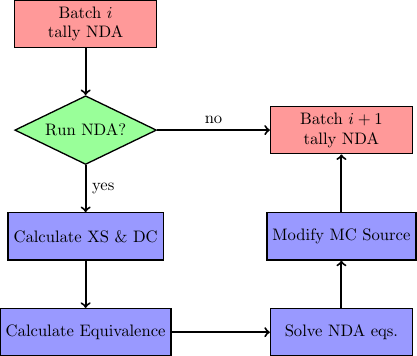
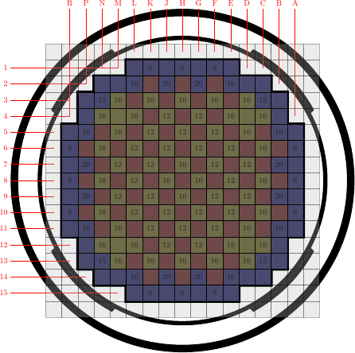
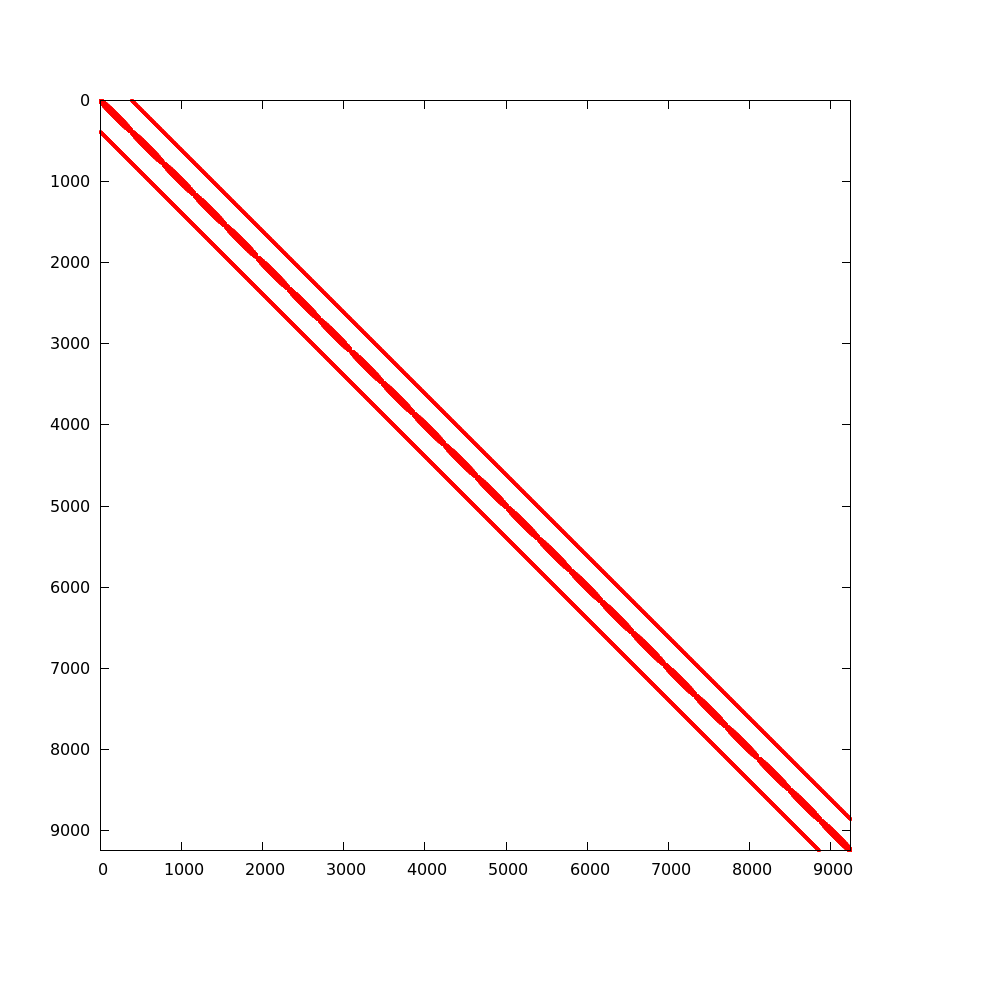
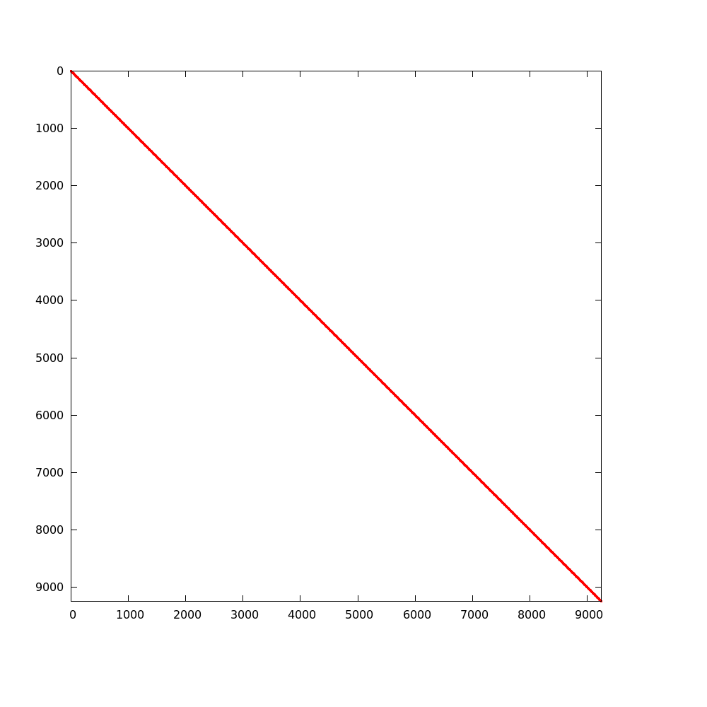

.. _methods_cmfd:

================================================================
Nonlinear Diffusion Acceleration - Coarse Mesh Finite Difference
================================================================

This page section discusses how nonlinear diffusion acceleration (NDA) using
coarse mesh finite difference (CMFD) is implemented into OpenMC. Before we get
into the theory, general notation for this section is discussed.

Note that the methods discussed in this section are written specifically for
continuous-energy mode but equivalent apply to the multi-group mode if the
particle's energy is replaced with the particle's group

--------
Notation
--------

Before deriving NDA relationships, notation is explained. If a parameter has a
:math:`\overline{\cdot}`, it is surface area-averaged and if it has a
:math:`\overline{\overline\cdot}`, it is volume-averaged. When describing a
specific cell in the geometry, indices :math:`(i,j,k)` are used which correspond
to directions :math:`(x,y,z)`. In most cases, the same operation is performed in
all three directions. To compactly write this, an arbitrary direction set
:math:`(u,v,w)` that corresponds to cell indices :math:`(l,m,n)` is used. Note
that :math:`u` and :math:`l` do not have to correspond to :math:`x` and
:math:`i`. However, if :math:`u` and :math:`l` correspond to :math:`y` and
:math:`j`, :math:`v` and :math:`w` correspond to :math:`x` and :math:`z`
directions. An example of this is shown in the following expression:

.. math::
    :label: not1

    \sum\limits_{u\in(x,y,z)}\left\langle\overline{J}^{u,g}_{l+1/2,m,n}
    \Delta_m^v\Delta_n^w\right\rangle

Here, :math:`u` takes on each direction one at a time. The parameter :math:`J`
is surface area-averaged over the transverse indices :math:`m` and :math:`n`
located at :math:`l+1/2`.  Usually, spatial indices are listed as subscripts and
the direction as a superscript. Energy group indices represented by :math:`g`
and :math:`h` are also listed as superscripts here. The group :math:`g` is the
group of interest and, if present, :math:`h` is all groups. Finally, any
parameter surrounded by :math:`\left\langle\cdot\right\rangle` represents a
tally quantity that can be edited from a Monte Carlo (MC) solution.

------
Theory
------

NDA is a diffusion model that has equivalent physics to a transport model. There
are many different methods that can be classified as NDA. The CMFD method is a
type of NDA that represents second order multigroup diffusion equations on a
coarse spatial mesh.  Whether a transport model or diffusion model is used to
represent the distribution of neutrons, these models must satisfy the *neutron
balance equation*. This balance is represented by the following formula for a
specific energy group :math:`g` in cell :math:`(l,m,n)`:

.. math::
    :label: eq_neut_bal

    \sum\limits_{u\in(x,y,z)}\left(\left\langle\overline{J}^{u,g}_{l+1/2,m,n}
    \Delta_m^v\Delta_n^w\right\rangle -
    \left\langle\overline{J}^{u,g}_{l-1/2,m,n}
    \Delta_m^v\Delta_n^w\right\rangle\right)
    +
    \left\langle\overline{\overline\Sigma}_{t_{l,m,n}}^g
    \overline{\overline\phi}_{l,m,n}^g\Delta_l^u\Delta_m^v\Delta_n^w\right\rangle
    = \\
    \sum\limits_{h=1}^G\left\langle
    \overline{\overline{\nu_s\Sigma}}_{s_{l,m,n}}^{h\rightarrow
    g}\overline{\overline\phi}_{l,m,n}^h\Delta_l^u\Delta_m^v\Delta_n^w
    \right\rangle
    +
    \frac{1}{k_{eff}}\sum\limits_{h=1}^G
    \left\langle\overline{\overline{\nu_f\Sigma}}_{f_{l,m,n}}^{h\rightarrow
    g}\overline{\overline\phi}_{l,m,n}^h
    \Delta_l^u\Delta_m^v\Delta_n^w\right\rangle.

In eq. :eq:`eq_neut_bal` the parameters are defined as:

* :math:`\left\langle\overline{J}^{u,g}_{l\pm
  1/2,m,n}\Delta_m^v\Delta_n^w\right\rangle` --- surface area-integrated net
  current over surface :math:`(l\pm 1/2,m,n)` with surface normal in direction
  :math:`u` in energy group :math:`g`. By dividing this quantity by the transverse
  area, :math:`\Delta_m^v\Delta_n^w`, the surface area-averaged net current can
  be computed.
* :math:`\left\langle\overline{\overline\Sigma}_{t_{l,m,n}}^g
  \overline{\overline\phi}_{l,m,n}^g\Delta_l^u\Delta_m^v\Delta_n^w\right\rangle`
  --- volume-integrated total reaction rate over energy group :math:`g`.
* :math:`\left\langle\overline{\overline{\nu_s\Sigma}}_{s_{l,m,n}}^{h\rightarrow
  g}
  \overline{\overline\phi}_{l,m,n}^h\Delta_l^u\Delta_m^v\Delta_n^w\right\rangle`
  --- volume-integrated scattering production rate of neutrons that begin with
  energy in group :math:`h` and exit reaction in group :math:`g`. This reaction
  rate also includes the energy transfer of reactions (except fission) that
  produce multiple neutrons such as (n, 2n); hence, the need for :math:`\nu_s`
  to represent neutron multiplicity.
* :math:`k_{eff}` --- core multiplication factor.
* :math:`\left\langle\overline{\overline{\nu_f\Sigma}}_{f_{l,m,n}}^{h\rightarrow
  g}\overline{\overline\phi}_{l,m,n}^h\Delta_l^u\Delta_m^v\Delta_n^w\right\rangle`
  --- volume-integrated fission production rate of neutrons from fissions in
  group :math:`h` that exit in group :math:`g`.

Each quantity in :math:`\left\langle\cdot\right\rangle` represents a scalar value that
is obtained from an MC tally. A good verification step when using an MC code is
to make sure that tallies satisfy this balance equation within statistics. No
NDA acceleration can be performed if the balance equation is not satisfied.

There are three major steps to consider when performing NDA: (1) calculation of
macroscopic cross sections and nonlinear parameters, (2) solving an eigenvalue
problem with a system of linear equations, and (3) modifying MC source
distribution to align with the NDA solution on a chosen mesh. This process is
illustrated as a flow chart below. After a batch of neutrons
is simulated, NDA can take place. Each of the steps described above is described
in detail in the following sections.

    Flow chart of NDA process. Note "XS" is used for cross section and "DC" is
    used for diffusion coefficient.

Calculation of Macroscopic Cross Sections
-----------------------------------------

A diffusion model needs macroscopic cross sections and diffusion coefficients to
solve for multigroup fluxes. Cross sections are derived by conserving reaction
rates predicted by MC tallies. From Eq. :eq:`eq_neut_bal`, total, scattering
production and fission production macroscopic cross sections are needed. They are
defined from MC tallies as follows:

.. math::
   :label: xs1

   \overline{\overline\Sigma}_{t_{l,m,n}}^g \equiv
   \frac{\left\langle\overline{\overline\Sigma}_{t_{l,m,n}}^g
   \overline{\overline\phi}_{l,m,n}^g\Delta_l^u\Delta_m^v\Delta_n^w\right\rangle}
   {\left\langle\overline{\overline\phi}_{l,m,n}^g
   \Delta_l^u\Delta_m^v\Delta_n^w\right\rangle},

.. math::
   :label: xs2

   \overline{\overline{\nu_s\Sigma}}_{s_{l,m,n}}^{h\rightarrow g} \equiv
   \frac{\left\langle\overline{\overline{\nu_s\Sigma}}_{s_{l,m,n}}^{h\rightarrow
   g}\overline{\overline\phi}_{l,m,n}^h\Delta_l^u\Delta_m^v\Delta_n^w\right\rangle}
   {\left\langle\overline{\overline\phi}_{l,m,n}^h
   \Delta_l^u\Delta_m^v\Delta_n^w\right\rangle}

and

.. math::
   :label: xs3

   \overline{\overline{\nu_f\Sigma}}_{f_{l,m,n}}^{h\rightarrow g} \equiv
   \frac{\left\langle\overline{\overline{\nu_f\Sigma}}_{f_{l,m,n}}^{h\rightarrow
   g}\overline{\overline\phi}_{l,m,n}^h\Delta_l^u\Delta_m^v\Delta_n^w\right\rangle}
   {\left\langle\overline{\overline\phi}_{l,m,n}^h\Delta_l^u\Delta_m^v\Delta_n^w\right\rangle}.

In order to fully conserve neutron balance, leakage rates also need to be
preserved. In standard diffusion theory, leakage rates are represented by
diffusion coefficients. Unfortunately, it is not easy in MC to calculate a
single diffusion coefficient for a cell that describes leakage out of each
surface. Luckily, it does not matter what definition of diffusion coefficient is
used because nonlinear equivalence parameters will correct for this
inconsistency. However, depending on the diffusion coefficient definition
chosen, different convergence properties of NDA equations are observed.
Here, we introduce a diffusion coefficient that is derived for a coarse energy
transport reaction rate. This definition can easily be constructed from
MC tallies provided that angular moments of scattering reaction rates can
be obtained. The diffusion coefficient is defined as follows:

.. math::
   :label: eq_transD

    \overline{\overline D}_{l,m,n}^g =
    \frac{\left\langle\overline{\overline\phi}_{l,m,n}^g
    \Delta_l^u\Delta_m^v\Delta_n^w\right\rangle}{3
    \left\langle\overline{\overline\Sigma}_{tr_{l,m,n}}^g
    \overline{\overline\phi}_{l,m,n}^g
    \Delta_l^u\Delta_m^v\Delta_n^w\right\rangle},

where

.. math::
   :label: xs4

   \left\langle\overline{\overline\Sigma}_{tr_{l,m,n}}^g
   \overline{\overline\phi}_{l,m,n}^g\Delta_l^u\Delta_m^v\Delta_n^w\right\rangle
   =
   \left\langle\overline{\overline\Sigma}_{t_{l,m,n}}^g
   \overline{\overline\phi}_{l,m,n}^g\Delta_l^u\Delta_m^v\Delta_n^w\right\rangle
   \\ -
   \left\langle\overline{\overline{\nu_s\Sigma}}_{s1_{l,m,n}}^g
   \overline{\overline\phi}_{l,m,n}^g\Delta_l^u\Delta_m^v\Delta_n^w\right\rangle.

Note that the transport reaction rate is calculated from the total reaction rate
reduced by the :math:`P_1` scattering production reaction rate. Equation :eq:`eq_transD`
does not represent the best definition of diffusion coefficients from MC;
however, it is very simple and usually fits into MC tally frameworks
easily. Different methods to calculate more accurate diffusion coefficients can
found in [Herman]_.

CMFD Equations
--------------

The first part of this section is devoted to discussing second-order finite
volume discretization of multigroup diffusion equations. This will be followed
up by the formulation of CMFD equations that are used in this NDA
scheme. When performing second-order finite volume discretization of the
diffusion equation, we need information that relates current to flux. In this
numerical scheme, each cell is coupled only to its direct neighbors. Therefore,
only two types of coupling exist: (1) cell-to-cell coupling and (2)
cell-to-boundary coupling. The derivation of this procedure is referred to as
finite difference diffusion equations and can be found in literature such
as [Hebert]_. These current/flux relationships are as follows:

* cell-to-cell coupling

.. math::
   :label: eq_cell_cell

   \overline{J}^{u,g}_{l\pm1/2,m,n} = -\frac{2\overline{\overline
   D}_{l\pm1,m,n}^g\overline{\overline
   D}_{l,m,n}^g}{\overline{\overline D}_{l\pm1,m,n}^g\Delta_l^u +
   \overline{\overline
   D}_{l,m,n}^g\Delta_{l\pm1}^u}
   \left(\pm\overline{\overline{\phi}}_{l\pm1,m,n}^g\mp
   \overline{\overline{\phi}}_{l,m,n}^g\right),

* cell-to-boundary coupling

.. math::
   :label: eq_cell_bound

   \overline{J}^{u,g}_{l\pm1/2,m,n} = \pm\frac{2\overline{\overline
   D}_{l,m,n}^g\left(1 -
   \beta_{l\pm1/2,m,n}^{u,g}\right)}{4\overline{\overline
   D}_{l,m,n}^g\left(1 + \beta_{l\pm1/2,m,n}^{u,g}\right) + \left(1 -
   \beta_{l\pm1/2,m,n}^{u,g}\right)\Delta_l^u}\overline{\overline{\phi}}_{l,m,n}^{g}.

In Eqs. :eq:`eq_cell_cell` and :eq:`eq_cell_bound`, the :math:`\pm` refers to
left (:math:`-x`) or right (:math:`+x`) surface in the :math:`x` direction,
back (:math:`-y`) or front (:math:`+y`) surface in the :math:`y` direction and
bottom (:math:`-z`) or top (:math:`+z`) surface in the :math:`z` direction. For
cell-to-boundary coupling, a general albedo, :math:`\beta_{l\pm1/2,m,n}^{u,g}`,
is used. The albedo is defined as the ratio of incoming (:math:`-` superscript)
to outgoing (:math:`+` superscript) partial current on any surface represented
as

.. math::
   :label: eq_albedo

   \beta_{l\pm1/2,m,n}^{u,g} =
   \frac{\overline{J}^{u,g-}_{l\pm1/2,m,n}}{\overline{J}^{u,g+}_{l\pm1/2,m,n}}.

Common boundary conditions are: vacuum (:math:`\beta=0`), reflective
(:math:`\beta=1`) and zero flux (:math:`\beta=-1`). Both eq. :eq:`eq_cell_cell`
and eq. :eq:`eq_cell_bound` can be written in this generic form,

.. math::
   :label: eq_dtilde

   \overline{J}^{u,g}_{l\pm1/2,m,n} = \widetilde{D}_{l,m,n}^{u,g} \left(\dots\right).

The parameter :math:`\widetilde{D}_{l,m,n}^{u,g}` represents the linear
coupling term between current and flux. These current relationships can be
sustituted into eq. :eq:`eq_neut_bal` to produce a linear system of multigroup
diffusion equations for each spatial cell and energy group. However, a solution
to these equations is not consistent with a higher order transport solution
unless equivalence factors are present. This is because both the diffusion
approximation, governed by Fick's Law, and spatial trunction error will produce
differences. Therefore, a nonlinear parameter,
:math:`\widehat{D}_{l,m,n}^{u,g}`, is added to eqs. :eq:`eq_cell_cell` and
:eq:`eq_cell_bound`. These equations are, respectively,

.. math::
   :label: eq_dhat_cell

   \overline{J}^{u,g}_{l\pm1/2,m,n} = -\widetilde{D}_{l,m,n}^{u,g}
   \left(\pm\overline{\overline{\phi}}_{l\pm1,m,n}^g\mp
   \overline{\overline{\phi}}_{l,m,n}^g\right) + \widehat{D}_{l,m,n}^{u,g}
   \left(\overline{\overline{\phi}}_{l\pm1,m,n}^g +
   \overline{\overline{\phi}}_{l,m,n}^g\right)

and

.. math::
   :label: eq_dhat_bound

   \overline{J}^{u,g}_{l\pm1/2,m,n} = \pm\widetilde{D}_{l,m,n}^{u,g}
   \overline{\overline{\phi}}_{l,m,n}^{g} + \widehat{D}_{l,m,n}^{u,g}
   \overline{\overline{\phi}}_{l,m,n}^{g}.

The only unknown in each of these equations is the equivalence parameter. The
current, linear coupling term and flux can either be obtained or derived from
MC tallies. Thus, it is called nonlinear because it is dependent on the flux
which is updated on the next iteration.

Equations :eq:`eq_dhat_cell` and :eq:`eq_dhat_bound` can be substituted into
eq. :eq:`eq_neut_bal` to create a linear system of equations that is consistent
with transport physics.  One example of this equation is written for an
interior cell,

.. math::
   :label: eq_cmfd_sys

   \sum_{u\in
   x,y,x}\frac{1}{\Delta_l^u}\left[\left(-\tilde{D}_{l-1/2,m,n}^{u,g} -
   \hat{D}_{l-1/2,m,n}^{u,g}\right)\overline{\overline{\phi}}_{l-1,m,n}^g\right.
   \\ + \left(\tilde{D}_{l-1/2,m,n}^{u,g} +
   \tilde{D}_{l+1/2,m,n}^{u,g} - \hat{D}_{l-1/2,m,n}^{u,g} +
   \hat{D}_{l+1/2,m,n}^{u,g}\right)\overline{\overline{\phi}}_{l,m,n}^g
   \\ +
   \left. \left(-\tilde{D}_{l+1/2,m,n}^{u,g} +
   \hat{D}_{l+1/2,m,n}^{u,g}\right)\overline{\overline{\phi}}_{l+1,m,n}^g
   \right] \\ +
   \overline{\overline\Sigma}_{t_{l,m,n}}^g\overline{\overline{\phi}}_{l,m,n}^g
   - \sum\limits_{h=1}^G\overline{\overline{\nu_s\Sigma}}^{h\rightarrow
   g}_{s_{l,m,n}}\overline{\overline{\phi}}_{l,m,n}^h =
   \frac{1}{k}\sum\limits_{h=1}^G\overline{\overline{\nu_f\Sigma}}^{h\rightarrow
   g}_{f_{l,m,n}}\overline{\overline{\phi}}_{l,m,n}^h.

It should be noted that before substitution, eq. :eq:`eq_neut_bal` was divided
by the volume of the cell, :math:`\Delta_l^u\Delta_m^v\Delta_n^w`. Equation
:eq:`eq_cmfd_sys` can be represented in operator form as

.. math::
   :label: eq_CMFDopers

   \mathbb{M}\mathbf{\Phi} = \frac{1}{k}\mathbb{F}\mathbf{\Phi},

where :math:`\mathbb{M}` is the neutron loss matrix operator,
:math:`\mathbb{F}` is the neutron production matrix operator,
:math:`\mathbf{\Phi}` is the multigroup flux vector and :math:`k` is the
eigenvalue. This generalized eigenvalue problem is solved to obtain fundamental
mode multigroup fluxes and eigenvalue. In order to produce consistent results
with transport theory from these equations, the neutron balance equation must
have been satisfied by MC tallies. The desire is that CMFD equations will
produce a more accurate source than MC after each fission source generation.

CMFD Feedback
-------------

Now that a more accurate representation of the expected source distribution is
estimated from CMFD, it needs to be communicated back to MC. The first step
in this process is to generate a probability mass function that provides
information about how probable it is for a neutron to be born in a given cell
and energy group. This is represented as

.. math::
   :label: eq_cmfd_psrc

   p_{l,m,n}^g =
   \frac{\sum_{h=1}^{G}\overline{\overline{\nu_f\Sigma}}^{h\rightarrow
   g}_{f_{l,m,n}}\overline{\overline{\phi}}_{l,m,n}^h\Delta_l^u\Delta_m^v
   \Delta_n^w}{\sum_n\sum_m\sum_l\sum_{h=1}^{G}\overline{
   \overline{\nu_f\Sigma}}^{h\rightarrow
   g}_{f_{l,m,n}}\overline{\overline{\phi}}_{l,m,n}^h\Delta_l^u\Delta_m^v
   \Delta_n^w}.

This equation can be multiplied by the number of source neutrons to obtain an
estimate of the expected number of neutrons to be born in a given cell and
energy group. This distribution can be compared to the MC source distribution
to generate weight adjusted factors defined as

.. math::
   :label: eq_waf

   f_{l,m,n}^g = \frac{Np_{l,m,n}^g}{\sum\limits_s w_s};\quad s\in
   \left(g,l,m,n\right).

The MC source distribution is represented on the same coarse mesh as
CMFD by summing all neutrons' weights, :math:`w_s`, in a given cell and
energy group. MC source weights can then be modified by this weight
adjustment factor so that it matches the CMFD solution on the coarse
mesh,

.. math::
   :label: src_mod

   w^\prime_s = w_s\times f_{l,m,n}^g;\quad s\in \left(g,l,m,n\right).

It should be noted that heterogeneous information about local coordinates and
energy remain constant throughout this modification process.

------------------------
Implementation in OpenMC
------------------------

The section describes how CMFD was implemented in OpenMC. Before the simulation
begins, a user sets up a CMFD input file that contains the following basic
information:

* CMFD mesh (space and energy),
* boundary conditions at edge of mesh (albedos),
* acceleration region (subset of mesh, optional),
* fission source generation (FSG)/batch that CMFD should begin, and
* whether CMFD feedback should be applied.

It should be noted that for more difficult simulations (e.g., light water
reactors), there are other options available to users such as tally resetting
parameters, effective down-scatter usage, tally estimator, etc. For more
information please see the :class:`openmc.cmfd.CMFDRun` class.

Of the options described above, the optional acceleration subset region is an
uncommon feature. Because OpenMC only has a structured Cartesian mesh, mesh
cells may overlay regions that don't contain fissionable material and may be so
far from the core that the neutron flux is very low. If these regions were
included in the CMFD solution, bad estimates of diffusion parameters may result
and affect CMFD feedback. To deal with this, a user can carve out an active
acceleration region from their structured Cartesian mesh. This is illustrated
in diagram below. When placing a CMFD mesh over a geometry, the boundary
conditions must be known at the global edges of the mesh. If the geometry is
complex like the one below, one may have to cover the whole geometry including
the reactor pressure vessel because we know that there is a zero incoming
current boundary condition at the outer edge of the pressure vessel. This is
not viable in practice because neutrons in simulations may not reach mesh cells
that are near the pressure vessel. To circumvent this, one can shrink the mesh
to cover just the core region as shown in the diagram. However, one must still
estimate the boundary conditions at the global boundaries, but at these
locations, they are not readily known. In OpenMC, one can carve out the active
core region from the entire structured Cartesian mesh. This is shown in the
diagram below by the darkened region over the core. The albedo boundary
conditions at the active core/reflector boundary can be tallied indirectly
during the MC simulation with incoming and outgoing partial currents. This
allows the user to not have to worry about neutrons producing adequate tallies
in mesh cells far away from the core.

    Diagram of CMFD acceleration mesh

During an MC simulation, CMFD tallies are accumulated. The basic tallies needed
are listed in Table :ref:`tab_tally`. Each tally is performed on a spatial and
energy mesh basis. The surface area-integrated net current is tallied on every
surface of the mesh. OpenMC tally objects are created by the CMFD code
internally, and cross sections are calculated at each CMFD feedback iteration.
The first CMFD iteration, controlled by the user, occurs just after tallies are
communicated to the master processor. Once tallies are collapsed, cross
sections, diffusion coefficients and equivalence parameters are calculated. This
is performed only on the acceleration region if that option has been activated
by the user. Once all diffusion parameters are calculated, CMFD matrices are
formed where energy groups are the inner most iteration index. In OpenMC,
compressed row storage sparse matrices are used due to the sparsity of CMFD
operators. An example of this sparsity is shown for the 3-D BEAVRS model in
figures :num:`fig-loss` and :num:`fig-prod` [BEAVRS]_. These matrices represent
an assembly radial mesh, 24 cell mesh in the axial direction and two energy
groups. The loss matrix is 99.92% sparse and the production matrix is 99.99%
sparse. Although the loss matrix looks like it is tridiagonal, it is really a
seven banded matrix with a block diagonal matrix for scattering. The production
matrix is a :math:`2\times 2` block diagonal; however, zeros are present because
no fission neutrons appear with energies in the thermal group.

.. _tab_tally:

.. table:: OpenMC CMFD tally list

   +--------------------------------------------------------------------------------------------+----------------+---------------------------+
   +--------------------------------------------------------------------------------------------+----------------+---------------------------+
   | tally                                                                                      |  score         |  filter                   |
   +============================================================================================+================+===========================+
   | \ :math:`\left\langle\overline{\overline\phi}_{l,m,n}^g                                    | flux           | mesh, energy              |
   | \Delta_l^u\Delta_m^v\Delta_n^w\right\rangle`                                               |                |                           |
   +--------------------------------------------------------------------------------------------+----------------+---------------------------+
   | \ :math:`\left\langle\overline{\overline\Sigma}_{t_{l,m,n}}^g                              | total          | mesh, energy              |
   | \overline{\overline\phi}_{l,m,n}^g\Delta_l^u\Delta_m^v\Delta_n^w\right\rangle`             |                |                           |
   +--------------------------------------------------------------------------------------------+----------------+---------------------------+
   | \ :math:`\left\langle\overline{\overline{\nu_s\Sigma}}_{s1_{l,m,n}}^g                      | nu-scatter-1   | mesh, energy              |
   | \overline{\overline\phi}_{l,m,n}^g\Delta_l^u\Delta_m^v\Delta_n^w\right\rangle`             |                |                           |
   +--------------------------------------------------------------------------------------------+----------------+---------------------------+
   | \ :math:`\left\langle\overline{\overline{\nu_s\Sigma}}_{s_{l,m,n}}^{h\rightarrow g}        | nu-scatter     | mesh, energy, energyout   |
   | \overline{\overline\phi}_{l,m,n}^h\Delta_l^u\Delta_m^v\Delta_n^w\right\rangle`             |                |                           |
   +--------------------------------------------------------------------------------------------+----------------+---------------------------+
   | \ :math:`\left\langle\overline{\overline{\nu_f\Sigma}}_{f_{l,m,n}}^{h\rightarrow g}        | nu-fission     | mesh, energy, energyout   |
   | \overline{\overline\phi}_{l,m,n}^h\Delta_l^u\Delta_m^v\Delta_n^w\right\rangle`             |                |                           |
   +--------------------------------------------------------------------------------------------+----------------+---------------------------+
   | \ :math:`\left\langle\overline{J}^{u,g}_{l\pm 1/2,m,n}\Delta_m^v\Delta_n^w\right\rangle`   | current        | mesh, energy              |
   +--------------------------------------------------------------------------------------------+----------------+---------------------------+

.. _fig-loss:

   Sparsity of Neutron Loss Operator

.. _fig-prod:

   Sparsity of Neutron Production Operator

To solve the eigenvalue problem with these matrices, different source iteration
and linear solvers can be used. The most common source iteration solver used is
standard power iteration as described in [Gill]_. To accelerate these source
iterations, a Wielandt shift scheme can be used as discussed in [Park]_.  PETSc
solvers were first implemented to perform the linear solution in parallel that
occurs once per source iteration. When using PETSc, different types of parallel
linear solvers and preconditioners can be used. By default, OpenMC uses an
incomplete LU preconditioner and a GMRES Krylov solver. After some initial
studies of parallelization with PETSc, it was observed that because CMFD
matrices are very sparse, solution times do not scale well. An additional
Gauss-Seidel linear solver with Chebyshev acceleration was added that is
similar to the one used for CMFD in CASMO [Rhodes]_ and [Smith]_. This solver
was implemented with a custom section for two energy groups. Because energy
group is the inner most index, a block diagonal is formed when using more than
one group. For two groups, it is easy to invert this diagonal analytically
inside the Gauss-Seidel iterative solver. For more than two groups, this
analytic inversion can still be performed, but with more computational effort.
A standard Gauss-Seidel solver is used for more than two groups.

Besides a power iteration, a Jacobian-free Newton-Krylov method was also
implemented to obtain eigenvalue and multigroup fluxes as described in [Gill]_
and [Knoll]_. This method is not the primary one used, but has gotten recent
attention due to its coupling advantages to other physics such as thermal
hydraulics. Once multigroup fluxes are obtained, a normalized fission source is
calculated in the code using eq. :eq:`eq_cmfd_psrc` directly.

The next step in the process is to compute weight adjustment factors. These are
calculated by taking the ratio of the expected number of neutrons from the CMFD
source distribution to the current number of neutrons in each mesh. It is
straightforward to compute the CMFD number of neutrons because it is the
product between the total starting initial weight of neutrons and the CMFD
normalized fission source distribution. To compute the number of neutrons from
the current MC source, OpenMC sums the statistical
weights of neutrons from the source bank on a given spatial and energy mesh.
Once weight adjustment factors were calculated, each neutron's statistical
weight in the source bank was modified according to its location and energy.
Examples of CMFD simulations using OpenMC can be found in [HermanThesis]_.

.. only:: html

   .. rubric:: References

.. [BEAVRS] Nick Horelik, Bryan Herman. *Benchmark for Evaluation And Verification of Reactor
            Simulations*. Massachusetts Institute of Technology, https://crpg.mit.edu/research/beavrs
            , 2013.

.. [Gill] Daniel F. Gill. *Newton-Krylov methods for the solution of the k-eigenvalue problem in
          multigroup neutronics calculations*. Ph.D. thesis, Pennsylvania State University, 2010.

.. [Hebert] Alain Hebert. *Applied reactor physics*. Presses Internationales Polytechnique,
            Montreal, 2009.

.. [Herman] Bryan R. Herman, Benoit Forget, Kord Smith, and Brian N. Aviles. Improved
            diffusion coefficients generated from Monte Carlo codes. In *Proceedings of M&C
            2013*, Sun Valley, ID, USA, May 5 - 9, 2013.

.. [HermanThesis] Bryan R. Herman. *Monte Carlo and Thermal Hydraulic Coupling using
                  Low-Order Nonlinear Diffusion Acceleration*. Sc.D. thesis,
                  Massachusetts Institute of Technology, 2014.

.. [Knoll] D.A. Knoll, H. Park, and C. Newman. *Acceleration of k-eigenvalue/criticality
           calculations using the Jacobian-free Newton-Krylov method*. Nuclear Science and
           Engineering, 167:133–140, 2011.

.. [Park] H. Park, D.A. Knoll, and C.K. Newman. *Nonlinear acceleration of transport
          criticality problems*. Nuclear Science and Engineering, 172:52–65, 2012.

.. [Rhodes] Joel Rhodes and Malte Edenius. *CASMO-4 --- A Fuel Assembly Burnup Program.
            User’s Manual*. Studsvik of America, ssp-09/443-u rev 0, proprietary edition, 2001.

.. [Smith] Kord S Smith and Joel D Rhodes III. *Full-core, 2-D, LWR core calculations with
           CASMO-4E*. In Proceedings of PHYSOR 2002, Seoul, Korea, October 7 - 10, 2002.
