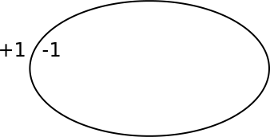
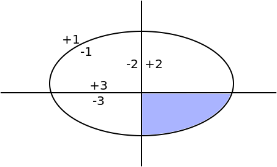
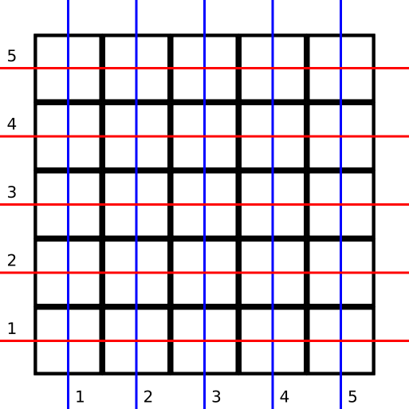
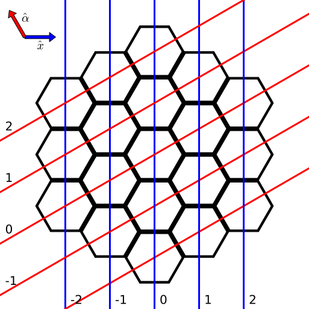
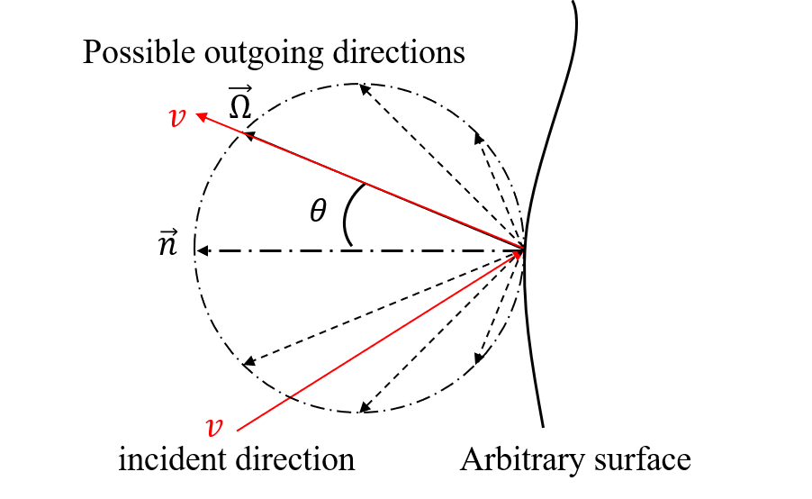

.. _methods_geometry:

========
Geometry
========

---------------------------
Constructive Solid Geometry
---------------------------

OpenMC uses a technique known as `constructive solid geometry`_ (CSG) to build
arbitrarily complex three-dimensional models in Euclidean space. In a CSG model,
every unique object is described as the union and/or intersection of
*half-spaces* created by bounding `surfaces`_. Every surface divides all of
space into exactly two half-spaces. We can mathematically define a surface as a
collection of points that satisfy an equation of the form :math:`f(x,y,z) = 0`
where :math:`f(x,y,z)` is a given function. All coordinates for which
:math:`f(x,y,z) < 0` are referred to as the negative half-space (or simply the
*negative side*) and coordinates for which :math:`f(x,y,z) > 0` are referred to
as the positive half-space.

Let us take the example of a sphere centered at the point :math:`(x_0,y_0,z_0)`
with radius :math:`R`. One would normally write the equation of the sphere as

.. math::
    :label: sphere-equation

    (x - x_0)^2 + (y - y_0)^2 + (z - z_0)^2 = R^2

By subtracting the right-hand term from both sides of equation
:eq:`sphere-equation`, we can then write the surface equation for the sphere:

.. math::
    :label: surface-equation-sphere

    f(x,y,z) = (x - x_0)^2 + (y - y_0)^2 + (z - z_0)^2 - R^2 = 0

One can confirm that any point inside this sphere will correspond to
:math:`f(x,y,z) < 0` and any point outside the sphere will correspond to
:math:`f(x,y,z) > 0`.

In OpenMC, every surface defined by the user is assigned an integer to uniquely
identify it. We can then refer to either of the two half-spaces created by a
surface by a combination of the unique ID of the surface and a positive/negative
sign.  Figure :num:`fig-halfspace` shows an example of an ellipse with unique ID 1
dividing space into two half-spaces.

.. _fig-halfspace:

   Example of an ellipse and its associated half-spaces.

References to half-spaces created by surfaces are used to define regions of
space of uniform composition, which are then assigned to *cells*. OpenMC allows
regions to be defined using union, intersection, and complement operators. As in
MCNP_, the intersection operator is implicit as doesn't need to be written in a
region specification. A defined region is then associated with a material
composition in a cell. Figure :num:`fig-union` shows an example of a cell region
defined as the intersection of an ellipse and two planes.

.. _fig-union:

   The shaded region represents a cell bounded by three surfaces.

The ability to form regions based on bounding quadratic surfaces enables OpenMC
to model arbitrarily complex three-dimensional objects. In practice, one is
limited only by the different surface types available in OpenMC. The following
table lists the available surface types, the identifier used to specify them in
input files, the corresponding surface equation, and the input parameters needed
to fully define the surface.

.. table:: Surface types available in OpenMC.

    +----------------------+------------+------------------------------+-------------------------+
    | Surface              | Identifier | Equation                     | Parameters              |
    +======================+============+==============================+=========================+
    | Plane perpendicular  | x-plane    | :math:`x - x_0 = 0`          | :math:`x_0`             |
    | to :math:`x`-axis    |            |                              |                         |
    +----------------------+------------+------------------------------+-------------------------+
    | Plane perpendicular  | y-plane    | :math:`y - y_0 = 0`          | :math:`y_0`             |
    | to :math:`y`-axis    |            |                              |                         |
    +----------------------+------------+------------------------------+-------------------------+
    | Plane perpendicular  | z-plane    | :math:`z - z_0 = 0`          | :math:`z_0`             |
    | to :math:`z`-axis    |            |                              |                         |
    +----------------------+------------+------------------------------+-------------------------+
    | Arbitrary plane      | plane      | :math:`Ax + By + Cz = D`     | :math:`A\;B\;C\;D`      |
    +----------------------+------------+------------------------------+-------------------------+
    | Infinite cylinder    | x-cylinder | :math:`(y-y_0)^2 + (z-z_0)^2 | :math:`y_0\;z_0\;R`     |
    | parallel to          |            | = R^2`                       |                         |
    | :math:`x`-axis       |            |                              |                         |
    +----------------------+------------+------------------------------+-------------------------+
    | Infinite cylinder    | y-cylinder | :math:`(x-x_0)^2 + (z-z_0)^2 | :math:`x_0\;z_0\;R`     |
    | parallel to          |            | = R^2`                       |                         |
    | :math:`y`-axis       |            |                              |                         |
    +----------------------+------------+------------------------------+-------------------------+
    | Infinite cylinder    | z-cylinder | :math:`(x-x_0)^2 + (y-y_0)^2 | :math:`x_0\;y_0\;R`     |
    | parallel to          |            | = R^2`                       |                         |
    | :math:`z`-axis       |            |                              |                         |
    +----------------------+------------+------------------------------+-------------------------+
    | Sphere               | sphere     | :math:`(x-x_0)^2 + (y-y_0)^2 | :math:`x_0 \; y_0 \;    |
    |                      |            | + (z-z_0)^2 = R^2`           | z_0 \; R`               |
    +----------------------+------------+------------------------------+-------------------------+
    | Cone parallel to the | x-cone     | :math:`(y-y_0)^2 + (z-z_0)^2 | :math:`x_0 \; y_0 \;    |
    | :math:`x`-axis       |            | = R^2(x-x_0)^2`              | z_0 \; R^2`             |
    +----------------------+------------+------------------------------+-------------------------+
    | Cone parallel to the | y-cone     | :math:`(x-x_0)^2 + (z-z_0)^2 | :math:`x_0 \; y_0 \;    |
    | :math:`y`-axis       |            | = R^2(y-y_0)^2`              | z_0 \; R^2`             |
    +----------------------+------------+------------------------------+-------------------------+
    | Cone parallel to the | z-cone     | :math:`(x-x_0)^2 + (y-y_0)^2 | :math:`x_0 \; y_0 \;    |
    | :math:`z`-axis       |            | = R^2(z-z_0)^2`              | z_0 \; R^2`             |
    +----------------------+------------+------------------------------+-------------------------+
    | General quadric      | quadric    | :math:`Ax^2 + By^2 + Cz^2 +  | :math:`A \; B \; C \; D |
    | surface              |            | Dxy + Eyz + Fxz + Gx + Hy +  | \; E \; F \; G \; H \;  |
    |                      |            | Jz + K`                      | J \; K`                 |
    +----------------------+------------+------------------------------+-------------------------+

.. _universes:

Universes
---------

OpenMC supports universe-based geometry similar to the likes of MCNP_ and
Serpent_. This capability enables user to model any identical repeated
structures once and then fill them in various spots in the geometry. A
prototypical example of a repeated structure would be a fuel pin within a fuel
assembly or a fuel assembly within a core.

Each cell in OpenMC can either be filled with a normal material or with a
universe. If the cell is filled with a universe, only the region of the universe
that is within the defined boundaries of the parent cell will be present in the
geometry. That is to say, even though a collection of cells in a universe may
extend to infinity, not all of the universe will be "visible" in the geometry
since it will be truncated by the boundaries of the cell that contains it.

When a cell is filled with a universe, it is possible to specify that the
universe filling the cell should be rotated and translated. This is done through
the ``rotation`` and ``translation`` attributes on a cell (note though that
these can only be specified on a cell that is filled with another universe, not
a material).

It is not necessary to use or assign universes in a geometry if there are no
repeated structures. Any cell in the geometry that is not assigned to a
specified universe is automatically part of the *base universe* whose
coordinates are just the normal coordinates in Euclidean space.

Lattices
--------

Often times, repeated structures in a geometry occur in a regular pattern such
as a rectangular or hexagonal lattice. In such a case, it would be cumbersome
for a user to have to define the boundaries of each of the cells to be filled
with a universe. Thus, OpenMC provides a lattice capability similar to that used
in MCNP_ and Serpent_.

The implementation of lattices is similar in principle to universes --- instead
of a cell being filled with a universe, the user can specify that it is filled
with a finite lattice. The lattice is then defined by a two-dimensional array of
universes that are to fill each position in the lattice. A good example of the
use of lattices and universes can be seen in the OpenMC model for the `Monte
Carlo Performance benchmark`_.

------------------------------------------
Computing the Distance to Nearest Boundary
------------------------------------------

One of the most basic algorithms in any Monte Carlo code is determining the
distance to the nearest surface within a cell. Since each cell is defined by
the surfaces that bound it, if we compute the distance to all surfaces bounding
a cell, we can determine the nearest one.

With the possibility of a particle having coordinates on multiple levels
(universes) in a geometry, we must exercise care when calculating the distance
to the nearest surface. Each different level of geometry has a set of boundaries
with which the particle's direction of travel may intersect. Thus, it is
necessary to check the distance to the surfaces bounding the cell in each
level. This should be done starting the highest (most global) level going down
to the lowest (most local) level. That ensures that if two surfaces on different
levels are coincident, by default the one on the higher level will be selected
as the nearest surface. Although they are not explicitly defined, it is also
necessary to check the distance to surfaces representing lattice boundaries if a
lattice exists on a given level.

The following procedure is used to calculate the distance to each bounding
surface. Suppose we have a particle at :math:`(x_0,y_0,z_0)` traveling in the
direction :math:`u_0,v_0,w_0`. To find the distance :math:`d` to a surface
:math:`f(x,y,z) = 0`, we need to solve the equation:

.. math::
    :label: dist-to-boundary-1

    f(x_0 + du_0, y_0 + dv_0, z_0 + dw_0) = 0

If no solutions to equation :eq:`dist-to-boundary-1` exist or the only solutions
are complex, then the particle's direction of travel will not intersect the
surface. If the solution to equation :eq:`dist-to-boundary-1` is negative, this
means that the surface is "behind" the particle, i.e. if the particle continues
traveling in its current direction, it will not hit the surface. The complete
derivation for different types of surfaces used in OpenMC will be presented in
the following sections.

Since :math:`f(x,y,z)` in general is quadratic in :math:`x`, :math:`y`, and
:math:`z`, this implies that :math:`f(x_0 + du_0, y + dv_0, z + dw_0)` is
quadratic in :math:`d`. Thus we expect at most two real solutions to
:eq:`dist-to-boundary-1`. If no solutions to :eq:`dist-to-boundary-1` exist or
the only solutions are complex, then the particle's direction of travel will not
intersect the surface. If the solution to :eq:`dist-to-boundary-1` is negative,
this means that the surface is "behind" the particle, i.e. if the particle
continues traveling in its current direction, it will not hit the surface.

Once a distance has been computed to a surface, we need to check if it is closer
than previously-computed distances to surfaces. Unfortunately, we cannot just
use the minimum function because some of the calculated distances, which should
be the same in theory (e.g. coincident surfaces), may be slightly different due
to the use of floating-point arithmetic. Consequently, we should first check for
floating-point equality of the current distance calculated and the minimum found
thus far. This is done by checking if

.. math::
    :label: fp-distance

    \frac{| d - d_{min} |}{d_{min}} < \epsilon

where :math:`d` is the distance to a surface just calculated, :math:`d_{min}` is
the minimum distance found thus far, and :math:`\epsilon` is a small number. In
OpenMC, this parameter is set to :math:`\epsilon = 10^{-14}` since all floating
calculations are done on 8-byte floating point numbers.

Plane Perpendicular to an Axis
------------------------------

The equation for a plane perpendicular to, for example, the x-axis is simply
:math:`x - x_0 = 0`. As such, we need to solve :math:`x + du - x_0 = 0`. The
solution for the distance is

.. math::
    :label: dist-xplane

    d = \frac{x_0 - x}{u}

Note that if the particle's direction of flight is parallel to the x-axis,
i.e. :math:`u = 0`, the distance to the surface will be infinity. While the
example here was for a plane perpendicular to the x-axis, the same formula can
be applied for the surfaces :math:`y = y_0` and :math:`z = z_0`.

Generic Plane
-------------

The equation for a generic plane is :math:`Ax + By + Cz = D`. Thus, we need to
solve the equation :math:`A(x + du) + B(y + dv) + C(z + dw) = D`. The solution
to this equation for the distance is

.. math::
    :label: dist-plane

    d = \frac{D - Ax - By - Cz}{Au + Bv + Cw}

Again, we need to check whether the denominator is zero. If so, this means that
the particle's direction of flight is parallel to the plane and it will
therefore never hit the plane.

.. _cylinder_distance:

Cylinder Parallel to an Axis
----------------------------

The equation for a cylinder parallel to, for example, the x-axis is :math:`(y -
y_0)^2 + (z - z_0)^2 = R^2`. Thus, we need to solve :math:`(y + dv - y_0)^2 +
(z + dw - z_0)^2 = R^2`. Let us define :math:`\bar{y} = y - y_0` and
:math:`\bar{z} = z - z_0`. We then have

.. math::
    :label: dist-xcylinder-1

    (\bar{y} + dv)^2 + (\bar{z} + dw)^2 = R^2

Expanding equation :eq:`dist-xcylinder-1` and rearranging terms, we obtain

.. math::
    :label: dist-xcylinder-2

    (v^2 + w^2) d^2 + 2 (\bar{y}v + \bar{z}w) d + (\bar{y}^2 + \bar{z}^2 - R^2)
    = 0

This is a quadratic equation for :math:`d`. To simplify notation, let us define
:math:`a = v^2 + w^2`, :math:`k = \bar{y}v + \bar{z}w`, and :math:`c =
\bar{y}^2 + \bar{z}^2 - R^2`. Thus, the distance is just the solution to
:math:`ad^2 + 2kd + c = 0`:

.. math::
    :label: dist-xcylinder-3

    d = \frac{-k \pm \sqrt{k^2 - ac}}{a}

A few conditions must be checked for. If :math:`a = 0`, this means the particle
is parallel to the cylinder and will thus never intersect it. Also, if
:math:`k^2 - ac < 0`, this means that both solutions to the quadratic are
complex. In physical terms, this means that the ray along which the particle is
traveling does not make any intersections with the cylinder.

If we do have intersections and :math:`c < 0`, this means that the particle is
inside the cylinder. Thus, one solution should be positive and one should be
negative. Clearly, the positive distance will occur when the sign on the
square root of the discriminant is positive since :math:`a > 0`.

If we have intersections and :math:`c > 0` this means that the particle is
outside the cylinder. Thus, the solutions to the quadratic are either both
positive or both negative. If they are both positive, the smaller (closer) one
will be the solution with a negative sign on the square root of the
discriminant.

The same equations and logic here can be used for cylinders that are parallel to
the y- or z-axis with appropriate substitution of constants.

Sphere
------

The equation for a sphere is :math:`(x - x_0)^2 + (y - y_0)^2 + (z - z_0)^2 =
R^2`. Thus, we need to solve the equation

.. math::
    :label: dist-sphere-1

    (x + du - x_0)^2 + (y + dv - y_0)^2 + (z + dw - z_0)^2 = R^2

Let us define :math:`\bar{x} = x - x_0`, :math:`\bar{y} = y - y_0`, and
:math:`\bar{z} = z - z_0`. We then have

.. math::
    :label: dist-sphere-2

    (\bar{x} + du)^2 + (\bar{y} + dv)^2 + (\bar{z} - dw)^2 = R^2

Expanding equation :eq:`dist-sphere-2` and rearranging terms, we obtain

.. math::
    :label: dist-sphere-3

    d^2 + 2 (\bar{x}u + \bar{y}v + \bar{z}w) d + (\bar{x}^2 + \bar{y}^2 +
    \bar{z}^2 - R^2) = 0

This is a quadratic equation for :math:`d`. To simplify notation, let us define
:math:`k = \bar{x}u + \bar{y}v + \bar{z}w` and :math:`c = \bar{x}^2 +
\bar{y}^2 + \bar{z}^2 - R^2`. Thus, the distance is just the solution to
:math:`d^2 + 2kd + c = 0`:

.. math::
    :label: dist-sphere-4

    d = -k \pm \sqrt{k^2 - c}

If the discriminant :math:`k^2 - c < 0`, this means that both solutions to the
quadratic are complex. In physical terms, this means that the ray along which
the particle is traveling does not make any intersections with the sphere.

If we do have intersections and :math:`c < 0`, this means that the particle is
inside the sphere. Thus, one solution should be positive and one should be
negative. The positive distance will occur when the sign on the square root of
the discriminant is positive. If we have intersections but :math:`c > 0` this
means that the particle is outside the sphere. The solutions to the quadratic
will then be either both positive or both negative. If they are both positive,
the smaller (closer) one will be the solution with a negative sign on the square
root of the discriminant.

Cone Parallel to an Axis
------------------------

The equation for a cone parallel to, for example, the x-axis is :math:`(y -
y_0)^2 + (z - z_0)^2 = R^2(x - x_0)^2`. Thus, we need to solve :math:`(y + dv -
y_0)^2 + (z + dw - z_0)^2 = R^2(x + du - x_0)^2`. Let us define :math:`\bar{x} =
x - x_0`, :math:`\bar{y} = y - y_0`, and :math:`\bar{z} = z - z_0`. We then have

.. math::
    :label: dist-xcone-1

    (\bar{y} + dv)^2 + (\bar{z} + dw)^2 = R^2(\bar{x} + du)^2

Expanding equation :eq:`dist-xcone-1` and rearranging terms, we obtain

.. math::
    :label: dist-xcone-2

    (v^2 + w^2 - R^2u^2) d^2 + 2 (\bar{y}v + \bar{z}w - R^2\bar{x}u) d +
    (\bar{y}^2 + \bar{z}^2 - R^2\bar{x}^2) = 0

Defining the terms

.. math::
    :label: dist-xcone-terms

    a = v^2 + w^2 - R^2u^2

    k = \bar{y}v + \bar{z}w - R^2\bar{x}u

    c = \bar{y}^2 + \bar{z}^2 - R^2\bar{x}^2

we then have the simple quadratic equation :math:`ad^2 + 2kd + c = 0` which can
be solved as described in :ref:`cylinder_distance`.

General Quadric
---------------

The equation for a general quadric surface is :math:`Ax^2 + By^2 + Cz^2 + Dxy +
Eyz + Fxz + Gx + Hy + Jz + K = 0`. Thus, we need to solve the equation

.. math::
    :label: dist-quadric-1

    A(x+du)^2 + B(y+dv)^2 + C(z+dw)^2 + D(x+du)(y+dv) + E(y+dv)(z+dw) + \\
    F(x+du)(z+dw) + G(x+du) + H(y+dv) + J(z+dw) + K = 0

Expanding equation :eq:`dist-quadric-1` and rearranging terms, we obtain

.. math::
    :label: dist-quadric-2

    d^2(uv + vw + uw) + 2d(Aux + Bvy + Cwx + (D(uv + vx) + E(vz + wy) + \\
    F(wx + uz))/2) + (x(Ax + Dy) + y(By + Ez) + z(Cz + Fx)) = 0

Defining the terms

.. math::
    :label: dist-quadric-terms

    a = uv + vw + uw

    k = Aux + Bvy + Cwx + (D(uv + vx) + E(vz + wy) + F(wx + uz))/2

    c = x(Ax + Dy) + y(By + Ez) + z(Cz + Fx)

we then have the simple quadratic equation :math:`ad^2 + 2kd + c = 0` which can
be solved as described in :ref:`cylinder_distance`.

.. _find-cell:

----------------------------
Finding a Cell Given a Point
----------------------------

Another basic algorithm is to determine which cell contains a given point in the
global coordinate system, i.e. if the particle's position is :math:`(x,y,z)`,
what cell is it currently in. This is done in the following manner in
OpenMC. With the possibility of multiple levels of coordinates, we must perform
a recursive search for the cell. First, we start in the highest (most global)
universe, which we call the base universe, and loop over each cell within
that universe. For each cell, we check whether the specified point is inside the
cell using the algorithm described in :ref:`cell-contains`. If the cell is
filled with a normal material, the search is done and we have identified the
cell containing the point. If the cell is filled with another universe, we then
search all cells within that universe to see if any of them contain the
specified point. If the cell is filled with a lattice, the position within the
lattice is determined, and then whatever universe fills that lattice position is
recursively searched. The search ends once a cell containing a normal material
is found that contains the specified point.

.. _cell-contains:

----------------------
Finding a Lattice Tile
----------------------

If a particle is inside a lattice, its position inside the lattice must be
determined before assigning it to a cell.  Throughout this section, the
volumetric units of the lattice will be referred to as "tiles".  Tiles are
identified by thier indices, and the process of discovering which tile contains
the particle is referred to as "indexing".

Rectilinear Lattice Indexing
----------------------------

Indices are assigned to tiles in a rectilinear lattice based on the tile's
position along the :math:`x`, :math:`y`, and :math:`z` axes.  Figure
:num:`fig-rect-lat` maps the indices for a 2D lattice.  The indices, (1, 1),
map to the lower-left tile.  (5, 1) and (5, 5) map to the lower-right and
upper-right tiles, respectively.

.. _fig-rect-lat:

   Rectilinear lattice tile indices.

In general, a lattice tile is specified by the three indices,
:math:`(i_x, i_y, i_z)`.  If a particle's current coordinates are
:math:`(x, y, z)` then the indices can be determined from these formulas:

.. math::
    :label: rect_indexing

    i_x = \left \lceil \frac{x - x_0}{p_0} \right \rceil

    i_y = \left \lceil \frac{y - y_0}{p_1} \right \rceil

    i_z = \left \lceil \frac{z - z_0}{p_2} \right \rceil

where :math:`(x_0, y_0, z_0)` are the coordinates to the lower-left-bottom
corner of the lattice, and :math:`p_0, p_1, p_2` are the pitches along the
:math:`x`, :math:`y`, and :math:`z` axes, respectively.

.. _hexagonal_indexing:

Hexagonal Lattice Indexing
--------------------------

A skewed coordinate system is used for indexing hexagonal lattice tiles.
Rather than a :math:`y`-axis, another axis is used that is rotated 30 degrees
counter-clockwise from the :math:`y`-axis.  This axis is referred to as the
:math:`\alpha`-axis.  Figure :num:`fig-hex-lat` shows how 2D hexagonal tiles
are mapped with the :math:`(x, \alpha)` basis.  In this system, (0, 0) maps to
the center tile, (0, 2) to the top tile, and (2, -1) to the middle tile on the
right side.

.. _fig-hex-lat:

   Hexagonal lattice tile indices.

Unfortunately, the indices cannot be determined with one simple formula as
before.  Indexing requires a two-step process, a coarse step which determines a
set of four tiles that contains the particle and a fine step that determines
which of those four tiles actually contains the particle.

In the first step, indices are found using these formulas:

.. math::
    :label: hex_indexing

    \alpha = -\frac{x}{\sqrt{3}} + y

    i_x^* = \left \lfloor \frac{x}{p_0 \sqrt{3} / 2} \right \rfloor

    i_\alpha^* = \left \lfloor \frac{\alpha}{p_0} \right \rfloor

where :math:`p_0` is the lattice pitch (in the :math:`x`-:math:`y` plane).  The
true index of the particle could be :math:`(i_x^*, i_\alpha^*)`,
:math:`(i_x^* + 1, i_\alpha^*)`, :math:`(i_x^*, i_\alpha^* + 1)`, or
:math:`(i_x^* + 1, i_\alpha^* + 1)`.

The second step selects the correct tile from that neighborhood of 4.  OpenMC
does this by calculating the distance between the particle and the centers of
each of the 4 tiles, and then picking the closest tile.  This works because
regular hexagonal tiles form a Voronoi tessellation which means that all of the
points within a tile are closest to the center of that same tile.

Indexing along the :math:`z`-axis uses the same method from rectilinear
lattices, i.e.

.. math::
    :label: hex_indexing_z

    i_z = \left \lceil \frac{z - z_0}{p_2} \right \rceil

----------------------------------------
Determining if a Coordinate is in a Cell
----------------------------------------

To determine which cell a particle is in given its coordinates, we need to be
able to check whether a given cell contains a point. The algorithm for
determining if a cell contains a point is as follows. For each surface that
bounds a cell, we determine the particle's sense with respect to the surface. As
explained earlier, if we have a point :math:`(x_0,y_0,z_0)` and a surface
:math:`f(x,y,z) = 0`, the point is said to have negative sense if
:math:`f(x_0,y_0,z_0) < 0` and positive sense if :math:`f(x_0,y_0,z_0) > 0`. If
for all surfaces, the sense of the particle with respect to the surface matches
the specified sense that defines the half-space within the cell, then the point
is inside the cell. Note that this algorithm works only for *simple cells*
defined as intersections of half-spaces.

It may help to illustrate this algorithm using a simple example. Let's say we
have a cell defined as

.. code-block:: xml

    <surface id="1" type="sphere"  coeffs="0 0 0 10" />
    <surface id="2" type="x-plane" coeffs="-3" />
    <surface id="3" type="y-plane" coeffs="2" />
    <cell id="1" surfaces="-1 2 -3" />

This means that the cell is defined as the intersection of the negative half
space of a sphere, the positive half-space of an x-plane, and the negative
half-space of a y-plane. Said another way, any point inside this cell must
satisfy the following equations

.. math::
    :label: cell-contains-example

    x^2 + y^2 + z^2 - 10^2 < 0 \\
    x - (-3) > 0 \\
    y - 2 < 0

In order to determine if a point is inside the cell, we would substitute its
coordinates into equation :eq:`cell-contains-example`. If the inequalities are
satisfied, than the point is indeed inside the cell.

--------------------------
Handling Surface Crossings
--------------------------

A particle will cross a surface if the distance to the nearest surface is closer
than the distance sampled to the next collision. A number of things happen when
a particle hits a surface. First, we need to check if a non-transmissive
boundary condition has been applied to the surface. If a vacuum boundary
condition has been applied, the particle is killed and any surface current
tallies are scored to as needed. If a reflective boundary condition has been
applied to the surface, surface current tallies are scored to and then the
particle's direction is changed according to the procedure in :ref:`reflection`.
Note that the white boundary condition can be considered as the special case of
reflective boundary condition, where the same processing method will be applied to
deal with the surface current tallies scoring, except for determining the
changes of particle's direction according to the procedures in :ref:`white`.

Next, we need to determine what cell is beyond the surface in the direction of
travel of the particle so that we can evaluate cross sections based on its
material properties. At initialization, a list of neighboring cells is created
for each surface in the problem as described in :ref:`neighbor-lists`. The
algorithm outlined in :ref:`find-cell` is used to find a cell containing the
particle with one minor modification; rather than searching all cells in the
base universe, only the list of neighboring cells is searched. If this search is
unsuccessful, then a search is done over every cell in the base universe.

.. _neighbor-lists:

-----------------------
Building Neighbor Lists
-----------------------

After the geometry has been loaded and stored in memory from an input file,
OpenMC builds a list for each surface containing any cells that are bounded by
that surface in order to speed up processing of surface crossings. The algorithm
to build these lists is as follows. First, we loop over all cells in the
geometry and count up how many times each surface appears in a specification as
bounding a negative half-space and bounding a positive half-space. Two arrays
are then allocated for each surface, one that lists each cell that contains the
negative half-space of the surface and one that lists each cell that contains
the positive half-space of the surface. Another loop is performed over all cells
and the neighbor lists are populated for each surface.

.. _reflection:

------------------------------
Reflective Boundary Conditions
------------------------------

If the velocity of a particle is :math:`\mathbf{v}` and it crosses a surface of
the form :math:`f(x,y,z) = 0` with a reflective boundary condition, it can be
shown based on geometric arguments that the velocity vector will then become

.. math::
    :label: reflection-v

    \mathbf{v'} = \mathbf{v} - 2 (\mathbf{v} \cdot \hat{\mathbf{n}})
    \hat{\mathbf{n}}

where :math:`\hat{\mathbf{n}}` is a unit vector normal to the surface at the
point of the surface crossing. The rationale for this can be understood by
noting that :math:`(\mathbf{v} \cdot \hat{\mathbf{n}}) \hat{\mathbf{n}}` is the
projection of the velocity vector onto the normal vector. By subtracting two
times this projection, the velocity is reflected with respect to the surface
normal. Since the magnitude of the velocity of the particle will not change as
it undergoes reflection, we can work with the direction of the particle instead,
simplifying equation :eq:`reflection-v` to

.. math::
    :label: reflection-omega

    \mathbf{\Omega'} = \mathbf{\Omega} - 2 (\mathbf{\Omega} \cdot
    \hat{\mathbf{n}}) \hat{\mathbf{n}}

where :math:`\mathbf{v} = || \mathbf{v} || \mathbf{\Omega}`. The direction of
the surface normal will be the gradient of the surface at the point of crossing,
i.e. :math:`\mathbf{n} = \nabla f(x,y,z)`. Substituting this into equation
:eq:`reflection-omega`, we get

.. math::
    :label: reflection-omega-2

    \mathbf{\Omega'} = \mathbf{\Omega} - \frac{2 ( \mathbf{\Omega} \cdot \nabla
    f )}{|| \nabla f ||^2} \nabla f

If we write the initial and final directions in terms of their vector
components, :math:`\mathbf{\Omega} = (u,v,w)` and :math:`\mathbf{\Omega'} = (u',
v', w')`, this allows us to represent equation :eq:`reflection-omega` as a
series of equations:

.. math::
    :label: reflection-system

    u' = u - \frac{2 ( \mathbf{\Omega} \cdot \nabla f )}{|| \nabla f ||^2}
    \frac{\partial f}{\partial x} \\

    v' = v - \frac{2 ( \mathbf{\Omega} \cdot \nabla f )}{|| \nabla f ||^2}
    \frac{\partial f}{\partial y} \\

    w' = w - \frac{2 ( \mathbf{\Omega} \cdot \nabla f )}{|| \nabla f ||^2}
    \frac{\partial f}{\partial z}

One can then use equation :eq:`reflection-system` to develop equations for
transforming a particle's direction given the equation of the surface.

Plane Perpendicular to an Axis
------------------------------

For a plane that is perpendicular to an axis, the rule for reflection is almost
so simple that no derivation is needed at all. Nevertheless, we will proceed
with the derivation to confirm that the rules of geometry agree with our
intuition. The gradient of the surface :math:`f(x,y,z) = x - x_0 = 0` is simply
:math:`\nabla f = (1, 0, 0)`. Note that this vector is already normalized,
i.e. :math:`|| \nabla f || = 1`. The second two equations in
:eq:`reflection-system` tell us that :math:`v` and :math:`w` do not change and
the first tell us that

.. math::
    :label: reflection-xplane

    u' = u - 2u = -u

We see that reflection for a plane perpendicular to an axis only entails
negating the directional cosine for that axis.

Generic Plane
-------------

A generic plane has the form :math:`f(x,y,z) = Ax + By + Cz - D = 0`. Thus, the
gradient to the surface is simply :math:`\nabla f = (A,B,C)` whose norm squared
is :math:`A^2 + B^2 + C^2`. This implies that

.. math::
    :label: reflection-plane-constant

    \frac{2 (\mathbf{\Omega} \cdot \nabla f)}{|| \nabla f ||^2} = \frac{2(Au +
    Bv + Cw)}{A^2 + B^2 + C^2}

Substituting equation :eq:`reflection-plane-constant` into equation
:eq:`reflection-system` gives us the form of the solution. For example, the
x-component of the reflected direction will be

.. math::
    :label: reflection-plane

    u' = u - \frac{2A(Au + Bv + Cw)}{A^2 + B^2 + C^2}

Cylinder Parallel to an Axis
----------------------------

A cylinder parallel to, for example, the x-axis has the form :math:`f(x,y,z) =
(y - y_0)^2 + (z - z_0)^2 - R^2 = 0`. Thus, the gradient to the surface is

.. math::
    :label: reflection-cylinder-grad

    \nabla f = 2 \left ( \begin{array}{c} 0 \\ y - y_0 \\ z - z_0 \end{array}
    \right ) = 2 \left ( \begin{array}{c} 0 \\ \bar{y} \\ \bar{z} \end{array}
    \right )

where we have introduced the constants :math:`\bar{y}` and
:math:`\bar{z}`. Taking the square of the norm of the gradient, we find that

.. math::
    :label: reflection-cylinder-norm

    || \nabla f ||^2 = 4 \bar{y}^2 + 4 \bar{z}^2 = 4 R^2

This implies that

.. math::
    :label: reflection-cylinder-constant

    \frac{2 (\mathbf{\Omega} \cdot \nabla f)}{|| \nabla f ||^2} =
    \frac{\bar{y}v + \bar{z}w}{R^2}

Substituting equations :eq:`reflection-cylinder-constant` and
:eq:`reflection-cylinder-grad` into equation :eq:`reflection-system` gives us
the form of the solution. In this case, the x-component will not change. The y-
and z-components of the reflected direction will be

.. math::
    :label: reflection-cylinder

    v' = v - \frac{2 ( \bar{y}v + \bar{z}w ) \bar{y}}{R^2} \\

    w' = w - \frac{2 ( \bar{y}v + \bar{z}w ) \bar{z}}{R^2}

Sphere
------

The surface equation for a sphere has the form :math:`f(x,y,z) = (x - x_0)^2 +
(y - y_0)^2 + (z - z_0)^2 - R^2 = 0`. Thus, the gradient to the surface is

.. math::
    :label: reflection-sphere-grad

    \nabla f = 2 \left ( \begin{array}{c} x - x_0 \\ y - y_0 \\ z - z_0
    \end{array} \right ) = 2 \left ( \begin{array}{c} \bar{x} \\ \bar{y} \\
    \bar{z} \end{array} \right )

where we have introduced the constants :math:`\bar{x}, \bar{y}, \bar{z}`. Taking
the square of the norm of the gradient, we find that

.. math::
    :label: reflection-sphere-norm

    || \nabla f ||^2 = 4 \bar{x}^2 + 4 \bar{y}^2 + 4 \bar{z}^2 = 4 R^2

This implies that

.. math::
    :label: reflection-sphere-constant

    \frac{2 (\mathbf{\Omega} \cdot \nabla f)}{|| \nabla f ||^2} =
    \frac{\bar{x}u + \bar{y}v + \bar{z}w}{R^2}

Substituting equations :eq:`reflection-sphere-constant` and
:eq:`reflection-sphere-grad` into equation :eq:`reflection-system` gives us the
form of the solution:

.. math::
    :label: reflection-sphere

    u' = u - \frac{2 ( \bar{x}u + \bar{y}v + \bar{z}w ) \bar{x} }{R^2} \\

    v' = v - \frac{2 ( \bar{x}u + \bar{y}v + \bar{z}w ) \bar{y} }{R^2} \\

    w' = w - \frac{2 ( \bar{x}u + \bar{y}v + \bar{z}w ) \bar{z} }{R^2}

Cone Parallel to an Axis
------------------------

A cone parallel to, for example, the z-axis has the form :math:`f(x,y,z) = (x -
x_0)^2 + (y - y_0)^2 - R^2(z - z_0)^2 = 0`. Thus, the gradient to the surface is

.. math::
    :label: reflection-cone-grad

    \nabla f = 2 \left ( \begin{array}{c} x - x_0 \\ y - y_0 \\ -R^2(z - z_0)
    \end{array} \right ) = 2 \left ( \begin{array}{c} \bar{x} \\ \bar{y} \\
    -R^2\bar{z} \end{array} \right )

where we have introduced the constants :math:`\bar{x}`, :math:`\bar{y}`, and
:math:`\bar{z}`. Taking the square of the norm of the gradient, we find that

.. math::
    :label: reflection-cone-norm

    || \nabla f ||^2 = 4 \bar{x}^2 + \bar{y}^2 + 4 R^4 \bar{z}^2 \\ = 4 R^2
       \bar{z}^2 + 4 R^4 \bar{z}^2 \\ = 4 R^2 (1 + R^2) \bar{z}^2

This implies that

.. math::
    :label: reflection-cone-constant

    \frac{2 (\mathbf{\Omega} \cdot \nabla f)}{|| \nabla f ||^2} =
    \frac{\bar{x}u + \bar{y}v - R^2\bar{z}w}{R^2 (1 + R^2) \bar{z}^2}

Substituting equations :eq:`reflection-cone-constant` and
:eq:`reflection-cone-grad` into equation :eq:`reflection-system` gives us the
form of the solution:

.. math::
    :label: reflection-cone

    u' = u - \frac{2 (\bar{x}u + \bar{y}v - R^2\bar{z}w) \bar{x}}{R^2 (1 + R^2)
    \bar{z}^2}

    v' = v - \frac{2 (\bar{x}u + \bar{y}v - R^2\bar{z}w) \bar{y}}{R^2 (1 + R^2)
    \bar{z}^2}

    w' = w + \frac{2 (\bar{x}u + \bar{y}v - R^2\bar{z}w)}{R^2 (1 + R^2) \bar{z}}

General Quadric
---------------

A general quadric surface has the form :math:`f(x,y,z) = Ax^2 + By^2 + Cz^2 +
Dxy + Eyz + Fxz + Gx + Hy + Jz + K = 0`. Thus, the gradient to the surface is

.. math::
    :label: reflection-quadric-grad

    \nabla f = \left ( \begin{array}{c} 2Ax + Dy + Fz + G \\ 2By + Dx + Ez + H
    \\ 2Cz + Ey + Fx + J \end{array} \right ).

.. _white:

-------------------------
White Boundary Conditions
-------------------------

The `white boundary condition <https://doi.org/10.1016/j.anucene.2019.05.006>`_
is usually applied in deterministic codes, where the particle will hit the
surface and travel back with isotropic angular distribution. The change in
particle's direction is sampled from a cosine distribution instead of uniform.
Figure :num:`fig-cosine-dist` shows an example of cosine-distribution reflection
on the arbitrary surface relative to the surface normal.

.. _fig-cosine-dist:

   Cosine-distribution reflection on an arbitrary surface.

The probability density function (pdf) for the reflected direction can be
expressed as follows,

.. math::
    :label: white-reflection-pdf

    f(\mu, \phi) d\mu d\phi = \frac{\mu}{\pi} d\mu d\phi = 2\mu d\mu \frac{d\phi}{2\pi}

where :math:`\mu = \cos \theta` is the cosine of the polar angle between
reflected direction and the normal to the surface; and :math:`\theta` is the
azimuthal angle in :math:`[0,2\pi]`. We can separate the multivariate
probability density into two separate univariate density functions, one for
the cosine of the polar angle,

.. math::
    :label: white-reflection-cosine

    f(\mu) = 2\mu

and one for the azimuthal angle,

.. math::
    :label: white-reflection-uniform

    f(\phi) = \frac{1}{2\pi}.

Each of these density functions can be sampled by analytical inversion of the
cumulative distribution distribution, resulting in the following sampling
scheme:

.. math::
    :label: white-reflection-sqrt-prn

    \mu = \sqrt{\xi_1} \\
    \phi = 2\pi\xi_2

where :math:`\xi_1` and :math:`\xi_2` are uniform random numbers on
:math:`[0,1)`. With the sampled values of :math:`\mu` and :math:`\phi`, the
final reflected direction vector can be computed via rotation of the surface
normal using the equations from :ref:`transform-coordinates`. The white boundary
condition can be applied to any kind of surface, as long as the normal to the
surface is known as in :ref:`reflection`.

.. _constructive solid geometry: https://en.wikipedia.org/wiki/Constructive_solid_geometry
.. _surfaces: https://en.wikipedia.org/wiki/Surface
.. _MCNP: http://mcnp.lanl.gov
.. _Serpent: http://montecarlo.vtt.fi
.. _Monte Carlo Performance benchmark: https://github.com/mit-crpg/benchmarks/tree/master/mc-performance/openmc
