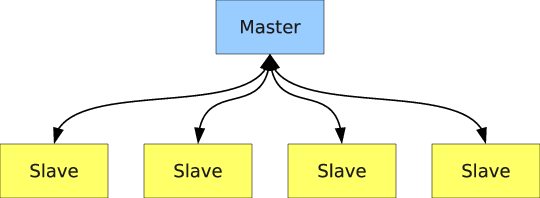
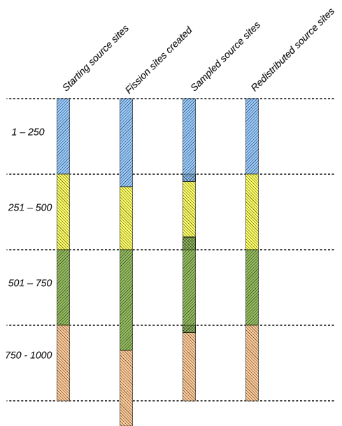

.. _methods_parallel:

===============
Parallelization
===============

Due to the computationally-intensive nature of Monte Carlo methods, there has
been an ever-present interest in parallelizing such simulations. Even in the
`first paper`_ on the Monte Carlo method, John Metropolis and Stanislaw Ulam
recognized that solving the Boltzmann equation with the Monte Carlo method could
be done in parallel very easily whereas the deterministic counterparts for
solving the Boltzmann equation did not offer such a natural means of
parallelism. With the introduction of `vector computers`_ in the early 1970s,
general-purpose parallel computing became a reality. In 1972, Troubetzkoy et
al. designed a Monte Carlo code to be run on the first vector computer, the
ILLIAC-IV [Troubetzkoy]_. The general principles from that work were later
refined and extended greatly through the `work of Forrest Brown`_ in the
1980s. However, as Brown's work shows, the `single-instruction multiple-data`_
(SIMD) parallel model inherent to vector processing does not lend itself to the
parallelism on particles in Monte Carlo simulations. Troubetzkoy et
al. recognized this, remarking that "the order and the nature of these physical
events have little, if any, correlation from history to history," and thus
following independent particle histories simultaneously using a SIMD model is
difficult.

The difficulties with vector processing of Monte Carlo codes led to the adoption
of the `single program multiple data`_ (SPMD) technique for parallelization. In
this model, each different process tracks a particle independently of other
processes, and between fission source generations the processes communicate data
through a `message-passing interface`_. This means of parallelism was enabled by
the introduction of message-passing standards in the late 1980s and early 1990s
such as PVM_ and MPI_. The SPMD model proved much easier to use in practice and
took advantage of the inherent parallelism on particles rather than
instruction-level parallelism. As a result, it has since become ubiquitous for
Monte Carlo simulations of transport phenomena.

Thanks to the particle-level parallelism using SPMD techniques, extremely high
parallel efficiencies could be achieved in Monte Carlo codes. Until the last
decade, even the most demanding problems did not require transmitting large
amounts of data between processors, and thus the total amount of time spent on
communication was not significant compared to the amount of time spent on
computation. However, today's computing power has created a demand for
increasingly large and complex problems, requiring a greater number of particles
to obtain decent statistics (and convergence in the case of criticality
calculations). This results in a correspondingly higher amount of communication,
potentially degrading the parallel efficiency. Thus, while Monte Carlo
simulations may seem `embarrassingly parallel`_, obtaining good parallel scaling
with large numbers of processors can be quite difficult to achieve in practice.

.. _fission-bank-algorithms:

-----------------------
Fission Bank Algorithms
-----------------------

Master-Slave Algorithm
----------------------

Monte Carlo particle transport codes commonly implement a SPMD model by having
one master process that controls the scheduling of work and the remaining
processes wait to receive work from the master, process the work, and then send
their results to the master at the end of the simulation (or a source iteration
in the case of an eigenvalue calculation). This idea is illustrated in
:ref:`figure-master-slave`.

.. _figure-master-slave:

    Communication pattern in master-slave algorithm.

Eigenvalue calculations are slightly more difficult to parallelize than fixed
source calculations since it is necessary to converge on the fission source
distribution and eigenvalue before tallying. In the
:ref:`method-successive-generations`, to ensure that the results are
reproducible, one must guarantee that the process by which fission sites are
randomly sampled does not depend on the number of processors. What is typically
done is the following:

    1. Each compute node sends_ its fission bank sites to a master process;

    2. The master process sorts or orders the fission sites based on a unique
    identifier;

    3. The master process samples :math:`N` fission sites from the ordered array
    of :math:`M` sites; and

    4. The master process broadcasts_ all the fission sites to the compute
    nodes.

The first and last steps of this process are the major sources of communication
overhead between cycles. Since the master process must receive :math:`M` fission
sites from the compute nodes, the first step is necessarily serial. This step
can be completed in :math:`O(M)` time. The broadcast step can benefit from
parallelization through a tree-based algorithm. Despite this, the communication
overhead is still considerable.

To see why this is the case, it is instructive to look at a hypothetical
example. Suppose that a calculation is run with :math:`N = 10,000,000` neutrons
across 64 compute nodes. On average, :math:`M = 10,000,000` fission sites will
be produced. If the data for each fission site consists of a spatial location
(three 8 byte real numbers) and a unique identifier (one 4 byte integer), the
memory required per site is 28 bytes. To broadcast 10,000,000 source sites to 64
nodes will thus require transferring 17.92 GB of data.  Since each compute node
does not need to keep every source site in memory, one could modify the
algorithm from a broadcast to a scatter_. However, for practical reasons
(e.g. work self-scheduling), this is normally not done in production Monte Carlo
codes.

.. _nearest-neighbors-algorithm:

Nearest Neighbors Algorithm
---------------------------

To reduce the amount of communication required in a fission bank synchronization
algorithm, it is desirable to move away from the typical master-slave algorithm
to an algorithm whereby the compute nodes communicate with one another only as
needed. This concept is illustrated in :ref:`figure-nearest-neighbor`.

.. _figure-nearest-neighbor:

    Communication pattern in nearest neighbor algorithm.

Since the source sites for each cycle are sampled from the fission sites banked
from the previous cycle, it is a common occurrence for a fission site to be
banked on one compute node and sent back to the master only to get sent back to
the same compute node as a source site. As a result, much of the communication
inherent in the algorithm described previously is entirely unnecessary. By
keeping the fission sites local, having each compute node sample fission sites,
and sending sites between nodes only as needed, one can cut down on most of the
communication. One algorithm to achieve this is as follows:

    1. An exclusive scan is performed on the number of sites banked, and the
    total number of fission bank sites is broadcasted to all compute nodes. By
    picturing the fission bank as one large array distributed across multiple
    nodes, one can see that this step enables each compute node to determine the
    starting index of fission bank sites in this array. Let us call the starting
    and ending indices on the :math:`i`-th node :math:`a_i` and :math:`b_i`,
    respectively;

    2. Each compute node samples sites at random from the fission bank using the
    same starting seed. A separate array on each compute node is created that
    consists of sites that were sampled local to that node, i.e. if the index of
    the sampled site is between :math:`a_i` and :math:`b_i`, it is set aside;

    3. If any node sampled more than :math:`N/p` fission sites where :math:`p`
    is the number of compute nodes, the extra sites are put in a separate array
    and sent to all other compute nodes. This can be done efficiently using the
    allgather_ collective operation;

    4. The extra sites are divided among those compute nodes that sampled fewer
    than :math:`N/p` fission sites.

However, even this algorithm exhibits more communication than necessary since
the allgather will send fission bank sites to nodes that don't necessarily
need any extra sites.

One alternative is to replace the allgather with a series of sends. If
:math:`a_i` is less than :math:`iN/p`, then send :math:`iN/p - a_i` sites to the
left adjacent node. Similarly, if :math:`a_i` is greater than :math:`iN/p`, then
receive :math:`a_i - iN/p` from the left adjacent node. This idea is applied to
the fission bank sites at the end of each node's array as well. If :math:`b_i`
is less than :math:`(i+1)N/p`, then receive :math:`(i+1)N/p - b_i` sites from
the right adjacent node. If :math:`b_i` is greater than :math:`(i+1)N/p`, then
send :math:`b_i - (i+1)N/p` sites to the right adjacent node. Thus, each compute
node sends/receives only two messages under normal circumstances.

The following example illustrates how this algorithm works. Let us suppose we
are simulating :math:`N = 1000` neutrons across four compute nodes. For this
example, it is instructive to look at the state of the fission bank and source
bank at several points in the algorithm:

    1. The beginning of a cycle where each node has :math:`N/p` source sites;

    2. The end of a cycle where each node has accumulated fission sites;

    3. After sampling, where each node has some amount of source sites usually
    not equal to :math:`N/p`;

    4. After redistribution, each node again has :math:`N/p` source sites for
    the next cycle;

At the end of each cycle, each compute node needs 250 fission bank sites to
continue on the next cycle. Let us suppose that :math:`p_0` produces 270 fission
banks sites, :math:`p_1` produces 230, :math:`p_2` produces 290, and :math:`p_3`
produces 250. After each node samples from its fission bank sites, let's assume
that :math:`p_0` has 260 source sites, :math:`p_1` has 215, :math:`p_2` has 280,
and :math:`p_3` has 245. Note that the total number of sampled sites is 1000 as
needed. For each node to have the same number of source sites, :math:`p_0` needs
to send its right-most 10 sites to :math:`p_1`, and :math:`p_2` needs to send
its left-most 25 sites to :math:`p_1` and its right-most 5 sites to
:math:`p_3`. A schematic of this example is shown in
:ref:`figure-neighbor-example`. The data local to each node is given a different
hatching, and the cross-hatched regions represent source sites that are
communicated between adjacent nodes.

.. _figure-neighbor-example:

    Example of nearest neighbor algorithm.

.. _master-slave-cost:

Cost of Master-Slave Algorithm
------------------------------

While the prior considerations may make it readily apparent that the novel
algorithm should outperform the traditional algorithm, it is instructive to look
at the total communication cost of the novel algorithm relative to the
traditional algorithm. This is especially so because the novel algorithm does
not have a constant communication cost due to stochastic fluctuations. Let us
begin by looking at the cost of communication in the traditional algorithm

As discussed earlier, the traditional algorithm is composed of a series of sends
and typically a broadcast. To estimate the communication cost of the algorithm,
we can apply a simple model that captures the essential features. In this model,
we assume that the time that it takes to send a message between two nodes is
given by :math:`\alpha + (sN)\beta`, where :math:`\alpha` is the time it takes
to initiate the communication (commonly called the latency_), :math:`\beta` is
the transfer time per unit of data (commonly called the bandwidth_), :math:`N`
is the number of fission sites, and :math:`s` is the size in bytes of each
fission site.

The first step of the traditional algorithm is to send :math:`p` messages to the
master node, each of size :math:`sN/p`. Thus, the total time to send these
messages is

.. math::
    :label: t-send

    t_{\text{send}} = p\alpha + sN\beta.

Generally, the best parallel performance is achieved in a weak scaling scheme
where the total number of histories is proportional to the number of
processors. However, we see that when :math:`N` is proportional to :math:`p`,
the time to send these messages increases proportionally with :math:`p`.

Estimating the time of the broadcast is complicated by the fact that different
MPI implementations may use different algorithms to perform collective
communications. Worse yet, a single implementation may use a different algorithm
depending on how many nodes are communicating and the size of the message. Using
multiple algorithms allows one to minimize latency for small messages and
minimize bandwidth for long messages.

We will focus here on the implementation of broadcast in the MPICH2_
implementation. For short messages, MPICH2 uses a `binomial tree`_ algorithm. In
this algorithm, the root process sends the data to one node in the first step,
and then in the subsequent, both the root and the other node can send the data
to other nodes. Thus, it takes a total of :math:`\lceil \log_2 p \rceil` steps
to complete the communication. The time to complete the communication is

.. math::
    :label: t-short

    t_{\text{short}} = \lceil \log_2 p \rceil \left ( \alpha + sN\beta \right ).

This algorithm works well for short messages since the latency term scales
logarithmically with the number of nodes. However, for long messages, an
algorithm that has lower bandwidth has been proposed by Barnett_ and implemented
in MPICH2. Rather than using a binomial tree, the broadcast is divided into a
scatter and an allgather. The time to complete the scatter is :math:` \log_2 p
\: \alpha + \frac{p-1}{p} N\beta` using a binomial tree algorithm. The allgather
is performed using a ring algorithm that completes in :math:`p-1) \alpha +
\frac{p-1}{p} N\beta`. Thus, together the time to complete the broadcast is

.. math::
    :label: t-broadcast

    t_{\text{long}} = \left ( \log_2 p + p - 1 \right ) \alpha + 2 \frac{p-1}{p}
    sN\beta.

The fission bank data will generally exceed the threshold for switching from
short to long messages (typically 8 kilobytes), and thus we will use the
equation for long messages. Adding equations :eq:`t-send` and :eq:`t-broadcast`,
the total cost of the series of sends and the broadcast is

.. math::
    :label: t-old

    t_{\text{old}} = \left ( \log_2 p + 2p - 1 \right ) \alpha + \frac{3p-2}{p}
    sN\beta.

Cost of Nearest Neighbor Algorithm
----------------------------------

With the communication cost of the traditional fission bank algorithm
quantified, we now proceed to discuss the communicatin cost of the proposed
algorithm. Comparing the cost of communication of this algorithm with the
traditional algorithm is not trivial due to fact that the cost will be a
function of how many fission sites are sampled on each node. If each node
samples exactly :math:`N/p` sites, there will not be communication between nodes
at all. However, if any one node samples more or less than :math:`N/p` sites,
the deviation will result in communication between logically adjacent nodes. To
determine the expected deviation, one can analyze the process based on the
fundamentals of the Monte Carlo process.

The steady-state neutron transport equation for a multiplying medium can be
written in the form of an eigenvalue problem,

.. math::
    :label: NTE

    S(\mathbf{r})= \frac{1}{k} \int F(\mathbf{r}' \rightarrow
    \mathbf{r})S(\mathbf{r}')\: d\mathbf{r},

where :math:`\mathbf{r}` is the spatial coordinates of the neutron,
:math:`S(\mathbf{r})` is the source distribution defined as the expected number
of neutrons born from fission per unit phase-space volume at :math:`\mathbf{r}`,
:math:`F( \mathbf{r}' \rightarrow \mathbf{r})` is the expected number of
neutrons born from fission per unit phase space volume at :math:`\mathbf{r}`
caused by a neutron at :math:`\mathbf{r}`, and :math:`k` is the eigenvalue. The
fundamental eigenvalue of equation :eq:`NTE` is known as :math:`k_{eff}`, but
for simplicity we will simply refer to it as :math:`k`.

In a Monte Carlo criticality simulation, the power iteration method is applied
iteratively to obtain stochastic realizations of the source distribution and
estimates of the :math:`k`-eigenvalue. Let us define :math:`\hat{S}^{(m)}` to be
the realization of the source distribution at cycle :math:`m` and
:math:`\hat{\epsilon}^{(m)}` be the noise arising from the stochastic nature of
the tracking process. We can write the stochastic realization in terms of the
fundamental source distribution and the noise component as (see `Brissenden and
Garlick`_):

.. math::
    :label: source

    \hat{S}^{(m)}(\mathbf{r})= N S(\mathbf{r}) + \sqrt{N}
    \hat{\epsilon}^{(m)}(\mathbf{r}),

where :math:`N` is the number of particle histories per cycle. Without loss of
generality, we shall drop the superscript notation indicating the cycle as it is
understood that the stochastic realization is at a particular cycle. The
expected value of the stochastic source distribution is simply

.. math::
    :label: expected-value-source

    E \left[ \hat{S}(\mathbf{r})\right] = N S (\mathbf{r})

since :math:`E \left[ \hat{\epsilon}(\mathbf{r})\right] = 0`. The noise in the
source distribution is due only to :math:`\hat{\epsilon}(\mathbf{r})` and thus
the variance of the source distribution will be

.. math::
    :label: var-source

    \text{Var} \left[ \hat{S}(\mathbf{r})\right] = N \text{Var} \left[
    \hat{\epsilon}(\mathbf{r}) \right].

Lastly, the stochastic and true eigenvalues can be written as integrals over all
phase space of the stochastic and true source distributions, respectively, as

.. math::
    :label: k-to-source

    \hat{k} = \frac{1}{N} \int \hat{S}(\mathbf{r}) \: d\mathbf{r} \quad
    \text{and} \quad k = \int S(\mathbf{r}) \: d\mathbf{r},

noting that :math:`S(\mathbf{r})` is :math:`O(1)`. One should note that the
expected value :math:`k` calculated by Monte Carlo power iteration (i.e. the
method of successive generations) will be biased from the true fundamental
eigenvalue of equation :eq:`NTE` by :math:`O(1/N)` (see `Brissenden and
Garlick`_), but we will assume henceforth that the number of particle histories
per cycle is sufficiently large to neglect this bias.

With this formalism, we now have a framework within which we can determine the
properties of the distribution of expected number of fission sites. The explicit
form of the source distribution can be written as

.. math::
    :label: source-explicit

    \hat{S}(\mathbf{r}) = \sum_{i=1}^{M} w_i \delta( \mathbf{r} - \mathbf{r}_i )

where :math:`\mathbf{r}_i` is the spatial location of the :math:`i`-th fission
site, :math:`w_i` is the statistical weight of the fission site at
:math:`\mathbf{r}_i`, and :math:`M` is the total number of fission sites. It is
clear that the total weight of the fission sites is simply the integral of the
source distribution. Integrating equation :eq:`source` over all space, we obtain

.. math::
    :label: source-integrated

    \int \hat{S}(\mathbf{r}) \: d\mathbf{r} = N \int S(\mathbf{r}) \:
    d\mathbf{r} + \sqrt{N} \int \hat{\epsilon}(\mathbf{r}) \: d\mathbf{r} .

Substituting the expressions for the stochastic and true eigenvalues from
equation :eq:`k-to-source`, we can relate the stochastic eigenvalue to the
integral of the noise component of the source distribution as

.. math::
    :label: noise-integeral

    N\hat{k} = Nk + \sqrt{N} \int \hat{\epsilon}(\mathbf{r}) \: d\mathbf{r}.

Since the expected value of :math:`\hat{\epsilon}` is zero, the expected value
of its integral will also be zero. We thus see that the variance of the integral
of the source distribution, i.e. the variance of the total weight of fission
sites produced, is directly proportional to the variance of the integral of the
noise component. Let us call this term :math:`\sigma^2` for simplicity:

.. math::
    :label: variance-sigma2

    \text{Var} \left[ \int \hat{S}(\mathbf{r}) \right ] = N \sigma^2.

The actual value of :math:`\sigma^2` will depend on the physical nature of the
problem, whether variance reduction techniques are employed, etc. For instance,
one could surmise that for a highly scattering problem, :math:`\sigma^2` would
be smaller than for a highly absorbing problem since more collisions will lead
to a more precise estimate of the source distribution. Similarly, using implicit
capture should in theory reduce the value of :math:`\sigma^2`.

Let us now consider the case where the :math:`N` total histories are divided up
evenly across :math:`p` compute nodes. Since each node simulates :math:`N/p`
histories, we can write the source distribution as

.. math::
    :label: source-node

    \hat{S}_i(\mathbf{r})= \frac{N}{p} S(\mathbf{r}) + \sqrt{\frac{N}{p}}
    \hat{\epsilon}_i(\mathbf{r}) \quad \text{for} \quad i = 1, \dots, p

Integrating over all space and simplifying, we can obtain an expression for the
eigenvalue on the :math:`i`-th node:

.. math::
    :label: k-i-hat

    \hat{k}_i = k + \sqrt{\frac{p}{N}} \int \hat{\epsilon}_i(\mathbf{r}) \:
    d\mathbf{r}.

It is easy to show from this expression that the stochastic realization of the
global eigenvalue is merely the average of these local eigenvalues:

.. math::
    :label: average-k-as-sum

    \hat{k} = \frac{1}{p} \sum_{i=1}^p \hat{k}_i.

As was mentioned earlier, at the end of each cycle one must sample :math:`N`
sites from the :math:`M` sites that were created. Thus, the source for the next
cycle can be seen as the fission source from the current cycle divided by the
stochastic realization of the eigenvalue since it is clear from equation
:eq:`k-to-source` that :math:`\hat{k} = M/N`. Similarly, the number of sites
sampled on each compute node that will be used for the next cycle is

.. math::
    :label: sites-per-node

    M_i = \frac{1}{\hat{k}} \int \hat{S}_i(\mathbf{r}) \: d\mathbf{r} =
    \frac{N}{p} \frac{\hat{k}_i}{\hat{k}}.

While we know conceptually that each compute node will under normal
circumstances send two messages, many of these messages will overlap. Rather
than trying to determine the actual communication cost, we will instead attempt
to determine the maximum amount of data being communicated from one node to
another. At any given cycle, the number of fission sites that the :math:`j`-th
compute node will send or receive (:math:`\Lambda_j`) is

.. math::
    :label: Lambda

    \Lambda_j = \left | \sum_{i=1}^j M_i - \frac{jN}{p} \right |.

Noting that :math:`jN/p` is the expected value of the summation, we can write
the expected value of :math:`\Lambda_j` as the mean absolute deviation of the
summation:

.. math::
    :label: mean-dev-lambda

    E \left [ \Lambda_j \right ] = E \left [ \left | \sum_{i=1}^j M_i -
    \frac{jN}{p} \right | \right ] = \text{MD} \left [ \sum_{i=1}^j M_i \right ]

where :math:`\text{MD}` indicates the mean absolute deviation of a random
variable. The mean absolute deviation is an alternative measure of variability.

In order to ascertain any information about the mean deviation of :math:`M_i`,
we need to know the nature of its distribution. Thus far, we have said nothing
of the distributions of the random variables in question. The total number of
fission sites resulting from the tracking of :math:`N` neutrons can be shown to
be normally distributed via the :ref:`central-limit-theorem` (provided that
:math:`N` is sufficiently large) since the fission sites resulting from each
neutron are "sampled" from independent, identically-distributed random
variables. Thus, :math:`\hat{k}` and :math:`\int \hat{S} (\mathbf{r}) \:
d\mathbf{r}` will be normally distributed as will the individual estimates of
these on each compute node.

Next, we need to know what the distribution of :math:`M_i` in equation
:eq:`sites-per-node` is or, equivalently, how :math:`\hat{k}_i / \hat{k}` is
distributed. The distribution of a ratio of random variables is not easy to
calculate analytically, and it is not guaranteed that the ratio distribution is
normal if the numerator and denominator are normally distributed. For example,
if :math:`X` is a standard normal distribution and :math:`Y` is also standard
normal distribution, then the ratio :math:`X/Y` has the standard `Cauchy
distribution`_. The reader should be reminded that the Cauchy distribution has
no defined mean or variance. That being said, Geary_ has shown that, for the
case of two normal distributions, if the denominator is unlikely to assume
values less than zero, then the ratio distribution is indeed approximately
normal. In our case, :math:`\hat{k}` absolutely cannot assume a value less than
zero, so we can be reasonably assured that the distribution of :math:`M_i` will
be normal.

For a normal distribution with mean :math:`\mu` and distribution function
:math:`f(x)`, it can be shown that

.. math::
    :label: mean-dev-to-stdev

    \int_{-\infty}^{\infty} f(x) \left | x - \mu \right | \: dx =
    \sqrt{\frac{2}{\pi} \int_{-\infty}^{\infty} f(x) \left ( x - \mu \right )^2
    \: dx}

and thus the mean absolute deviation is :math:`\sqrt{2/\pi}` times the standard
deviation. Therefore, to evaluate the mean absolute deviation of :math:`M_i`, we
need to first determine its variance. Substituting equation
:eq:`average-k-as-sum` into equation :eq:`sites-per-node`, we can rewrite
:math:`M_i` solely in terms of :math:`\hat{k}_1, \dots, \hat{k}_p`:

.. math::
    :label: M-i

    M_i = \frac{N \hat{k}_i}{\sum\limits_{j=1}^p \hat{k}_j}.

Since we know the variance of :math:`\hat{k}_i`, we can use the error
propagation law to determine the variance of :math:`M_i`:

.. math::
    :label: M-variance

    \text{Var} \left [ M_i \right ] = \sum_{j=1}^p \left ( \frac{\partial
    M_i}{\partial \hat{k}_j} \right )^2 \text{Var} \left [ \hat{k}_j \right ] +
    \sum\limits_{j \neq m} \sum\limits_{m=1}^p \left ( \frac{\partial
    M_i}{\partial \hat{k}_j} \right ) \left ( \frac{\partial M_i}{\partial
    \hat{k}_m} \right ) \text{Cov} \left [ \hat{k}_j, \hat{k}_m \right ]

where the partial derivatives are evaluated at :math:`\hat{k}_j = k`. Since
:math:`\hat{k}_j` and :math:`\hat{k}_m` are independent if :math:`j \neq m`,
their covariance is zero and thus the second term cancels out. Evaluating the
partial derivatives, we obtain

.. math::
    :label: M-variance-2

    \text{Var} \left [ M_i \right ] = \left ( \frac{N(p-1)}{kp^2} \right )^2
    \frac{p\sigma^2}{N} + \sum_{j \neq i} \left ( \frac{-N}{kp^2} \right )^2
    \frac{p\sigma^2}{N} = \frac{N(p-1)}{k^2p^2} \sigma^2.

Through a similar analysis, one can show that the variance of
:math:`\sum_{i=1}^j M_i` is

.. math::
    :label: sum-M-variance

    \text{Var} \left [ \sum_{i=1}^j M_i \right ] = \frac{Nj(p-j)}{k^2p^2}
    \sigma^2

Thus, the expected amount of communication on node :math:`j`, i.e. the mean
absolute deviation of :math:`\sum_{i=1}^j M_i` is proportional to

.. math::
    :label: communication-cost

    E \left [ \Lambda_j \right ] = \sqrt{\frac{2Nj(p-j)\sigma^2}{\pi k^2p^2}}.

This formula has all the properties that one would expect based on intuition:

    1. As the number of histories increases, the communication cost on each node
    increases as well;

    2. If :math:`p=1`, i.e. if the problem is run on only one compute node, the
    variance will be zero. This reflects the fact that exactly :math:`N` sites
    will be sampled if there is only one node.

    3. For :math:`j=p`, the variance will be zero. Again, this says that when
    you sum the number of sites from each node, you will get exactly :math:`N`
    sites.

We can determine the node that has the highest communication cost by
differentiating equation :eq:`communication-cost` with respect to :math:`j`,
setting it equal to zero, and solving for :math:`j`. Doing so yields
:math:`j_{\text{max}} = p/2`. Interestingly, substituting :math:`j = p/2` in
equation :eq:`communication-cost` shows us that the maximum communication cost
is actually independent of the number of nodes:

.. math::
    :label: maximum-communication

    E \left [ \Lambda_{j_{\text{max}}} \right ] = \sqrt{ \frac{N\sigma^2}{2\pi
    k^2}}.

.. only:: html

   .. rubric:: References

.. [Troubetzkoy] E. Troubetzkoy, H. Steinberg, and M. Kalos, "Monte Carlo
   Radiation Penetration Calculations on a Parallel Computer,"
   *Trans. Am. Nucl. Soc.*, **17**, 260 (1973).

.. _first paper: https://doi.org/10.2307/2280232

.. _work of Forrest Brown: http://hdl.handle.net/2027.42/24996

.. _Brissenden and Garlick: https://doi.org/10.1016/0306-4549(86)90095-2

.. _MPICH2: http://www.mcs.anl.gov/mpi/mpich

.. _binomial tree: https://www.mcs.anl.gov/~thakur/papers/ijhpca-coll.pdf

.. _Geary: https://doi.org/10.2307/2342070

.. _Barnett: http://citeseerx.ist.psu.edu/viewdoc/summary?doi=10.1.1.51.7772

.. _single-instruction multiple-data: https://en.wikipedia.org/wiki/SIMD

.. _vector computers: https://en.wikipedia.org/wiki/Vector_processor

.. _single program multiple data: https://en.wikipedia.org/wiki/SPMD

.. _message-passing interface: https://en.wikipedia.org/wiki/Message_Passing_Interface

.. _PVM: http://www.csm.ornl.gov/pvm/pvm_home.html

.. _MPI: http://www.mcs.anl.gov/research/projects/mpi/

.. _embarrassingly parallel: https://en.wikipedia.org/wiki/Embarrassingly_parallel

.. _sends: http://www.mcs.anl.gov/research/projects/mpi/www/www3/MPI_Send.html

.. _broadcasts: http://www.mcs.anl.gov/research/projects/mpi/www/www3/MPI_Bcast.html

.. _scatter: http://www.mcs.anl.gov/research/projects/mpi/www/www3/MPI_Scatter.html

.. _allgather: http://www.mcs.anl.gov/research/projects/mpi/www/www3/MPI_Allgather.html

.. _Cauchy distribution: https://en.wikipedia.org/wiki/Cauchy_distribution

.. _latency: https://en.wikipedia.org/wiki/Latency_(engineering)#Packet-switched_networks

.. _bandwidth: https://en.wikipedia.org/wiki/Bandwidth_(computing)
