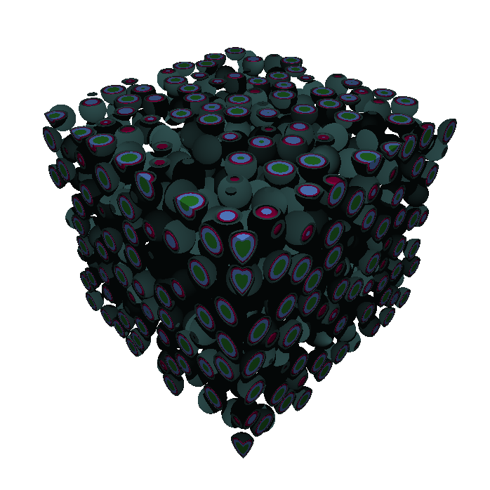

.. _usersguide_plots:

======================
Geometry Visualization
======================

.. currentmodule:: openmc

OpenMC is capable of producing two-dimensional slice plots of a geometry,
three-dimensional voxel plots, and three-dimensional raytrace plots using the
geometry plotting :ref:`run mode <usersguide_run_modes>`. The geometry plotting
mode relies on the presence of a :ref:`plots.xml <io_plots>` file that indicates
what plots should be created. To create this file, one needs to create one or
more instances of the various plot classes described below, add them to a
:class:`openmc.Plots` collection, and then use the :class:`Plots.export_to_xml`
method to write the ``plots.xml`` file.

-----------
Slice Plots
-----------

.. image:: ../_images/atr.png
   :width: 300px

The :class:`openmc.SlicePlot` class indicates that a 2D slice plot should be
made. You can specify the origin of the plot (:attr:`SlicePlot.origin`), the
width of the plot in each direction (:attr:`SlicePlot.width`), the number of
pixels to use in each direction (:attr:`SlicePlot.pixels`), and the basis
directions for the plot. For example, to create a :math:`x` - :math:`z` plot
centered at (5.0, 2.0, 3.0) with a width of (50., 50.)  and 400x400 pixels::

  plot = openmc.SlicePlot()
  plot.basis = 'xz'
  plot.origin = (5.0, 2.0, 3.0)
  plot.width = (50., 50.)
  plot.pixels = (400, 400)

The color of each pixel is determined by placing a particle at the center of
that pixel and using OpenMC's internal ``find_cell`` routine (the same one used
for particle tracking during simulation) to determine the cell and material at
that location.

.. note:: In this example, pixels are 50/400=0.125 cm wide. Thus, this plot may
          miss any features smaller than 0.125 cm, since they could exist
          between pixel centers. More pixels can be used to resolve finer
          features but will result in larger files.

By default, a unique color will be assigned to each cell in the geometry. If you
want your plot to be colored by material instead, change the
:attr:`SlicePlot.color_by` attribute::

  plot.color_by = 'material'

If you don't like the random colors assigned, you can also indicate that
particular cells/materials should be given colors of your choosing::

  plot.colors = {
      water: 'blue',
      clad: 'black'
  }

  # This is equivalent
  plot.colors = {
      water: (0, 0, 255),
      clad: (0, 0, 0)
  }

Note that colors can be given as RGB tuples or by a string indicating a valid
`SVG color <https://www.w3.org/TR/SVG11/types.html#ColorKeywords>`_.

When you're done creating your :class:`openmc.SlicePlot` instances, you need to
then assign them to a :class:`openmc.Plots` collection and export it to XML::

  plots = openmc.Plots([plot1, plot2, plot3])
  plots.export_to_xml()

  # This is equivalent
  plots = openmc.Plots()
  plots.append(plot1)
  plots += [plot2, plot3]
  plots.export_to_xml()

To actually generate the plots, run the :func:`openmc.plot_geometry` function.
Alternatively, run the :ref:`scripts_openmc` executable with the ``--plot``
command-line flag. When that has finished, you will have one or more ``.png``
files. Alternatively, if you're working within a `Jupyter
<https://jupyter.org/>`_ Notebook or QtConsole, you can use the
:func:`openmc.plot_inline` to run OpenMC in plotting mode and display the
resulting plot within the notebook.

.. _usersguide_voxel:

-----------
Voxel Plots
-----------

.. image:: ../_images/3dba.png
   :width: 200px

The :class:`openmc.VoxelPlot` class enables the generation of a 3D voxel plot
instead of a 2D slice plot. In this case, the :attr:`VoxelPlot.width` and
:attr:`VoxelPlot.pixels` attributes should be three items long, e.g.::

  vox_plot = openmc.VoxelPlot()
  vox_plot.width = (100., 100., 50.)
  vox_plot.pixels = (400, 400, 200)

The voxel plot data is written to an :ref:`HDF5 file <io_voxel>`. The voxel file
can subsequently be converted into a standard mesh format that can be viewed in
`ParaView <https://www.paraview.org/>`_, `VisIt
<https://wci.llnl.gov/simulation/computer-codes/visit>`_, etc. This typically
will compress the size of the file significantly. The
:func:`openmc.voxel_to_vtk` function can convert the HDF5 voxel file to VTK
formats. Once processed into a standard 3D file format, colors and masks can be
defined using the stored ID numbers to better explore the geometry. The process
for doing this will depend on the 3D viewer, but should be straightforward.

.. note:: 3D voxel plotting can be very computer intensive for the viewing
          program (Visit, ParaView, etc.) if the number of voxels is large (>10
          million or so).  Thus if you want an accurate picture that renders
          smoothly, consider using only one voxel in a certain direction.

----------------------
Solid Ray-traced Plots
----------------------

The :class:`openmc.SolidRayTracePlot` class allows three dimensional
visualization of detailed geometric features without voxelization. The plot
above visualizes a geometry created by :class:`openmc.TRISO`, with the materials
in the fuel kernel distinguished by color. It was enclosed in a bounding box
such that some kernels are cut off, revealing the inner structure of the kernel.

The `Phong reflection model
<https://en.wikipedia.org/wiki/Phong_reflection_model>`_ approximates how light
reflects off of a surface. On a diffusely light-scattering material, the Phong
model prescribes the amount of light reflected from a surface as proportional to
the dot product between the normal vector of the surface and the vector between
that point on the surface and the light. With this assumption, visually
appealing plots of simulation geometries can be created.

Solid ray-traced plots use the same ray tracing functions that neutrons and
photons do in OpenMC, so any input that does not leak particles can be
visualized in 3D using a solid ray-traced plot. That being said, these plots are
not useful for detecting overlap or undefined regions, so it is recommended to
use the slice plot approach for geometry debugging.

Only a few inputs are required for a solid ray-traced plot. The camera location,
where the camera is looking, and a set of opaque material or cell IDs are
required. The colors of materials or cells are prescribed in the same way as
slice plots. The set of IDs that are opaque in the plot must correspond to
materials if coloring by material, or cells if coloring by cell.

A minimal solid ray-traced plot input could be::

  plot = openmc.SolidRayTracePlot()
  plot.pixels = (600, 600)
  plot.camera_position = (10.0, 20.0, -30.0)
  plot.look_at = (4.0, 5.0, 1.0)
  plot.color_by = 'cell'

  # optional. defaults to camera_position
  plot.light_position = (10, 20, 30)

  # controls ambient lighting. Defaults to 10%
  plot.diffuse_fraction = 0.1
  plot.opaque_domains = [cell2, cell3]

These plots are then stored into a :class:`openmc.Plots` instance, just like the
slice plots.

---------------
Wireframe Plots
---------------

.. only:: html

   .. image:: ../_images/hexlat_anim.gif
     :width: 200px

The :class:`openmc.WireframeRayTracePlot` class also produces 3D visualizations
of OpenMC geometries without voxelization but is intended to show the inside of
a model using wireframing of cell or material boundaries in addition to cell
coloring based on the path length of camera rays through the model. The coloring
in these plots is a bit like turning the model into partially transparent
colored glass that can be seen through, without any refractive effects. This is
called volume rendering. The colors are specified in exactly the same interface
employed by slice plots.

Similar to solid ray-traced plots, these use the native ray tracing capabilities
within OpenMC, so any geometry in which particles successfully run without
overlaps or leaks will work with wireframe plots.

One drawback of wireframe plots is that particle tracks cannot be overlaid on
them at present. Moreover, checking for overlap regions is not currently
possible with wireframe plots. The image heading this section can be created by
adding the following code to the hexagonal lattice example packaged with OpenMC,
before exporting to plots.xml.

::

  r = 5
  import numpy as np
  for i in range(100):
      phi = 2 * np.pi * i/100
      thisp = openmc.WireframeRayTracePlot(plot_id = 4 + i)
      thisp.filename = 'frame%s'%(str(i).zfill(3))
      thisp.look_at = [0, 0, 0]
      thisp.camera_position = [r * np.cos(phi), r * np.sin(phi), 6 * np.sin(phi)]
      thisp.pixels = [200, 200]
      thisp.color_by = 'material'
      thisp.colorize(geometry)
      thisp.set_transparent(geometry)
      thisp.xs[fuel] = 1.0
      thisp.xs[iron] = 1.0
      thisp.wireframe_domains = [fuel]
      thisp.wireframe_thickness = 2

      plot_file.append(thisp)

This generates a sequence of png files that can be joined to form a gif. Each
image specifies a different camera position using some simple periodic functions
to create a perfectly looped gif. :attr:`~WireframeRayTracePlot.look_at` defines
where the camera's centerline should point at.
:attr:`~WireframeRayTracePlot.camera_position` similarly defines where the
camera is situated in the universe level we seek to plot. The other settings
resemble those employed by :class:`openmc.Plot`, with the exception of the
:meth:`~WireframeRayTracePlot.set_transparent` method and
:attr:`~WireframeRayTracePlot.xs` dictionary. These are used to control volume
rendering of material volumes. "xs" here stands for cross section, and it
defines material opacities in units of inverse centimeters. Setting this value
to a large number would make a material or cell opaque, and setting it to zero
makes a material transparent. Thus, the
:meth:`~WireframeRayTracePlot.set_transparent` method can be used to make all
materials in the geometry transparent. From there, individual material or cell
opacities can be tuned to produce the desired result.

Two camera projections are available when using these plots, perspective and
orthographic. The default, perspective projection, is a cone of rays passing
through each pixel which radiate from the camera position and span the field of
view in the x and y positions. The horizontal field of view can be set with the
:attr:`~WireframeRayTracePlot.horizontal_field_of_view` attribute, which is to
be specified in units of degrees. The field of view only influences behavior in
perspective projection mode.

In the orthographic projection, rays follow the same angle but originate from
different points. The horizontal width of this plane of ray starting points may
be set with the :attr:`~WireframeRayTracePlot.orthographic_width` attribute. If
this element is nonzero, the orthographic projection is employed. Left to its
default value of zero, the perspective projection is employed.

Most importantly, wireframe plots come packaged with wireframe generation that
can target either all surface/cell/material boundaries in the geometry, or only
wireframing around specific regions. In the above example, we have set only the
fuel region from the hexagonal lattice example to have a wireframe drawn around
it. This is accomplished by setting the
:attr:`~WireframeRayTracePlot.wireframe_domains` attribute, which may be set to
either material IDs or cell IDs. The
:attr:`~WireframeRayTracePlot.wireframe_thickness` attribute sets the wireframe
thickness in units of pixels.

.. note:: When setting specific material or cell regions to have wireframes
          drawn around them, the plot must be colored by materials if wireframing
          around specific materials and similarly colored by cell instance if
          wireframing around specific cells.
