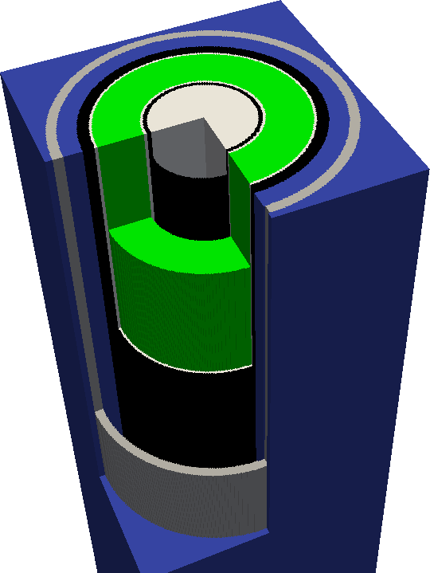

.. _usersguide_plots:

======================
Geometry Visualization
======================

.. currentmodule:: openmc

OpenMC is capable of producing two-dimensional slice plots of a geometry as well
as three-dimensional voxel plots using the geometry plotting :ref:`run mode
<usersguide_run_modes>`. The geometry plotting mode relies on the presence of a
:ref:`plots.xml <io_plots>` file that indicates what plots should be created. To
create this file, one needs to create one or more :class:`openmc.Plot`
instances, add them to a :class:`openmc.Plots` collection, and then use the
:class:`Plots.export_to_xml` method to write the ``plots.xml`` file.

-----------
Slice Plots
-----------

.. image:: ../_images/atr.png
   :width: 300px

By default, when an instance of :class:`openmc.Plot` is created, it indicates
that a 2D slice plot should be made. You can specify the origin of the plot
(:attr:`Plot.origin`), the width of the plot in each direction
(:attr:`Plot.width`), the number of pixels to use in each direction
(:attr:`Plot.pixels`), and the basis directions for the plot. For example, to
create a :math:`x` - :math:`z` plot centered at (5.0, 2.0, 3.0) with a width of
(50., 50.)  and 400x400 pixels::

  plot = openmc.Plot()
  plot.basis = 'xz'
  plot.origin = (5.0, 2.0, 3.0)
  plot.width = (50., 50.)
  plot.pixels = (400, 400)

The color of each pixel is determined by placing a particle at the center of
that pixel and using OpenMC's internal ``find_cell`` routine (the same one used
for particle tracking during simulation) to determine the cell and material at
that location.

.. note:: In this example, pixels are 50/400=0.125 cm wide. Thus, this plot may
          miss any features smaller than 0.125 cm, since they could exist
          between pixel centers. More pixels can be used to resolve finer
          features but will result in larger files.

By default, a unique color will be assigned to each cell in the geometry. If you
want your plot to be colored by material instead, change the
:attr:`Plot.color_by` attribute::

  plot.color_by = 'material'

If you don't like the random colors assigned, you can also indicate that
particular cells/materials should be given colors of your choosing::

  plot.colors = {
      water: 'blue',
      clad: 'black'
  }

  # This is equivalent
  plot.colors = {
      water: (0, 0, 255),
      clad: (0, 0, 0)
  }

Note that colors can be given as RGB tuples or by a string indicating a valid
`SVG color <https://www.w3.org/TR/SVG11/types.html#ColorKeywords>`_.

When you're done creating your :class:`openmc.Plot` instances, you need to then
assign them to a :class:`openmc.Plots` collection and export it to XML::

  plots = openmc.Plots([plot1, plot2, plot3])
  plots.export_to_xml()

  # This is equivalent
  plots = openmc.Plots()
  plots.append(plot1)
  plots += [plot2, plot3]
  plots.export_to_xml()

To actually generate the plots, run the :func:`openmc.plot_geometry`
function. Alternatively, run the :ref:`scripts_openmc` executable with the
``--plot`` command-line flag. When that has finished, you will have one or more
``.ppm`` files, i.e., `portable pixmap
<http://netpbm.sourceforge.net/doc/ppm.html>`_ files. On some Linux
distributions, these ``.ppm`` files are natively viewable. If you find that
you're unable to open them on your system (or you don't like the fact that they
are not compressed), you may want to consider converting them to another format.
This is easily accomplished with the ``convert`` command available on most Linux
distributions as part of the `ImageMagick
<http://www.imagemagick.org/script/convert.php>`_ package. (On Debian
derivatives: ``sudo apt install imagemagick``).  Images are then converted like:

.. code-block:: sh

    convert myplot.ppm myplot.png

Alternatively, if you're working within a `Jupyter <http://jupyter.org/>`_
Notebook or QtConsole, you can use the :func:`openmc.plot_inline` to run OpenMC
in plotting mode and display the resulting plot within the notebook.

.. _usersguide_voxel:

-----------
Voxel Plots
-----------

The :class:`openmc.Plot` class can also be told to generate a 3D voxel plot
instead of a 2D slice plot. Simply change the :attr:`Plot.type` attribute to
'voxel'. In this case, the :attr:`Plot.width` and :attr:`Plot.pixels` attributes
should be three items long, e.g.::

  vox_plot = openmc.Plot()
  vox_plot.type = 'voxel'
  vox_plot.width = (100., 100., 50.)
  vox_plot.pixels = (400, 400, 200)

The voxel plot data is written to an :ref:`HDF5 file <io_voxel>`. The voxel file
can subsequently be converted into a standard mesh format that can be viewed in
`ParaView <http://www.paraview.org/>`_, `VisIt
<https://wci.llnl.gov/simulation/computer-codes/visit>`_, etc. This typically
will compress the size of the file significantly. The provided
:ref:`scripts_voxel` script can convert the HDF5 voxel file to VTK formats. Once
processed into a standard 3D file format, colors and masks can be defined using
the stored ID numbers to better explore the geometry. The process for doing this
will depend on the 3D viewer, but should be straightforward.

.. note:: 3D voxel plotting can be very computer intensive for the viewing
          program (Visit, ParaView, etc.) if the number of voxels is large (>10
          million or so).  Thus if you want an accurate picture that renders
          smoothly, consider using only one voxel in a certain direction.
