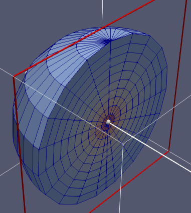

.. _usersguide_processing:

=================================
Data Processing and Visualization
=================================

.. currentmodule:: openmc

This section is intended to explain procedures for carrying out common
post-processing tasks with OpenMC. While several utilities of varying complexity
are provided to help automate the process, the most powerful capabilities for
post-processing derive from use of the :ref:`Python API <pythonapi>`.

.. _usersguide_statepoint:

-------------------------
Working with State Points
-------------------------

Tally results are saved in both a text file (tallies.out) as well as an HDF5
statepoint file. While the tallies.out file may be fine for simple tallies, in
many cases the user requires more information about the tally or the run, or has
to deal with a large number of result values (e.g. for mesh tallies).  In these
cases, extracting data from the statepoint file via the :ref:`pythonapi` is the
preferred method of data analysis and visualization.

Data Extraction
---------------

A great deal of information is available in statepoint files (See
:ref:`io_statepoint`), all of which is accessible through the Python
API. The :class:`openmc.StatePoint` class can load statepoints and access data
as requested; it is used in many of the provided plotting utilities, OpenMC's
regression test suite, and can be used in user-created scripts to carry out
manipulations of the data.

An `example notebook`_ demonstrates how to extract data from a statepoint using
the Python API.

Plotting in 2D
--------------

The `example notebook`_ also demonstrates how to plot a structured mesh tally in
two dimensions using the Python API. One can also use the `openmc-plotter
<https://github.com/openmc-dev/plotter/>`_ application that provides an
interactive GUI to explore and plot a much wider variety of tallies.

.. _usersguide_track:

----------------------------
Particle Track Visualization
----------------------------

.. image:: ../_images/Tracks.png
   :width: 400px

OpenMC can dump particle tracks—the position of particles as they are
transported through the geometry. There are two ways to make OpenMC output
tracks: all particle tracks through a command line argument or specific particle
tracks through settings.xml.

Running :ref:`scripts_openmc` with the argument ``-t`` or ``--track`` will cause
a track file to be created for every particle transported in the code. Be
careful as this will produce as many files as there are source particles in your
simulation. To identify a specific particle for which a track should be created,
set the :attr:`Settings.track` attribute to a tuple containing the batch,
generation, and particle number of the desired particle. For example, to create
a track file for particle 4 of batch 1 and generation 2::

  settings = openmc.Settings()
  settings.track = (1, 2, 4)

To specify multiple particles, the length of the iterable should be a multiple
of three, e.g., if we wanted particles 3 and 4 from batch 1 and generation 2::

  settings.track = (1, 2, 3, 1, 2, 4)

After running OpenMC, the working directory will contain a file of the form
"track_(batch #)_(generation #)_(particle #).h5" for each particle tracked.
These track files can be converted into VTK poly data files with the
:class:`openmc.Tracks` class.

----------------------
Source Site Processing
----------------------

For eigenvalue problems, OpenMC will store information on the fission source
sites in the statepoint file by default. For each source site, the weight,
position, sampled direction, and sampled energy are stored. To extract this data
from a statepoint file, the ``openmc.statepoint`` module can be used. An
`example notebook`_ demontrates how to analyze and plot source information.

.. _example notebook: https://nbviewer.jupyter.org/github/openmc-dev/openmc-notebooks/blob/main/post-processing.ipynb

------------------------
VTK Mesh File Generation
------------------------

VTK files of OpenMC meshes can be created using the
:meth:`openmc.Mesh.write_data_to_vtk`  method. Data can be applied to the
elements of the resulting mesh from mesh filter objects. This data can be
provided either as a flat array or, in the case of structured meshes
(:class:`~openmc.RegularMesh`, :class:`~openmc.RectilinearMesh`,
:class:`~openmc.CylindricalMesh`, or :class:`SphericalMesh`), the data can be
shaped with dimensions that match the dimensions of the mesh itself.

For all mesh types, if a flat data array is provided to the mesh, it is expected
that the data is ordered in the same ordering as the :attr:`openmc.Mesh.indices`
for that mesh object. When providing data directly from a tally, as shown below,
a flat array for a given dataset can be passed directly to this method.

::

    # create model above

    # create a mesh tally
    mesh = openmc.RegularMesh()
    mesh.dimension = [10, 20, 30]
    mesh.lower_left = [-5, -10, -15]
    mesh.upper_right = [5, 10, 15]
    mesh_filter = openmc.MeshFilter(mesh)
    tally = openmc.Tally()
    tally.filters = [mesh_filter]
    tally.scores = ['flux']

    model.tallies = [tally]
    model.run(apply_tally_results=True)

    # provide the data as-is to the method
    mesh.write_data_to_vtk('flux.vtk', {'flux-mean': tally.mean})

The :class:`~openmc.Tally` object also provides a way to expand the dimensions
of the mesh filter into a meaningful form where indexing the mesh filter
dimensions results in intuitive slicing of structured meshes by setting
``expand_dims=True`` when using :meth:`openmc.Tally.get_reshaped_data`. This
reshaping does cause flat indexing of the data to change, however. As noted
above, provided datasets are allowed to be shaped so long as such datasets have
shapes that match the mesh dimensions. The ability to pass datasets in this way
is useful when additional filters are applied to a tally. The example below
demonstrates such a case for tally with both a :class:`~openmc.MeshFilter` and
:class:`~openmc.EnergyFilter` applied.

::

    # create model above

    # create a mesh tally with energy filter
    mesh = openmc.RegularMesh()
    mesh.dimension = [10, 20, 30]
    mesh.lower_left = [-5, -10, -15]
    mesh.upper_right = [5, 10, 15]
    mesh_filter = openmc.MeshFilter(mesh)
    energy_filter = openmc.EnergyFilter([0.0, 1.0, 20.0e6])
    tally = openmc.Tally()
    tally.filters = [mesh_filter, energy_filter]
    tally.scores = ['flux']

    model.tallies = [tally]
    model.run(apply_tally_results=True)

    # get the data with mesh dimensions expanded, squeeze out length-one dimensions (nuclides, scores)
    flux = tally.get_reshaped_data(expand_dims=True).squeeze() # shape: (10, 20, 30, 2)

    # write the lowest energy group to a VTK file
    mesh.write_data_to_vtk('flux-group1.vtk', datasets={'flux-mean': flux[..., 0]})
