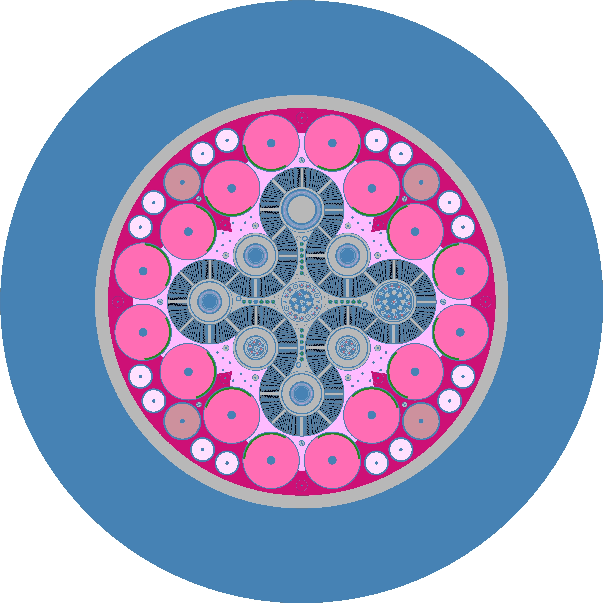
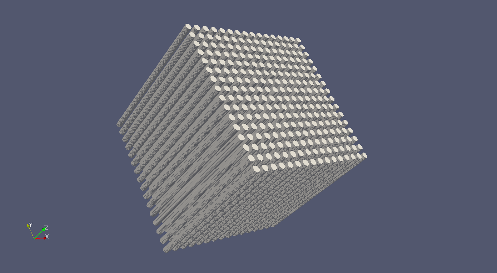
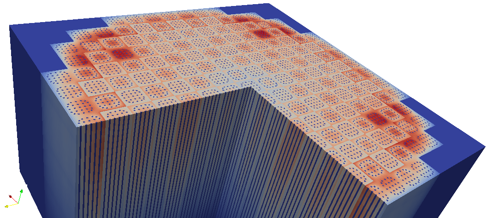

.. _usersguide_processing:

=================================
Data Processing and Visualization
=================================

This section is intended to explain in detail the recommended procedures for
carrying out common tasks with OpenMC. While several utilities of varying
complexity are provided to help automate the process, in many cases it will be
extremely beneficial to do some coding in Python to quickly obtain results.  In
these cases, and for many of the provided utilities, it is necessary for your
Python installation to contain:

* `Numpy <http://www.numpy.org/>`_
* `Scipy <http://www.scipy.org/>`_
* `Matplotlib <http://matplotlib.org/>`_ (optional for plotting utilities)
* `Silomesh <https://github.com/nhorelik/silomesh>`_ (optional for plotting
  utilities)
* `VTK <http://www.vtk.org/>`_ (optional for plotting utilities)

----------------------
Geometry Visualization
----------------------

Geometry plotting is carried out by creating a plots.xml, specifying plots, and
running OpenMC with the -plot or -p command-line option (See
:ref:`usersguide_plotting`).

Plotting in 2D
--------------

After running OpenMC to obtain PPM files, images should be saved to another
format before using them elsewhere. This cuts down the size of the file by
orders of magnitude.  Most image viewers and editors that can view PPM images
can also save to other formats (e.g. `Gimp <http://www.gimp.org/>`_, `IrfanView
<http://www.irfanview.com/>`_, etc.).  However, more likey the user will want to
convert to another format on the command line.  This is easily accomplished with
the ``convert`` command available on most linux distributions as part of the
`ImageMagick <http://www.imagemagick.org/script/convert.php>`_ package. (On
Ubuntu: ``sudo apt-get install imagemagick``).  Images are then converted like:

.. code-block:: sh

    convert plot.ppm plot.png

Plotting in 3D
--------------

The binary VOXEL files output by OpenMC can not be viewed directly by any
existing viewers. In order to view them, they must be converted into a standard
mesh format that can be viewed in ParaView, Visit, etc. The provided utility
voxel.py accomplishes this for SILO:

.. code-block:: sh

    <openmc_root>/src/utils/voxel.py myplot.voxel -o output.silo

and VTK:

.. code-block:: sh

    <openmc_root>/src/utils/myplot.voxel --vtk -o output.vti

To use this utility you need either

* `Silomesh <https://github.com/nhorelik/silomesh>`_

or

* `VTK <http://www.vtk.org/>`_ with python bindings - On Ubuntu, these are easily obtained with ``sudo apt-get install python-vtk``

Users can process the binary into any other format if desired by following the
example of voxel.py.  For the binary file structure, see :ref:`devguide_voxel`.

-------------------
Tally Visualization
-------------------

Data Extraction
---------------

Plotting in 2D
--------------

Plotting in 3D
--------------

Getting Data into MATLAB
------------------------
