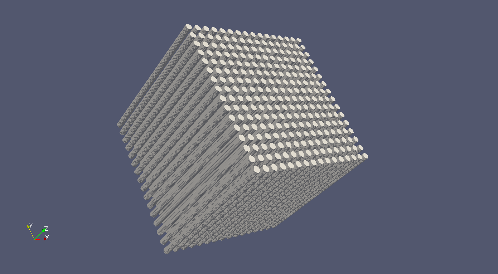
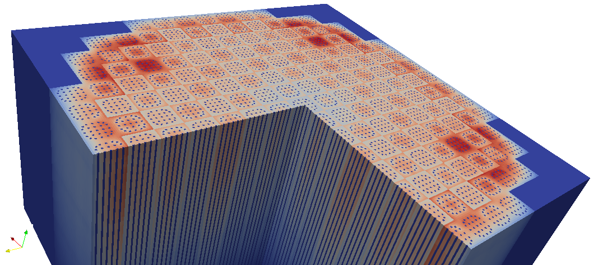

.. _usersguide_processing:

=================================
Data Processing and Visualization
=================================

This section is intended to explain in detail the recommended procedures for
carrying out common post-processing tasks with OpenMC. While several utilities
of varying complexity are provided to help automate the process, the most
powerful capabilities for post-processing derive from use of the :ref:`Python
API <pythonapi>`. Both the provided scripts and the Python API rely on a number
third-party Python packages, including:

* [1]_ `NumPy <http://www.numpy.org/>`_
* [2]_ `h5py <http://www.h5py.org>`_
* [3]_ `pandas <http://pandas.pydata.org>`_
* [4]_ `matplotlib <http://matplotlib.org/>`_
* [4]_ `Silomesh <https://github.com/nhorelik/silomesh>`_
* [4]_ `VTK <http://www.vtk.org/>`_
* [4]_ `lxml <http://lxml.de>`_

Most of these are can easily be installed with `pip <https://pip.pypa.io>`_
or alternatively obtaining through a package manager.

.. [1] Required for most post-processing tasks
.. [2] Required for reading HDF5 output files
.. [3] Optional dependency for advanced features in Python API
.. [4] Not used directly by the Python API, but are optional dependencies for a
       number of scripts.

----------------------
Geometry Visualization
----------------------

Geometry plotting is carried out by creating a plots.xml, specifying plots, and
running OpenMC with the --plot or -p command-line option (See
:ref:`usersguide_plotting`).

Plotting in 2D
--------------

See below for a simple example of a plots xml file that demonstrates the
capabilities of 2D slice plots. Here we assume that there is a ``geometry.xml``
file containing 7 cells.

.. code-block:: xml

        <?xml version="1.0" encoding="UTF-8"?>
        <plots>

          <plot id="1" type="slice" color="cell" basis="xy">
              <filename> myplot </filename>
              <origin> 0 0 </origin>
              <width> 10 10 </width>
              <pixels> 2000 2000 </pixels>
              <background> 0 0 0 </background>
              <col_spec id="1" rgb="198 226 255"/>
              <col_spec id="2" rgb="255 218 185"/>
              <col_spec id="3" rgb="255 255 255"/>
              <col_spec id="4" rgb="101 101 101"/>
              <col_spec id="7" rgb="123 123 231"/>
              <mask background="255 255 255">
                <components> 1 3 4 5 6 </components>
              </mask>
          </plot>

        </plots>

In this example, OpenMC will produce a plot named ``myplot.ppm`` when run in
plotting mode. The picture will be on the xy-plane, depicting the rectangle
between points (-5,-5) and (5,5) with 2000 pixels along each dimension. The
color of each pixel is determined by placing a particle at the center of that
pixel and using OpenMC's internal ``find_cell`` routine (the same one used for
particle tracking during simulation) to determine the cell and material at that
location. In this example, pixels are 10/2000=0.005 cm wide, so points will be
at (-4.9975,-4.9975), (-4.9950,-4.9975), (-4.9925,-4.9975), etc. This is pointed
out to demonstrate that this plot may miss any features smaller than 0.005 cm,
since they could exist between pixel centers. More pixels can be used to resolve
finer features, but could result in larger files.

The ``background``, ``col_spec``, and ``mask`` elements define how to set pixel
colors based on the cell ids at each pixel center. In this example, RGB colors
are specified for cells 1,2,3,4, and 7, a random color will be assigned to cells
5 and 6, and a black background color (``rgb="0 0 0"``) will be applied to
locations where no cell is defined. However, the ``mask`` element here says that
only cells 1,3,4,5, and 6 should be displayed, with other cells taking a white
color (``rgb="255 255 255"``), which overrides the ``col_spec`` for cell 2 and
the random color assigned to cell 7.

After running OpenMC to obtain PPM files, images should be saved to another
format before using them elsewhere. This cuts down the size of the file by
orders of magnitude.  Most image viewers and editors that can view PPM images
can also save to other formats (e.g. `Gimp <http://www.gimp.org/>`_, `IrfanView
<http://www.irfanview.com/>`_, etc.).  However, more likely the user will want to
convert to another format on the command line.  This is easily accomplished with
the ``convert`` command available on most Linux distributions as part of the
`ImageMagick <http://www.imagemagick.org/script/convert.php>`_ package. (On
Ubuntu: ``sudo apt-get install imagemagick``).  Images are then converted like:

.. code-block:: sh

    convert myplot.ppm myplot.png

Plotting in 3D
--------------

See below for a simple example of a plots xml file that demonstrates the
capabilities of 3D voxel plots.

.. code-block:: xml

        <?xml version="1.0" encoding="UTF-8"?>
        <plots>

          <plot id="1" type="voxel" color="mat">
              <filename> myplot </filename>
              <origin> 0 0 0 </origin>
              <width> 10 10 10 </width>
              <pixels> 500 500 500 </pixels>
          </plot>

        </plots>

Voxel plots are built the same way 2D slice plots are, by determining the cell
or material id of a particle at the center of each voxel. In this example, the
space covered is the cube between the points (-5,-5,-5) and (5,5,5), with voxel
centers 10/500 = 0.02 cm apart. The HDF5 voxel files that are produced do not
specify any color - instead containing only material or cell ids (material id
in this example) - and thus the ``background``, ``col_spec``, and ``mask``
elements are not used. If no cell is found at a voxel center, an id of -1 is
stored.

The voxel plot data is written to an HDF5 file. The voxel file can subsequently
be converted into a standard mesh format that can be viewed in ParaView, Visit,
etc. This typically will compress the size of the file significantly. The
provided utility openmc-voxel-to-silovtk accomplishes this for SILO:

.. code-block:: sh

    openmc-voxel-to-silovtk myplot.voxel -o output.silo

and VTK file formats:

.. code-block:: sh

    openmc-voxel-to-silovtk myplot.voxel --vtk -o output.vti

To use this utility you need either

* `Silomesh <https://github.com/nhorelik/silomesh>`_

or

* `VTK <http://www.vtk.org/>`_ with python bindings. On debian derivatives,
  these are easily obtained with ``sudo apt-get install python-vtk``

For the HDF5 file structure, see :ref:`usersguide_voxel`.

Once processed into a standard 3D file format, colors and masks can be defined
using the stored id numbers to better explore the geometry. The process for
doing this will depend on the 3D viewer, but should be straightforward.

.. image:: ../_images/3dba.png
   :height: 200px

.. note:: 3D voxel plotting can be very computer intensive for the viewing
          program (Visit, ParaView, etc.) if the number of voxels is large (>10
          million or so).  Thus if you want an accurate picture that renders
          smoothly, consider using only one voxel in a certain direction. For
          instance, the 3D pin lattice figure at the beginning of this section
          was generated with a 500x500x1 voxel mesh, which allows for resolution
          of the cylinders without wasting too many voxels on the axial
          dimension.

-------------------
Tally Visualization
-------------------

Tally results are saved in both a text file (tallies.out) as well as an HDF5
statepoint file. While the tallies.out file may be fine for simple tallies, in
many cases the user requires more information about the tally or the run, or has
to deal with a large number of result values (e.g. for mesh tallies).  In these
cases, extracting data from the statepoint file via the :ref:`pythonapi` is the
preferred method of data analysis and visualization.

Data Extraction
---------------

A great deal of information is available in statepoint files (See
:ref:`usersguide_statepoint`), all of which is accessible through the Python
API. The :class:`openmc.StatePoint` class can load statepoints and access data
as requested; it is used in many of the provided plotting utilities, OpenMC's
regression test suite, and can be used in user-created scripts to carry out
manipulations of the data.

An :ref:`example IPython notebook <notebook_post_processing>` demonstrates how
to extract data from a statepoint using the Python API.

Plotting in 2D
--------------

The :ref:`IPython notebook example <notebook_post_processing>` also demonstrates
how to plot a mesh tally in two dimensions using the Python API. Note, however,
that there is also a script distributed with OpenMC, ``openmc-plot-mesh-tally``,
that provides an interactive GUI to explore and plot mesh tallies for any scores
and filter bins.

.. image:: ../_images/plotmeshtally.png
   :height: 200px

Plotting in 3D
--------------

As with 3D plots of the geometry, meshtally data needs to be put into a standard
format for viewing. The utility ``openmc-statepoint-3d`` is provided to
accomplish this for both VTK and SILO. By default ``openmc-statepoint-3d``
processes a statepoint into a 3D file with all mesh tallies and filter/score
combinations,

.. code-block:: sh

    openmc-statepoint-3d <statepoint_file> -o output.silo
    openmc-statepoint-3d <statepoint_file> --vtk -o output.vtm

but it also provides several command-line options to selectively process only
certain data arrays in order to keep file sizes down.

.. code-block:: sh

    openmc-statepoint-3d <statepoint_file> --tallies 2,4 --scores 4.1,4.3 -o output.silo
    openmc-statepoint-3d <statepoint_file> --filters 2.energyin.1 --vtk -o output.vtm

All available options for specifying a subset of tallies, scores, and filters
can be listed with the ``--list`` or ``-l`` command line options.

.. note:: Note that while SILO files can contain multiple meshes in one file,
          VTK needs to use a multi-block dataset, which stores each mesh piece
          in a different file in a subfolder.  All meshes can be loaded at once
          with the main VTM file, or each VTI file in the subfolder can be
          loaded individually.

Alternatively, the user can write their own Python script to manipulate the data
appropriately before insertion into a SILO or VTK file.  For instance, if the
data has been extracted as was done in the 2D plotting example script above, a
SILO file can be created with:

.. code-block:: python

    import silomesh as sm
    sm.init_silo("fluxtally.silo")
    sm.init_mesh('tally_mesh', *mesh.dimension, *mesh.lower_left, *mesh.upper_right)
    sm.init_var('flux_tally_thermal')
    for x in range(1,nx+1):
      for y in range(1,ny+1):
          for z in range(1,nz+1):
            sm.set_value(float(thermal[(x,y,z)]),x,y,z)
    sm.finalize_var()
    sm.init_var('flux_tally_fast')
    for x in range(1,nx+1):
      for y in range(1,ny+1):
          for z in range(1,nz+1):
              sm.set_value(float(fast[(x,y,z)]),x,y,z)
    sm.finalize_var()
    sm.finalize_mesh()
    sm.finalize_silo()

and the equivalent VTK file with:

.. code-block:: python

    import vtk

    grid = vtk.vtkImageData()
    grid.SetDimensions(nx+1,ny+1,nz+1)
    grid.SetOrigin(*mesh.lower_left)
    grid.SetSpacing(*mesh.width)

    # vtk cell arrays have x on the inners, so we need to reorder the data
    idata = {}
    for x in range(nx):
      for y in range(ny):
        for z in range(nz):
          i = z*nx*ny + y*nx + x
          idata[i] = (x,y,z)

    vtkfastdata = vtk.vtkDoubleArray()
    vtkfastdata.SetName("fast")
    for i in range(nx*ny*nz):
      vtkfastdata.InsertNextValue(fast[idata[i]])

    vtkthermaldata = vtk.vtkDoubleArray()
    vtkthermaldata.SetName("thermal")
    for i in range(nx*ny*nz):
      vtkthermaldata.InsertNextValue(thermal[idata[i]])

    grid.GetCellData().AddArray(vtkfastdata)
    grid.GetCellData().AddArray(vtkthermaldata)

    writer = vtk.vtkXMLImageDataWriter()
    writer.SetInput(grid)
    writer.SetFileName('tally.vti')
    writer.Write()

Getting Data into MATLAB
------------------------

There is currently no front-end utility to dump tally data to MATLAB files, but
the process is straightforward. First extract the data using the Python API via
``openmc.statepoint`` and then use the `Scipy MATLAB IO routines
<http://docs.scipy.org/doc/scipy/reference/tutorial/io.html>`_ to save to a MAT
file. Note that all arrays that are accessible in a statepoint are already in
NumPy arrays that can be reshaped and dumped to MATLAB in one step.

----------------------------
Particle Track Visualization
----------------------------

.. image:: ../_images/Tracks.png
   :height: 200px

OpenMC can dump particle tracks—the position of particles as they are
transported through the geometry.  There are two ways to make OpenMC output
tracks: all particle tracks through a command line argument or specific particle
tracks through settings.xml.

Running OpenMC with the argument "-t", "-track", or "--track" will cause a track
file to be created for every particle transported in the code.

The settings.xml file can dictate that specific particle tracks are output.
These particles are specified within a ''track'' element.  The ''track'' element
should contain triplets of integers specifying the batch, generation, and
particle numbers, respectively.  For example, to output the tracks for particles
3 and 4 of batch 1 and generation 2 the settings.xml file should contain:

.. code-block:: xml

      <track>
        1 2 3
        1 2 4
      </track>

After running OpenMC, the directory should contain a file of the form
"track_(batch #)_(generation #)_(particle #).h5" for each particle tracked.
These track files can be converted into VTK poly data files with the
``openmc-track-to-vtk`` utility.  The usage of ``openmc-track-to-vtk`` is of the
form "openmc-track-to-vtk [-o OUT] IN" where OUT is the optional output filename
and IN is one or more filenames describing track files.  The default output name
is "track.pvtp".  A common usage of track.py is "openmc-track-to-vtk track*.h5"
which will use the data from all binary track files in the directory to write a
"track.pvtp" VTK output file.  The .pvtp file can then be read and plotted by 3d
visualization programs such as ParaView.

----------------------
Source Site Processing
----------------------

For eigenvalue problems, OpenMC will store information on the fission source
sites in the statepoint file by default. For each source site, the weight,
position, sampled direction, and sampled energy are stored. To extract this data
from a statepoint file, the ``openmc.statepoint`` module can be used. An
:ref:`example IPython notebook <notebook_post_processing>` demontrates how to
analyze and plot source information.
