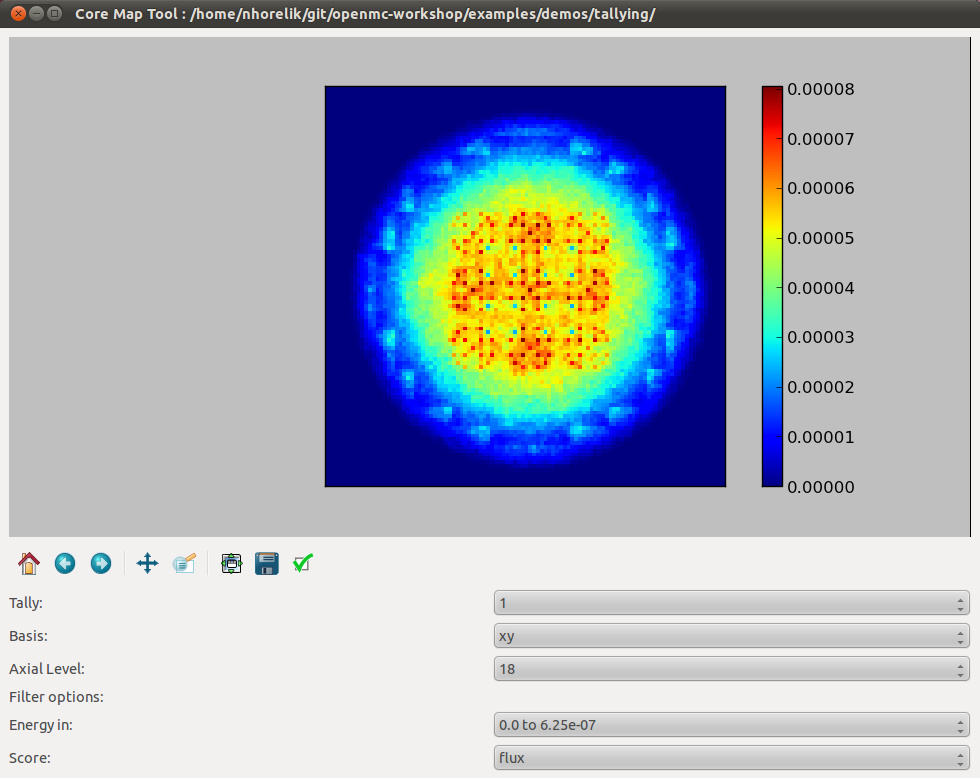
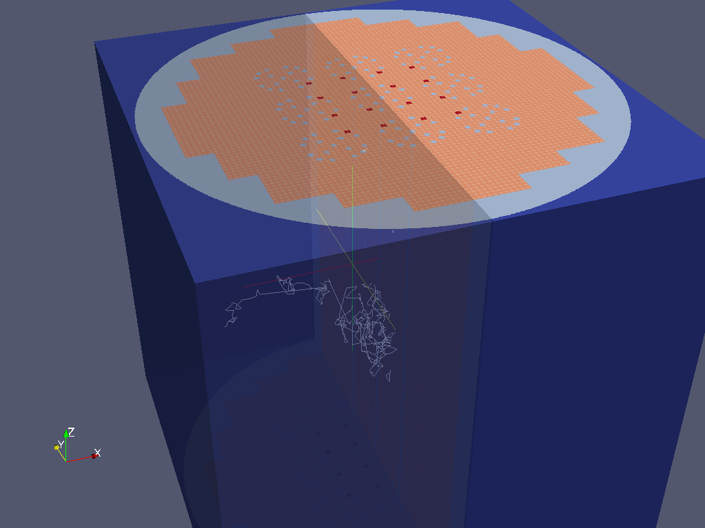

.. _usersguide_processing:

=================================
Data Processing and Visualization
=================================

.. currentmodule:: openmc

This section is intended to explain procedures for carrying out common
post-processing tasks with OpenMC. While several utilities of varying complexity
are provided to help automate the process, the most powerful capabilities for
post-processing derive from use of the :ref:`Python API <pythonapi>`.

.. _usersguide_statepoint:

-------------------------
Working with State Points
-------------------------

Tally results are saved in both a text file (tallies.out) as well as an HDF5
statepoint file. While the tallies.out file may be fine for simple tallies, in
many cases the user requires more information about the tally or the run, or has
to deal with a large number of result values (e.g. for mesh tallies).  In these
cases, extracting data from the statepoint file via the :ref:`pythonapi` is the
preferred method of data analysis and visualization.

Data Extraction
---------------

A great deal of information is available in statepoint files (See
:ref:`io_statepoint`), all of which is accessible through the Python
API. The :class:`openmc.StatePoint` class can load statepoints and access data
as requested; it is used in many of the provided plotting utilities, OpenMC's
regression test suite, and can be used in user-created scripts to carry out
manipulations of the data.

An :ref:`example IPython notebook <notebook_post_processing>` demonstrates how
to extract data from a statepoint using the Python API.

Plotting in 2D
--------------

The :ref:`IPython notebook example <notebook_post_processing>` also demonstrates
how to plot a structured mesh tally in two dimensions using the Python API. One
can also use the :ref:`scripts_plot` script which provides an interactive GUI to
explore and plot structured mesh tallies for any scores and filter bins.

Getting Data into MATLAB
------------------------

There is currently no front-end utility to dump tally data to MATLAB files, but
the process is straightforward. First extract the data using the Python API via
``openmc.statepoint`` and then use the `Scipy MATLAB IO routines
<http://docs.scipy.org/doc/scipy/reference/tutorial/io.html>`_ to save to a MAT
file. Note that all arrays that are accessible in a statepoint are already in
NumPy arrays that can be reshaped and dumped to MATLAB in one step.

.. _usersguide_track:

----------------------------
Particle Track Visualization
----------------------------

OpenMC can dump particle tracks—the position of particles as they are
transported through the geometry. There are two ways to make OpenMC output
tracks: all particle tracks through a command line argument or specific particle
tracks through settings.xml.

Running :ref:`scripts_openmc` with the argument ``-t`` or ``--track`` will cause
a track file to be created for every particle transported in the code. Be
careful as this will produce as many files as there are source particles in your
simulation. To identify a specific particle for which a track should be created,
set the :attr:`Settings.track` attribute to a tuple containing the batch,
generation, and particle number of the desired particle. For example, to create
a track file for particle 4 of batch 1 and generation 2::

  settings = openmc.Settings()
  settings.track = (1, 2, 4)

To specify multiple particles, the length of the iterable should be a multiple
of three, e.g., if we wanted particles 3 and 4 from batch 1 and generation 2::

  settings.track = (1, 2, 3, 1, 2, 4)

After running OpenMC, the working directory will contain a file of the form
"track_(batch #)_(generation #)_(particle #).h5" for each particle tracked.
These track files can be converted into VTK poly data files with the
:ref:`scripts_track` script.

----------------------
Source Site Processing
----------------------

For eigenvalue problems, OpenMC will store information on the fission source
sites in the statepoint file by default. For each source site, the weight,
position, sampled direction, and sampled energy are stored. To extract this data
from a statepoint file, the ``openmc.statepoint`` module can be used. An
:ref:`example IPython notebook <notebook_post_processing>` demontrates how to
analyze and plot source information.
