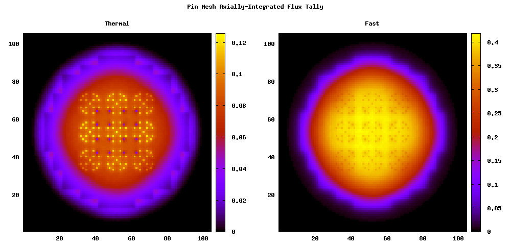

.. _usersguide_processing:

=================================
Data Processing and Visualization
=================================

This section is intended to explain in detail the recommended procedures for
carrying out common post-processing tasks with OpenMC. While several utilities
of varying complexity are provided to help automate the process, in many cases
it will be extremely beneficial to do some coding in Python to quickly obtain
results. In these cases, and for many of the provided utilities, it is necessary
for your Python installation to contain:

* [1]_ `Numpy <http://www.numpy.org/>`_
* [1]_ `Scipy <http://www.scipy.org/>`_
* [2]_ `h5py <http://code.google.com/p/h5py/>`_
* [3]_ `Matplotlib <http://matplotlib.org/>`_
* [3]_ `Silomesh <https://github.com/nhorelik/silomesh>`_
* [3]_ `VTK <http://www.vtk.org/>`_
* [4]_ `PyQt <http://www.riverbankcomputing.com/software/pyqt>`_

Most of these are easily obtainable in Ubuntu through the package manager, or
are easily installed with distutils.

.. [1] Required for tally data extraction from statepoints with statepoint.py
.. [2] Required only if reading HDF5 statepoint files. 
.. [3] Optional for plotting utilities
.. [4] Optional for interactive GUIs

----------------------
Geometry Visualization
----------------------

Geometry plotting is carried out by creating a plots.xml, specifying plots, and
running OpenMC with the -plot or -p command-line option (See
:ref:`usersguide_plotting`).

Plotting in 2D
--------------

.. image:: ../_images/atr.png
   :height: 200px

See below for a simple example of a plots xml file that demonstrates the
capabilities of 2D slice plots. Here we assume that there is a ``geometry.xml``
file containing 7 cells.

.. code-block:: xml

        <?xml version="1.0" encoding="UTF-8"?>
        <plots>

          <plot id="1" type="slice" color="cell" basis="xy">
              <filename> myplot </filename>
              <origin> 0 0 </origin>
              <width> 10 10 </width>
              <pixels> 2000 2000 </pixels>
              <background> 0 0 0 </background>
              <col_spec id="1" rgb="198 226 255"/>
              <col_spec id="2" rgb="255 218 185"/>
              <col_spec id="3" rgb="255 255 255"/>
              <col_spec id="4" rgb="101 101 101"/>
              <col_spec id="7" rgb="123 123 231"/>
              <mask background="255 255 255">
                <components> 1 3 4 5 6 </components>
              </mask>
          </plot>

        </plots>

In this example, OpenMC will produce a plot named ``myplot.ppm`` when run in
plotting mode. The picture will be on the xy-plane, depicting the rectangle
between points (-5,-5) and (5,5) with 2000 pixels along each dimension. The
color of each pixel is determined by placing a particle at the center of that
pixel and using OpenMC's internal ``find_cell`` routine (the same one used for
particle tracking during simulation) to determine the cell and material at that
location. In this example, pixels are 10/2000=0.005 cm wide, so points will be
at (-4.9975,-4.9975), (-4.9950,-4.9975), (-4.9925,-4.9975), etc. This is pointed
out to demonstrate that this plot may miss any features smaller than 0.005 cm,
since they could exist between pixel centers. More pixels can be used to resolve
finer features, but could result in larger files.

The ``background``, ``col_spec``, and ``mask`` elements define how to set pixel
colors based on the cell ids at each pixel center. In this example, RGB colors
are specified for cells 1,2,3,4, and 7, a random color will be assigned to cells
5 and 6, and a black background color (``rgb="0 0 0"``) will be applied to
locations where no cell is defined. However, the ``mask`` element here says that
only cells 1,3,4,5, and 6 should be displayed, with other cells taking a white
color (``rgb="255 255 255"``), which overrides the ``col_spec`` for cell 2 and
the random color assigned to cell 7.

After running OpenMC to obtain PPM files, images should be saved to another
format before using them elsewhere. This cuts down the size of the file by
orders of magnitude.  Most image viewers and editors that can view PPM images
can also save to other formats (e.g. `Gimp <http://www.gimp.org/>`_, `IrfanView
<http://www.irfanview.com/>`_, etc.).  However, more likey the user will want to
convert to another format on the command line.  This is easily accomplished with
the ``convert`` command available on most linux distributions as part of the
`ImageMagick <http://www.imagemagick.org/script/convert.php>`_ package. (On
Ubuntu: ``sudo apt-get install imagemagick``).  Images are then converted like:

.. code-block:: sh

    convert myplot.ppm myplot.png

Plotting in 3D
--------------

.. image:: ../_images/3dgeomplot.png
   :height: 200px

See below for a simple example of a plots xml file that demonstrates the
capabilities of 3D voxel plots.

.. code-block:: xml

        <?xml version="1.0" encoding="UTF-8"?>
        <plots>

          <plot id="1" type="voxel" color="mat">
              <filename> myplot </filename>
              <origin> 0 0 0 </origin>
              <width> 10 10 10 </width>
              <pixels> 500 500 500 </pixels>
          </plot>

        </plots>

Voxel plots are built the same way 2D slice plots are, by determining the cell
or material id of a particle at the center of each voxel. In this example, the
space covered is the cube between the points (-5,-5,-5) and (5,5,5), with voxel
centers 10/500 = 0.02 cm apart. The binary VOXEL files that are produced do not
specify any color - instead containing only material or cell ids (material id
in this example) - and thus the ``background``, ``col_spec``, and ``mask``
elements are not used. If no cell is found at a voxel center, an id of -1 is
stored.

The binary VOXEL files output by OpenMC can not be viewed directly by any
existing viewers. In order to view them, they must be converted into a standard
mesh format that can be viewed in ParaView, Visit, etc. This typically will
compress the size of the file significantly. The provided utility voxel.py
accomplishes this for SILO:

.. code-block:: sh

    <openmc_root>/src/utils/voxel.py myplot.voxel -o output.silo

and VTK file formats:

.. code-block:: sh

    <openmc_root>/src/utils/voxel.py myplot.voxel --vtk -o output.vti

To use this utility you need either

* `Silomesh <https://github.com/nhorelik/silomesh>`_

or

* `VTK <http://www.vtk.org/>`_ with python bindings - On Ubuntu, these are
  easily obtained with ``sudo apt-get install python-vtk``

Users can process the binary into any other format if desired by following the
example of voxel.py.  For the binary file structure, see :ref:`devguide_voxel`.

Once processed into a standard 3D file format, colors and masks can be defined
using the stored id numbers to better explore the geometry. The process for
doing this will depend on the 3D viewer, but should be straightforward.

.. image:: ../_images/3dba.png
   :height: 200px

.. note:: 3D voxel plotting can be very computer intensive for the viewing
          program (Visit, Paraview, etc.) if the number of voxels is large (>10
          million or so).  Thus if you want an accurate picture that renders
          smoothly, consider using only one voxel in a certain direction. For
          instance, the 3D pin lattice figure at the beginning of this section
          was generated with a 500x500x1 voxel mesh, which allows for resolution
          of the cylinders without wasting too many voxels on the axial
          dimension.

-------------------
Tally Visualization
-------------------

Tally results are saved in both a text file (tallies.out) as well as a binary
statepoint file. While the tallies.out file may be fine for simple tallies, in
many cases the user requires more information about the tally or the run, or
has to deal with a large number of result values (e.g. for mesh tallies).  In
these cases, extracting data from the statepoint file via Python scripting is
the preferred method of data analysis and visualization.

Data Extraction
---------------

A great deal of information is available in statepoint files (See
:ref:`devguide_statepoint`), most of which is easily extracted by the provided
utility statepoint.py. This utility provides a Python class to load statepoints
and extract data - it is used in many of the provided plotting utilities, and
can be used in user-created scripts to carry out manipulations of the data. To
read tallies using this utility, make sure statepoint.py is in your PYTHONPATH,
and then import the class, instantiate it, and call read_results:

.. code-block:: python

    from statepoint import StatePoint
    sp = StatePoint('statepoint.100.binary')
    sp.read_results()

At this point the user can extract entire scores from tallies into a data
dictionary containing numpy arrays:

.. code-block:: python

    tallyid = 1
    score = 'flux'
    data = sp.extract_results(tallyid, score)
    means = data['means']
    print data.keys()

The results from this function contain all filter bins (all mesh points, all
energy groups, etc.), which can be reshaped with the bin ordering also contained
in the output dictionary. This is the best choice of output for easily
integrating ranges of data.

Alternatively the user can extract specific values for a single score/filter
combination:

.. code-block:: python

    tallyid = 1
    score = 'flux'
    filters = [('mesh', (1, 1, 5)), ('energyin', 0)]
    value, error = sp.get_value(tallyid, filters, score)

In the future more documentaion may become available here for statepoint.py and
the data extraction functions of StatePoint objects. However, for now it is up
to the user to explore the classes in statepoint.py to discover what data is
available in StatePoint objects (we highly recommend interactively exploring
with `IPython <http://ipython.org/>`_). Many exmaples can be found by looking
through the other utilies that use statepoint.py, and a few common visualization
tasks will be described here in the following sections.

Plotting in 2D
--------------

.. image:: ../_images/plotmeshtally.png
   :height: 200px

For simple viewing of 2D slices of a mesh plot, the utility plot_mesh_tally.py
is provided.  This utility provides an interactive GUI to explore and plot
mesh tallies for any scores and filter bins.  It requires statepoint.py, as well
as `PyQt <http://www.riverbankcomputing.com/software/pyqt>`_.

Alternatively, the user can write their own Python script to manipulate the data
appropriately. Consider a run where the first tally contains a 105x105x20 mesh
over a small core, with a flux score and two energyin filter bins. To explicitly
extract the data and create a plot with gnuplot, the following script can be
used. The script operates in several steps for clarity, and is not necessarily
the most efficient way to extract data from large mesh tallies. This creates the
two heatmaps in the previous figure.

.. code-block:: python

    #!/usr/bin/env python
    
    import os
    
    import statepoint
    
    # load and parse the statepoint file
    sp = statepoint.StatePoint('statepoint.300.binary')
    sp.read_results()
    
    tallyid = 0 # This is tally 1
    score = 0   # This corresponds to flux (see tally.scores)
    
    # get mesh dimensions
    meshid = sp.tallies[tallyid].filters['mesh'].bins[0]
    for i,m in enumerate(sp.meshes):
        if m.id == meshid:
          mesh = m
          break
    nx,ny,nz = mesh.dimension

    # loop through mesh and extract values to python dictionaries
    thermal = {}
    fast = {}
    for x in range(1,nx+1):
        for y in range(1,ny+1):
            for z in range(1,nz+1):
                val,err = sp.get_value(tallyid,
                                       [('mesh',(x,y,z)),('energyin',0)],
                                       score)
                thermal[(x,y,z)] = val
                val,err = sp.get_value(tallyid,
                                       [('mesh',(x,y,z)),('energyin',1)],
                                       score)
                fast[(x,y,z)] = val
    
    # sum up the axial values and write datafile for gnuplot
    with open('meshdata.dat','w') as fh:
        for x in range(1,nx+1):
            for y in range(1,ny+1):
                thermalval = 0.
                fastval = 0.
                for z in range(1,nz+1):
                  thermalval += thermal[(x,y,z)]
                  fastval += fast[(x,y,z)]
                fh.write("{} {} {} {}\n".format(x,y,thermalval,fastval))

    # write gnuplot file
    with open('tmp.gnuplot','w') as fh:
      fh.write(r"""set terminal png size 1000 400
  set output 'fluxplot.png'
  set nokey
  set autoscale fix
  set multiplot layout 1,2 title "Pin Mesh Flux Tally"
  set title "Thermal"
  plot 'meshdata.dat' using 1:2:3 with image
  set title "Fast"
  plot 'meshdata.dat' using 1:2:4 with image
  """)

    # make plot
    os.system("gnuplot < tmp.gnuplot")

Plotting in 3D
--------------

.. image:: ../_images/3dcore.png
   :height: 200px

As with 3D plots of the geometry, meshtally data needs to be put into a standard
format for viewing. The utility statepoint_3d.py is provided to accomplish this
for both VTK and SILO. By default statepoint_3d.py processes a statepoint into a
3D file with all mesh tallies and filter/score combinations, 

.. code-block:: sh

    <openmc_root>/src/utils/statepoint_3d.py <statepoint_file> -o output.silo
    <openmc_root>/src/utils/statepoint_3d.py <statepoint_file> --vtk -o output.vtm

but it also provides several command-line options to selectively process only
certain data arrays in order to keep file sizes down.

.. code-block:: sh

    <openmc_root>/src/utils/statepoint_3d.py <statepoint_file> --tallies 2,4 --scores 4.1,4.3 -o output.silo
    <openmc_root>/src/utils/statepoint_3d.py <statepoint_file> --filters 2.energyin.1 --vtk -o output.vtm

All available options for specifying a subset of tallies, scores, and filters
can be listed with the ``--list`` or ``-l`` command line options.

.. note:: Note that while SILO files can contain multiple meshes in one file,
          VTK needs to use a multi-block dataset, which stores each mesh piece
          in a different file in a subfolder.  All meshes can be loaded at once
          with the main VTM file, or each VTI file in the subfolder can be
          loaded individually. 

Alternatively, the user can write their own Python script to manipulate the data
appropriately before insertion into a SILO or VTK file.  For instance, if the
data has been extracted as was done in the 2D plotting example script above, a
SILO file can be created with:

.. code-block:: python

    import silomesh as sm
    sm.init_silo("fluxtally.silo")
    sm.init_mesh('tally_mesh', *mesh.dimension, *mesh.lower_left, *mesh.upper_right)
    sm.init_var('flux_tally_thermal')
    for x in range(1,nx+1):
      for y in range(1,ny+1):
          for z in range(1,nz+1):
            sm.set_value(float(thermal[(x,y,z)]),x,y,z)
    sm.finalize_var()
    sm.init_var('flux_tally_fast')
    for x in range(1,nx+1):
      for y in range(1,ny+1):
          for z in range(1,nz+1):
              sm.set_value(float(fast[(x,y,z)]),x,y,z)
    sm.finalize_var()
    sm.finalize_mesh()
    sm.finalize_silo()

and the equivalent VTK file with:

.. code-block:: python

    import vtk

    grid = vtk.vtkImageData()
    grid.SetDimensions(nx+1,ny+1,nz+1)
    grid.SetOrigin(*mesh.lower_left)
    grid.SetSpacing(*mesh.width)

    # vtk cell arrays have x on the inners, so we need to reorder the data    
    idata = {}
    for x in range(nx):
      for y in range(ny):
        for z in range(nz):
          i = z*nx*ny + y*nx + x
          idata[i] = (x,y,z)

    vtkfastdata = vtk.vtkDoubleArray()
    vtkfastdata.SetName("fast")
    for i in range(nx*ny*nz):
      vtkfastdata.InsertNextValue(fast[idata[i]])

    vtkthermaldata = vtk.vtkDoubleArray()
    vtkthermaldata.SetName("thermal")
    for i in range(nx*ny*nz):
      vtkthermaldata.InsertNextValue(thermal[idata[i]])

    grid.GetCellData().AddArray(vtkfastdata)
    grid.GetCellData().AddArray(vtkthermaldata)
    
    writer = vtk.vtkXMLImageDataWriter()
    writer.SetInput(grid)
    writer.SetFileName('tally.vti')
    writer.Write()

Getting Data into MATLAB
------------------------

There is currently no front-end utility to dump tally data to MATLAB files, but
the process is straightforward. First extract the data using a custom Python
script with statepoint.py, put the data into appropriately-shaped numpy arrays,
and then use the `Scipy MATLAB IO routines
<http://docs.scipy.org/doc/scipy/reference/tutorial/io.html>`_ to save to a MAT
file. Note that the data contained in the output from
``StatePoint.extract_result`` is already in a Numpy array that can be reshaped
and dumped to MATLAB in one step.

----------------------------
Particle Track Visualization
----------------------------

.. image:: ../_images/Tracks.png
   :height: 200px

OpenMC can dump particle tracks—the position of particles as they are
transported through the geometry.  There are two ways to make OpenMC output
tracks: all particle tracks through a commandline argument or specific particle
tracks through settings.xml.

Running OpenMC with the argument "-t", "-track", or "--track" will cause a track
file to be created for every particle transported in the code.

The settings.xml file can dictate that specific particle tracks are output.
These particles are specified withen a ''track'' element.  The ''track'' element
should contain triplets of integers specifying the batch, generation, and
particle numbers, respectively.  For example, to output the tracks for particles
3 and 4 of batch 1 and generation 2 the settings.xml file should contain:

.. code-block:: xml

      <track>
        1 2 3
        1 2 4
      </track>

After running OpenMC, the directory should contain a file of the form
"track_(batch #)_(generation #)_(particle #).(binary or h5)" for each particle
tracked.  These track files can be converted into VTK poly data files with the
"track.py" utility.  The usage of track.py is of the form "track.py [-o OUT] IN"
where OUT is the optional output filename and IN is one or more filenames
describing track files.  The default output name is "track.pvtp".  A common
usage of track.py is "track.py track*.binary" which will use the data from all
binary track files in the directory to write a "track.pvtp" VTK output file.
The .pvtp file can then be read and plotted by 3d visualization programs such as
Paraview.

----------------------
Source Site Processing
----------------------

For eigenvalue problems, OpenMC will store information on the fission source
sites in the statepoint file by default. For each source site, the weight,
position, sampled direction, and sampled energy are stored. To extract this data
from a statepoint file, the statepoint.py Python module can be used. Below is an
example of an interactive ipython session using the statepoint.py Python module:

.. code-block:: python

    In [1]: import statepoint
    
    In [2]: sp = statepoint.StatePoint('statepoint.100.h5')
    
    In [3]: sp.read_source()
    
    In [4]: len(sp.source)
    Out[4]: 1000
    
    In [5]: sp.source[0:10]
    Out[5]: 
    [<SourceSite: xyz=[  2.21980946  -8.92686048  87.93720485] at E=0.932923263566>,
     <SourceSite: xyz=[  2.21980946  -8.92686048  87.93720485] at E=0.349240220512>,
     <SourceSite: xyz=[-31.21542213 -30.26762771  72.10845757] at E=3.75843584486>,
     <SourceSite: xyz=[-31.21542213 -30.26762771  72.10845757] at E=0.80550137267>,
     <SourceSite: xyz=[   0.18805099  -69.13376508  103.67726838] at E=1.67922461097>,
     <SourceSite: xyz=[   0.18805099  -69.13376508  103.67726838] at E=1.16304110199>,
     <SourceSite: xyz=[ -50.42189115   -9.96571672  123.34077905] at E=0.710937974074>,
     <SourceSite: xyz=[ -32.80427668  -15.49316628  125.26301151] at E=1.61907104162>,
     <SourceSite: xyz=[  53.20376026  -15.38643708  120.58071044] at E=3.33962024907>,
     <SourceSite: xyz=[  53.20376026  -15.38643708  120.58071044] at E=1.90185680329>]
    
    In [6]: site = sp.source[0]
    
    In [7]: site.weight
    Out[7]: 1.0
    
    In [8]: site.xyz
    Out[8]: array([  2.21980946,  -8.92686048,  87.93720485])
    
    In [9]: site.uvw
    Out[9]: array([ 0.06740523,  0.50612814,  0.85982024])
    
    In [10]: site.E
    Out[10]: 0.93292326356564159
