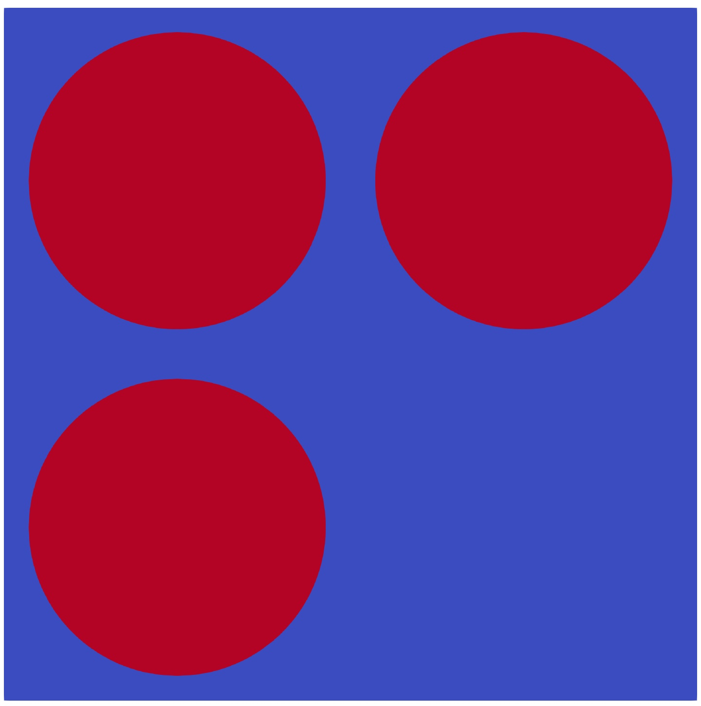
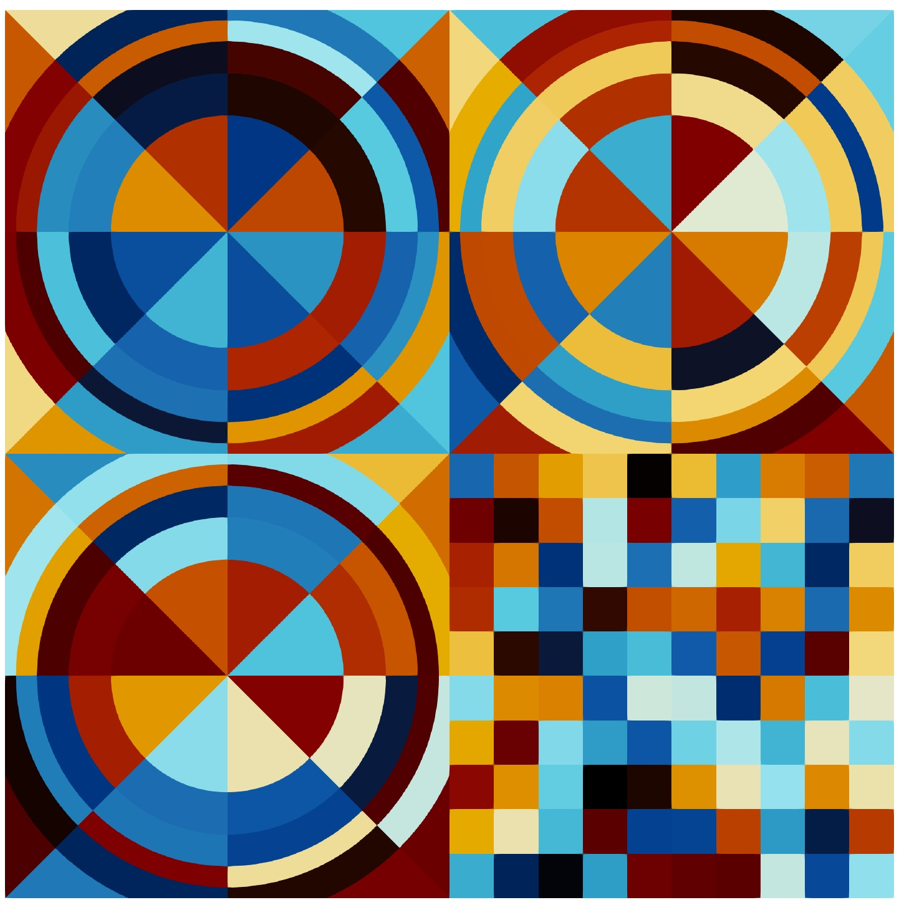

.. _random_ray:

=================
Random Ray Solver
=================

In general, the random ray solver mode uses most of the same settings and
:ref:`run strategies <usersguide_particles>` as the standard Monte Carlo solver
mode. For instance, random ray solves are also split up into :ref:`inactive and
active batches <usersguide_batches>`. However, there are a couple of settings
that are unique to the random ray solver and a few areas that the random ray
run strategy differs, both of which will be described in this section.

------------------------
Enabling Random Ray Mode
------------------------

To utilize the random ray solver, the :attr:`~openmc.Settings.random_ray`
dictionary must be present in the :class:`openmc.Settings` Python class. There
are a number of additional settings that must be specified within this
dictionary that will be discussed below. Additionally, the "multi-group" energy
mode must be specified.

-------
Batches
-------

In Monte Carlo simulations, inactive batches are used to let the fission source
develop into a stationary distribution before active batches are performed that
actually accumulate statistics. While this is true of random ray as well, in the
random ray mode the inactive batches are also used to let the scattering source
develop. Monte Carlo fully represents the scattering source within each
iteration (by its nature of fully simulating particles from birth to death
through any number of physical scattering events), whereas the scattering source
in random ray can only represent as many scattering events as batches have been
completed. For example, by iteration 10 in random ray, the scattering source
only captures the behavior of neutrons through their 10th scattering event.
Thus, while inactive batches are only required in an eigenvalue solve in Monte
Carlo, **inactive batches are required for both eigenvalue and fixed source
solves in random ray mode** due to this additional need to converge the
scattering source.

.. warning::
    Unlike Monte Carlo, the random ray solver still requires usage of inactive
    batches when in fixed source mode so as to develop the scattering source.

The additional burden of converging the scattering source generally results in a
higher requirement for the number of inactive batches---often by an order of
magnitude or more. For instance, it may be reasonable to only use 50 inactive
batches for a light water reactor simulation with Monte Carlo, but random ray
might require 500 or more inactive batches.

Similar to Monte Carlo, active batches are used in the random ray solver mode to
accumulate and converge statistics on unknown quantities (i.e., the random ray
sources, scalar fluxes, as well as any user-specified tallies).

The batch parameters are set in the same manner as with the regular Monte Carlo
solver::

    settings = openmc.Settings()
    settings.energy_mode = "multi-group"
    settings.batches = 1200
    settings.inactive = 600

---------------
Shannon Entropy
---------------

Similar to Monte Carlo, :ref:`Shannon entropy
<methods-shannon-entropy-random-ray>` can be used to gauge whether the fission
source has fully developed. The Shannon entropy is calculated automatically
after each batch and is printed to the statepoint file. Unlike Monte Carlo, an
entropy mesh does not need to be defined, as the Shannon entropy is calculated
over FSRs using a volume-weighted approach.

-------------------------------
Inactive Ray Length (Dead Zone)
-------------------------------

A major issue with random ray is that the starting angular flux distribution for
each sampled ray is unknown. Thus, an on-the-fly method is used to build a high
quality approximation of the angular flux of the ray each iteration. This is
accomplished by running the ray through an inactive length (also known as a dead
zone length), where the ray is moved through the geometry and its angular flux
is solved for via the normal :ref:`MOC <methods_random_ray_intro>` equation, but
no information is written back to the system. Thus, the ray is run in a "read
only" mode for the set inactive length. This parameter can be adjusted, in units
of cm, as::

    settings.random_ray['distance_inactive'] = 40.0

After several mean free paths are traversed, the angular flux spectrum of the
ray becomes dominated by the in-scattering and fission source components that it
picked up when travelling through the geometry, while its original (incorrect)
starting angular flux is attenuated toward zero. Thus, longer selections of
inactive ray length will asymptotically approach the true angular flux.

In practice, 10 mean free paths are sufficient (with light water reactors often
requiring only about 10--50 cm of inactive ray length for the error to become
undetectable). However, we caution that certain models with large quantities of
void regions (even if just limited to a few streaming channels) may require
significantly longer inactive ray lengths to ensure that the angular flux is
accurate before the conclusion of the inactive ray length. Additionally,
problems where a sensitive estimate of the uncollided flux is required (e.g.,
the detector response to fast neutrons is required, and the detected is located
far away from the source in a moderator region) may require the user to specify
an inactive length that is derived from the pyhsical geometry of the simulation
problem rather than its material properties. For instance, consider a detector
placed 30 cm outside of a reactor core, with a moderator region separating the
detector from the core. In this case, rays sampled in the moderator region and
heading toward the detector will begin life with a highly scattered thermal
spectrum and will have an inaccurate fast spectrum. If the dead zone length is
only 20 cm, we might imagine such rays writing to the detector tally within
their active lengths, despite their innaccurate estimate of the uncollided fast
angular flux. Thus, an inactive length of 100--200 cm would ensure that any such
rays would still be within their inactive regions, and only rays that have
actually traversed through the core (and thus have an accurate representation of
the core's emitted fast flux) will score to the detector region while in their
active phase.

------------------------------------
Active Ray Length and Number of Rays
------------------------------------

Once the inactive length of the ray has completed, the active region of the ray
begins. The ray is now run in regular mode, where changes in angular flux as it
traverses through each flat source region are written back to the system, so as
to contribute to the estimate for the iteration scalar flux (which is used to
compute the source for the next iteration). The active ray length can be
adjusted, in units of [cm], as::

    settings.random_ray['distance_active'] = 400.0

Assuming that a sufficient inactive ray length is used so that the starting
angular flux is highly accurate, any selection of active length greater than
zero is theoretically acceptable. However, in order to adequately sample the
full integration domain, a selection of a very short track length would require
a very high number of rays to be selected. Due to the static costs per ray of
computing the starting angular flux in the dead zone, typically very short ray
lengths are undesireable. Thus, to amortize the per-ray cost of the inactive
region of the ray, it is desirable to select a very long inactive ray length.
For example, if the inactive length is set to 20 cm, a 200 cm active ray length
ensures that only about 10% of the overall simulation runtime is spent in the
inactive ray phase integration, making the dead zone a relatively inexpensive
way of estimating the angular flux.

Thus, to fully amortize the cost of the dead zone integration, one might ask why
not simply run a single ray per iteration with an extremely long active length?
While this is also theoretically possible, this results in two issues. The first
problem is that each ray only represents a single angular sample. As we want to
sample the angular phase space of the simulation with similar fidelity to the
spatial phase space, we naturally want a lot of angles. This means in practice,
we want to balance the need to amortize the cost of the inactive region of the
ray with the need to sample lots of angles. The second problem is that
parallelism in OpenMC is expressed in terms of rays, with each being processed
by an independent MPI rank and/or OpenMP thread, thus we want to ensure each
thread has many rays to process.

In practical terms, the best strategy is typically to set an active ray length
that is about 10 times that of the inactive ray length. This is often the right
balance between ensuring not too much time is spent in the dead zone, while
still adequately sampling the angular phase space. However, as discussed in the
previous section, some types of simulation may demand that additional thought be
applied to this parameter. For instance, in the same example where we have a
detector region far outside a reactor core, we want to make sure that there is
enough active ray length that rays exiting the core can reach the detector
region. For example, if the detector were to be 30 cm outside of the core, then
we would need to ensure that at least a few hundred cm of active length were
used so as to ensure even rays with indirect angles will be able to reach the
target region.

The number of rays each iteration can be set by reusing the normal Monte Carlo
particle count selection parameter, as::

    settings.particles = 2000

-----------
Ray Density
-----------

In the preceding sections, it was argued that for most use cases, the inactive
length for a ray can be determined by taking a multiple of the mean free path
for the limiting energy group. The active ray length could then be set by taking
a multiple of the inactive length. With these parameters set, how many rays per
iteration should be run?

There are three basic settings that control the density of the stochastic
quadrature being used to integrate the domain each iteration. These three
variables are:

- The number of rays (in OpenMC settings parlance, "particles")
- The inactive distance per ray
- The active distance per ray

While the inactive and active ray lengths can usually be chosen by simply
examining the geometry, tallies, and cross section data, one has much more
flexibility in the choice of the number of rays to run. Consider a few
scenarios:

- If a choice of zero rays is made, then no information is gained by the system
  after each batch.
- If a choice of rays close to zero is made, then some information is gained
  after each batch, but many source regions may not have been visited that
  iteration, which is not ideal numerically and can result in instability.
  Empirically, we have found that the simulation can remain stable and produce
  accurate results even when on average 20% or more of the cells have zero rays
  passing through them each iteration. However, besides the cost of transporting
  rays, a new neutron source must be computed based on the scalar flux at each
  iteration. This cost is dictated only by the number of source regions and
  energy groups---it is independent of the number of rays. Thus, in practical
  terms, if too few rays are run, then the simulation runtime becomes dominated
  by the fixed cost of source updates, making it inefficient overall given that
  a huge number of active batches will likely be required to converge statistics
  to acceptable levels. Additionally, if many cells are missed each iteration,
  then the fission and scattering sources may not develop very quickly,
  resulting in a need for far more inactive batches than might otherwise be
  required.
- If a choice of running a very large number of rays is made such that you
  guarantee that all cells are hit each iteration, this avoids any issues with
  numerical instability. As even more rays are run, this reduces the number of
  active batches that must be used to converge statistics and therefore
  minimizes the fixed per-iteration source update costs. While this seems
  advantageous, it has the same practical downside as with Monte Carlo---namely,
  that the inactive batches tend to be overly well integrated, resulting in a
  lot of wasted time. This issue is actually much more serious than in Monte
  Carlo (where typically only tens of inactive batches are needed), as random
  ray often requires hundreds or even thousands of inactive batches. Thus,
  minimizing the cost of the source updates in the active phase needs to be
  balanced against the increased cost of the inactive phase of the simulation.
- If a choice of rays is made such that relatively few (e.g., around 0.1%) of
  cells are missed each iteration, the cost of the inactive batches of the
  simulation is minimized. In this "goldilocks" regime, there is very little
  chance of numerical instability, and enough information is gained by each cell
  to progress the fission and scattering sources forward at their maximum rate.
  However, the inactive batches can proceed with minimal cost. While this will
  result in the active phase of the simulation requiring more batches (and
  correspondingly higher source update costs), the added cost is typically far
  less than the savings by making the inactive phase much cheaper.

To help you set this parameter, OpenMC will report the average flat source
region miss rate at the end of the simulation. Additionally, OpenMC will alert
you if very high miss rates are detected, indicating that more rays and/or a
longer active ray length might improve numerical performance. Thus, a "guess and
check" approach to this parameter is recommended, where a very low guess is
made, a few iterations are performed, and then the simulation is restarted with
a larger value until the "low ray density" messages go away.

.. note::
    In summary, the user should select an inactive length corresponding to many
    times the mean free path of a particle, generally O(10--100) cm, to ensure accuracy of
    the starting angular flux. The active length should be 10× the inactive
    length to amortize its cost. The number of rays should be enough so that
    nearly all :ref:`FSRs <subdivision_fsr>` are hit at least once each power iteration (the hit fraction
    is reported by OpenMC for empirical user adjustment).

.. warning::
    For simulations where long range uncollided flux estimates need to be
    accurately resolved (e.g., shielding, detector response, and problems with
    significant void areas), make sure that selections for inactive and active
    ray lengths are sufficiently long to allow for transport to occur between
    source and target regions of interest.

.. _usersguide_ray_source:

----------
Ray Source
----------

Random ray requires that the ray source be uniform in space and isotropic in
angle. To facilitate sampling, the user must specify a single random ray source
for sampling rays in both eigenvalue and fixed source solver modes. The random
ray integration source should be of type :class:`openmc.IndependentSource`, and
is specified as part of the :attr:`openmc.Settings.random_ray` dictionary. Note
that the source must not be limited to only fissionable regions. Additionally,
the source box must cover the entire simulation domain. In the case of a
simulation domain that is not box shaped, a box source should still be used to
bound the domain but with the source limited to rejection sampling the actual
simulation universe (which can be specified via the ``domains`` constraint of the
:class:`openmc.IndependentSource` Python class). Similar to Monte Carlo sources,
for two-dimensional problems (e.g., a 2D pincell) it is desirable to make the
source bounded near the origin of the infinite dimension. An example of an
acceptable ray source for a two-dimensional 2x2 lattice would look like:

::

    pitch = 1.26
    lower_left  = (-pitch, -pitch, -pitch)
    upper_right = ( pitch,  pitch,  pitch)
    uniform_dist = openmc.stats.Box(lower_left, upper_right)
    settings.random_ray['ray_source'] = openmc.IndependentSource(space=uniform_dist)

.. note::
    The random ray source is not related to the underlying particle flux or
    source distribution of the simulation problem. It is akin to the selection
    of an integration quadrature. Thus, in fixed source mode, the ray source
    still needs to be provided and still needs to be uniform in space and angle
    throughout the simulation domain. In fixed source mode, the user will
    provide physical particle fixed sources in addition to the random ray
    source.

.. _subdivision_fsr:

----------------------------------
Subdivision of Flat Source Regions
----------------------------------

While the scattering and fission sources in Monte Carlo
are treated continuously, they are assumed to be invariant (flat) within a
MOC or random ray flat source region (FSR). This introduces bias into the
simulation, which can be remedied by reducing the physical size of the FSR
to dimensions below that of typical mean free paths of particles.

In OpenMC, this subdivision currently must be done manually. The level of
subdivision needed will be dependent on the fidelity the user requires. For
typical light water reactor analysis, consider the following example subdivision
of a two-dimensional 2x2 reflective pincell lattice:

    Material definition for an asymmetrical 2x2 lattice (1.26 cm pitch)

    FSR decomposition for an asymmetrical 2x2 lattice (1.26 cm pitch)

In the future, automated subdivision of FSRs via mesh overlay may be supported.

.. _usersguide_flux_norm:

-------
Tallies
-------

Most tallies, filters, and scores that you would expect to work with a
multigroup solver like random ray are supported. For example, you can define 3D
mesh tallies with energy filters and flux, fission, and nu-fission scores, etc.
There are some restrictions though. For starters, it is assumed that all filter
mesh boundaries will conform to physical surface boundaries (or lattice
boundaries) in the simulation geometry. It is acceptable for multiple cells
(FSRs) to be contained within a mesh element (e.g., pincell-level or
assembly-level tallies should work), but it is currently left as undefined
behavior if a single simulation cell is contained in multiple mesh elements.

Supported scores:
    - flux
    - total
    - fission
    - nu-fission
    - events

Supported Estimators:
    - tracklength

Supported Filters:
    - cell
    - cell instance
    - distribcell
    - energy
    - material
    - mesh
    - universe

Note that there is no difference between the analog, tracklength, and collision
estimators in random ray mode as individual particles are not being simulated.
Tracklength-style tally estimation is inherent to the random ray method.

As discussed in the random ray theory section on :ref:`Random Ray
Tallies<methods_random_tallies>`, by default flux tallies in the random ray mode
are not normalized by the spatial tally volumes such that flux tallies are in
units of cm. While the volume information is readily available as a byproduct of
random ray integration, the flux value is reported in unnormalized units of cm
so that the user will be able to compare "apples to apples" with the default
flux tallies from the Monte Carlo solver (also reported by default in units of
cm). If volume normalized flux tallies (in units of cm\ :sup:`-2`) are desired,
then the user can set the ``volume_normalized_flux_tallies`` field in the
:attr:`openmc.Settings.random_ray` dictionary to ``True``. An example is given
below:

::

    settings.random_ray['volume_normalized_flux_tallies'] = True

Note that MC mode flux tallies can also be normalized by volume, as discussed in
the :ref:`Volume Calculation Section<usersguide_volume>` of the user guide.

--------
Plotting
--------

Visualization of geometry is handled in the same way as normal with OpenMC (see
:ref:`plotting guide <usersguide_plots>` for more details). That is, ``openmc
--plot`` is handled without any modifications, as the random ray solver uses the
same geometry definition as in Monte Carlo.

In addition to OpenMC's standard geometry plotting mode, the random ray solver
also features an additional method of data visualization. If a ``plots.xml``
file is present, any voxel plots that are defined will be output at the end of a
random ray simulation. Rather than being stored in HDF5 file format, the random
ray plotting will generate ``.vtk`` files that can be directly read and plotted
with `Paraview <https://www.paraview.org/>`_.

In fixed source Monte Carlo (MC) simulations, by default the only thing global
tally provided is the leakage fraction. In a k-eigenvalue MC simulation, by
default global tallies are collected for the eigenvalue and leakage fraction.
Spatial flux information must be manually requested, and often fine-grained
spatial meshes are considered costly/unnecessary, so it is impractical in MC
mode to plot spatial flux or power info by default. Conversely, in random ray,
the solver functions by estimating the multigroup source and flux spectrums in
every fine-grained FSR each iteration. Thus, for random ray, in both fixed
source and eigenvalue simulations, the simulation always finishes with a well
converged flux estimate for all areas. As such, it is much more common in random
ray, MOC, and other deterministic codes to provide spatial flux information by
default. In the future, all FSR data will be made available in the statepoint
file, which facilitates plotting and manipulation through the Python API; at
present, statepoint support is not available.

Only voxel plots will be used to generate output; other plot types present in
the ``plots.xml`` file will be ignored. The following fields will be written to
the VTK structured grid file:

    - material
    - FSR index
    - flux spectrum (for each energy group)
    - total fission source (integrated across all energy groups)

------------------------------------------
Inputting Multigroup Cross Sections (MGXS)
------------------------------------------

Multigroup cross sections for use with OpenMC's random ray solver are input the
same way as with OpenMC's traditional multigroup Monte Carlo mode. There is more
information on generating multigroup cross sections via OpenMC in the
:ref:`multigroup materials <create_mgxs>` user guide. You may also wish to use
an existing ``mgxs.h5`` MGXS library file, or define your own given a known set
of cross section data values (e.g., as taken from a benchmark specification). An
example of using OpenMC's Python interface to generate a correctly formatted
``mgxs.h5`` input file is given in the `OpenMC Jupyter notebook collection
<https://nbviewer.org/github/openmc-dev/openmc-notebooks/blob/main/mg-mode-part-i.ipynb>`_.

.. note::
    Currently only isotropic and isothermal multigroup cross sections are
    supported in random ray mode. To represent multiple material temperatures,
    separate materials can be defined each with a separate multigroup dataset
    corresponding to a given temperature.

.. _mgxs_gen:

-------------------------------------------
Generating Multigroup Cross Sections (MGXS)
-------------------------------------------

OpenMC is capable of generating multigroup cross sections by way of flux
collapsing data based on flux solutions obtained from a continuous energy Monte
Carlo solve. While it is a circular excercise in some respects to use continuous
energy Monte Carlo to generate cross sections to be used by a reduced-fidelity
multigroup transport solver, there are many use cases where this is nonetheless
highly desirable. For instance, generation of a multigroup library may enable
the same set of approximate multigroup cross section data to be used across a
variety of problem types (or through a multidimensional parameter sweep of
design variables) with only modest errors and at greatly reduced cost as
compared to using only continuous energy Monte Carlo.

We give here a quick summary of how to produce a multigroup cross section data
file (``mgxs.h5``) from a starting point of a typical continuous energy Monte
Carlo input file. Notably, continuous energy input files define materials as a
mixture of nuclides with different densities, whereas multigroup materials are
simply defined by which name they correspond to in a ``mgxs.h5`` library file.

To generate the cross section data, we begin with a continuous energy Monte
Carlo input deck and add in the required tallies that will be needed to generate
our library. In this example, we will specify material-wise cross sections and a
two group energy decomposition::

  # Define geometry
  ...
  ...
  geometry = openmc.Geometry()
  ...
  ...

  # Initialize MGXS library with a finished OpenMC geometry object
  mgxs_lib = openmc.mgxs.Library(geometry)

  # Pick energy group structure
  groups = mgxs.EnergyGroups(mgxs.GROUP_STRUCTURES['CASMO-2'])
  mgxs_lib.energy_groups = groups

  # Disable transport correction
  mgxs_lib.correction = None

  # Specify needed cross sections for random ray
  mgxs_lib.mgxs_types = ['total', 'absorption', 'nu-fission', 'fission',
                      'nu-scatter matrix', 'multiplicity matrix', 'chi']

  # Specify a "cell" domain type for the cross section tally filters
  mgxs_lib.domain_type = "material"

  # Specify the cell domains over which to compute multi-group cross sections
  mgxs_lib.domains = geom.get_all_materials().values()

  # Do not compute cross sections on a nuclide-by-nuclide basis
  mgxs_lib.by_nuclide = False

  # Check the library - if no errors are raised, then the library is satisfactory.
  mgxs_lib.check_library_for_openmc_mgxs()

  # Construct all tallies needed for the multi-group cross section library
  mgxs_lib.build_library()

  # Create a "tallies.xml" file for the MGXS Library
  tallies = openmc.Tallies()
  mgxs_lib.add_to_tallies_file(tallies, merge=True)

  # Export
  tallies.export_to_xml()

  ...

When selecting an energy decomposition, you can manually define group boundaries
or pick out a group structure already known to OpenMC (a list of which can be
found at :class:`openmc.mgxs.GROUP_STRUCTURES`). Once the above input deck has
been run, the resulting statepoint file will contain the needed flux and
reaction rate tally data so that a MGXS library file can be generated. Below is
the postprocessing script needed to generate the ``mgxs.h5`` library file given
a statepoint file (e.g., ``statepoint.100.h5``) file and summary file (e.g.,
``summary.h5``) that resulted from running our previous example::

  import openmc
  import openmc.mgxs as mgxs

  summary = openmc.Summary('summary.h5')
  geom = summary.geometry
  mats = summary.materials

  statepoint_filename = 'statepoint.100.h5'
  sp = openmc.StatePoint(statepoint_filename)

  groups = mgxs.EnergyGroups(mgxs.GROUP_STRUCTURES['CASMO-2'])
  mgxs_lib = openmc.mgxs.Library(geom)
  mgxs_lib.energy_groups = groups
  mgxs_lib.correction = None
  mgxs_lib.mgxs_types = ['total', 'absorption', 'nu-fission', 'fission',
                          'nu-scatter matrix', 'multiplicity matrix', 'chi']

  # Specify a "cell" domain type for the cross section tally filters
  mgxs_lib.domain_type = "material"

  # Specify the cell domains over which to compute multi-group cross sections
  mgxs_lib.domains = geom.get_all_materials().values()

  # Do not compute cross sections on a nuclide-by-nuclide basis
  mgxs_lib.by_nuclide = False

  # Check the library - if no errors are raised, then the library is satisfactory.
  mgxs_lib.check_library_for_openmc_mgxs()

  # Construct all tallies needed for the multi-group cross section library
  mgxs_lib.build_library()

  mgxs_lib.load_from_statepoint(sp)

  names = []
  for mat in mgxs_lib.domains: names.append(mat.name)

  # Create a MGXS File which can then be written to disk
  mgxs_file = mgxs_lib.create_mg_library(xs_type='macro', xsdata_names=names)

  # Write the file to disk using the default filename of "mgxs.h5"
  mgxs_file.export_to_hdf5("mgxs.h5")

Notably, the postprocessing script needs to match the same
:class:`openmc.mgxs.Library` settings that were used to generate the tallies,
but otherwise is able to discern the rest of the simulation details from the
statepoint and summary files. Once the postprocessing script is successfully
run, the ``mgxs.h5`` file can be loaded by subsequent runs of OpenMC.

If you want to convert continuous energy material objects in an OpenMC input
deck to multigroup ones from a ``mgxs.h5`` library, you can follow the below
example. Here we begin with the original continuous energy materials we used to
generate our MGXS library::

    fuel = openmc.Material(name='UO2 (2.4%)')
    fuel.set_density('g/cm3', 10.29769)
    fuel.add_nuclide('U234', 4.4843e-6)
    fuel.add_nuclide('U235', 5.5815e-4)
    fuel.add_nuclide('U238', 2.2408e-2)
    fuel.add_nuclide('O16', 4.5829e-2)

    water = openmc.Material(name='Hot borated water')
    water.set_density('g/cm3', 0.740582)
    water.add_nuclide('H1', 4.9457e-2)
    water.add_nuclide('O16', 2.4672e-2)
    water.add_nuclide('B10', 8.0042e-6)
    water.add_nuclide('B11', 3.2218e-5)
    water.add_s_alpha_beta('c_H_in_H2O')

    materials = openmc.Materials([fuel, water])

Once the ``mgxs.h5`` library file has been generated, we can then manually make
the necessary edits to the material definitions so that they load from the
multigroup library instead of defining their isotopic contents, as::

    # Instantiate some Macroscopic Data
    fuel_data = openmc.Macroscopic('UO2 (2.4%)')
    water_data = openmc.Macroscopic('Hot borated water')

    # Instantiate some Materials and register the appropriate Macroscopic objects
    fuel= openmc.Material(name='UO2 (2.4%)')
    fuel.set_density('macro', 1.0)
    fuel.add_macroscopic(fuel_data)

    water= openmc.Material(name='Hot borated water')
    water.set_density('macro', 1.0)
    water.add_macroscopic(water_data)

    # Instantiate a Materials collection and export to XML
    materials = openmc.Materials([fuel, water])
    materials.cross_sections = "mgxs.h5"

In the above example, our ``fuel`` and ``water`` materials will now load MGXS
data from the ``mgxs.h5`` file instead of loading continuous energy isotopic
cross section data.

--------------
Linear Sources
--------------

Linear Sources (LS), are supported with the eigenvalue and fixed source random
ray solvers. General 3D LS can be toggled by setting the ``source_shape`` field
in the :attr:`openmc.Settings.random_ray` dictionary to ``'linear'`` as::

    settings.random_ray['source_shape'] = 'linear'

LS enables the use of coarser mesh discretizations and lower ray populations,
offsetting the increased computation per ray.

While OpenMC has no specific mode for 2D simulations, such simulations can be
performed implicitly by leaving one of the dimensions of the geometry unbounded
or by imposing reflective boundary conditions with no variation in between them
in that dimension. When 3D linear sources are used in a 2D random ray
simulation, the extremely long (or potentially infinite) spatial dimension along
one of the axes can cause the linear source to become noisy, leading to
potentially large increases in variance. To mitigate this, the user can force
the z-terms of the linear source to zero by setting the ``source_shape`` field
as::

    settings.random_ray['source_shape'] = 'linear_xy'

which will greatly improve the quality of the linear source term in 2D
simulations.

---------------------------------
Fixed Source and Eigenvalue Modes
---------------------------------

Both fixed source and eigenvalue modes are supported with the random ray solver
in OpenMC. Modes can be selected as described in the :ref:`run modes section
<usersguide_run_modes>`. In both modes, a ray source must be provided to let
OpenMC know where to sample ray starting locations from, as discussed in the
:ref:`ray source section <usersguide_ray_source>`. In fixed source mode, at
least one regular source must be provided as well that represents the physical
particle fixed source. As discussed in the :ref:`fixed source methodology
section <usersguide_fixed_source_methods>`, the types of fixed sources supported
in the random ray solver mode are limited compared to what is possible with the
Monte Carlo solver.

Currently, all of the following conditions must be met for the particle source
to be valid in random ray mode:

- One or more domain ids must be specified that indicate which cells, universes,
  or materials the source applies to. This implicitly limits the source type to
  being volumetric. This is specified via the ``domains`` constraint placed on the
  :class:`openmc.IndependentSource` Python class.
- The source must be isotropic (default for a source)
- The source must use a discrete (i.e., multigroup) energy distribution. The
  discrete energy distribution is input by defining a
  :class:`openmc.stats.Discrete` Python class, and passed as the ``energy``
  field of the :class:`openmc.IndependentSource` Python class.

Any other spatial distribution information contained in a particle source will
be ignored. Only the specified cell, material, or universe domains will be used
to define the spatial location of the source, as the source will be applied
during a pre-processing stage of OpenMC to all source regions that are contained
within the specified domains for the source.

When defining a :class:`openmc.stats.Discrete` object, note that the ``x`` field
will correspond to the discrete energy points, and the ``p`` field will
correspond to the discrete probabilities. It is recommended to select energy
points that fall within energy groups rather than on boundaries between the
groups. That is, if the problem contains two energy groups (with bin edges of
1.0e-5, 1.0e-1, 1.0e7), then a good selection for the ``x`` field might be
points of 1.0e-2 and 1.0e1.

::

    # Define geometry, etc.
    ...
    source_cell = openmc.Cell(fill=source_mat, name='cell where fixed source will be')
    ...
    # Define physical neutron fixed source
    energy_points = [1.0e-2, 1.0e1]
    strengths = [0.25, 0.75]
    energy_distribution = openmc.stats.Discrete(x=energy_points, p=strengths)
    neutron_source = openmc.IndependentSource(
        energy=energy_distribution,
        constraints={'domains': [source_cell]}
    )

    # Add fixed source and ray sampling source to settings file
    settings.source = [neutron_source]

.. _usersguide_vol_estimators:

-----------------------------
Alternative Volume Estimators
-----------------------------

As discussed in the random ray theory section on :ref:`volume estimators
<methods_random_ray_vol>`, there are several possible derivations for the scalar
flux estimate. These options deal with different ways of treating the
accumulation over ray lengths crossing each FSR (a quantity directly
proportional to volume), which can be computed using several methods. The
following methods are currently available in OpenMC:

.. list-table:: Comparison of Estimators
   :header-rows: 1
   :widths: 10 30 30 30

   * - Estimator
     - Description
     - Pros
     - Cons
   * - ``simulation_averaged``
     - Accumulates total active ray lengths in each FSR over all iterations,
       improving the estimate of the volume in each cell each iteration.
     - * Virtually unbiased after several iterations
       * Asymptotically approaches the true analytical volume
       * Typically most efficient in terms of speed vs. accuracy
     - * Higher variance
       * Can lead to negative fluxes and numerical instability in pathological
         cases
   * - ``naive``
     - Treats the volume as composed only of the active ray length through each
       FSR per iteration, being a biased but numerically consistent ratio
       estimator.
     - * Low variance
       * Unlikely to result in negative fluxes
       * Recommended in cases where the simulation averaged estimator is
         unstable
     - * Biased estimator
       * Requires more rays or longer active ray length to mitigate bias
   * - ``hybrid`` (default)
     - Applies the naive estimator to all cells that contain an external (fixed)
       source contribution. Applies the simulation averaged estimator to all
       other cells.
     - * High accuracy/low bias of the simulation averaged estimator in most
         cells
       * Stability of the naive estimator in cells with fixed sources
     - * Can lead to slightly negative fluxes in cells where the simulation
         averaged estimator is used

These estimators can be selected by setting the ``volume_estimator`` field in the
:attr:`openmc.Settings.random_ray` dictionary. For example, to use the naive
estimator, the following code would be used:

::

    settings.random_ray['volume_estimator'] = 'naive'

-----------------
Adjoint Flux Mode
-----------------

The adjoint flux random ray solver mode can be enabled as:
entire
::

    settings.random_ray['adjoint'] = True

When enabled, OpenMC will first run a forward transport simulation followed by
an adjoint transport simulation. The purpose of the forward solve is to compute
the adjoint external source when an external source is present in the
simulation. Simulation settings (e.g., number of rays, batches, etc.) will be
identical for both simulations. At the conclusion of the run, all results (e.g.,
tallies, plots, etc.) will be derived from the adjoint flux rather than the
forward flux but are not labeled any differently. The initial forward flux
solution will not be stored or available in the final statepoint file. Those
wishing to do analysis requiring both the forward and adjoint solutions will
need to run two separate simulations and load both statepoint files.

.. note::
    When adjoint mode is selected, OpenMC will always perform a full forward
    solve and then run a full adjoint solve immediately afterwards. Statepoint
    and tally results will be derived from the adjoint flux, but will not be
    labeled any differently.

---------------------------------------
Putting it All Together: Example Inputs
---------------------------------------

~~~~~~~~~~~~~~~~~~
Eigenvalue Example
~~~~~~~~~~~~~~~~~~

An example of a settings definition for an eigenvalue random ray simulation is
given below:

::

    # Geometry and MGXS material definition of 2x2 lattice (not shown)
    pitch = 1.26
    group_edges = [1e-5, 0.0635, 10.0, 1.0e2, 1.0e3, 0.5e6, 1.0e6, 20.0e6]
    ...

    # Instantiate a settings object for a random ray solve
    settings = openmc.Settings()
    settings.energy_mode = "multi-group"
    settings.batches = 1200
    settings.inactive = 600
    settings.particles = 2000

    settings.random_ray['distance_inactive'] = 40.0
    settings.random_ray['distance_active'] = 400.0

    # Create an initial uniform spatial source distribution for sampling rays
    lower_left  = (-pitch, -pitch, -pitch)
    upper_right = ( pitch,  pitch,  pitch)
    uniform_dist = openmc.stats.Box(lower_left, upper_right)
    settings.random_ray['ray_source'] = openmc.IndependentSource(space=uniform_dist)

    settings.export_to_xml()

    # Define tallies

    # Create a mesh filter
    mesh = openmc.RegularMesh()
    mesh.dimension = (2, 2)
    mesh.lower_left = (-pitch/2, -pitch/2)
    mesh.upper_right = (pitch/2, pitch/2)
    mesh_filter = openmc.MeshFilter(mesh)

    # Create a multigroup energy filter
    energy_filter = openmc.EnergyFilter(group_edges)

    # Create tally using our two filters and add scores
    tally = openmc.Tally()
    tally.filters = [mesh_filter, energy_filter]
    tally.scores = ['flux', 'fission', 'nu-fission']

    # Instantiate a Tallies collection and export to XML
    tallies = openmc.Tallies([tally])
    tallies.export_to_xml()

    # Create voxel plot
    plot = openmc.Plot()
    plot.origin = [0, 0, 0]
    plot.width = [2*pitch, 2*pitch, 1]
    plot.pixels = [1000, 1000, 1]
    plot.type = 'voxel'

    # Instantiate a Plots collection and export to XML
    plots = openmc.Plots([plot])
    plots.export_to_xml()

All other inputs (e.g., geometry, materials) will be unchanged from a typical
Monte Carlo run (see the :ref:`geometry <usersguide_geometry>` and
:ref:`multigroup materials <create_mgxs>` user guides for more information).

There is also a complete example of a pincell available in the
``openmc/examples/pincell_random_ray`` folder.

~~~~~~~~~~~~~~~~~~~~
Fixed Source Example
~~~~~~~~~~~~~~~~~~~~

An example of a settings definition for a fixed source random ray simulation is
given below:

::

    # Geometry and MGXS material definition of 2x2 lattice (not shown)
    pitch = 1.26
    source_cell = openmc.Cell(fill=source_mat, name='cell where fixed source will be')
    ebins = [1e-5, 1e-1, 20.0e6]
    ...

    # Instantiate a settings object for a random ray solve
    settings = openmc.Settings()
    settings.energy_mode = "multi-group"
    settings.batches = 1200
    settings.inactive = 600
    settings.particles = 2000
    settings.run_mode = 'fixed source'
    settings.random_ray['distance_inactive'] = 40.0
    settings.random_ray['distance_active'] = 400.0

    # Create an initial uniform spatial source distribution for sampling rays
    lower_left  = (-pitch, -pitch, -pitch)
    upper_right = ( pitch,  pitch,  pitch)
    uniform_dist = openmc.stats.Box(lower_left, upper_right)
    settings.random_ray['ray_source'] = openmc.IndependentSource(space=uniform_dist)

    # Define physical neutron fixed source
    energy_points = [1.0e-2, 1.0e1]
    strengths = [0.25, 0.75]
    energy_distribution = openmc.stats.Discrete(x=energy_points, p=strengths)
    neutron_source = openmc.IndependentSource(
        energy=energy_distribution,
        constraints={'domains': [source_cell]}
    )

    # Add fixed source and ray sampling source to settings file
    settings.source = [neutron_source]

    settings.export_to_xml()

    # Define tallies

    # Create a mesh filter
    mesh = openmc.RegularMesh()
    mesh.dimension = (2, 2)
    mesh.lower_left = (-pitch/2, -pitch/2)
    mesh.upper_right = (pitch/2, pitch/2)
    mesh_filter = openmc.MeshFilter(mesh)

    # Create a multigroup energy filter
    energy_filter = openmc.EnergyFilter(ebins)

    # Create tally using our two filters and add scores
    tally = openmc.Tally()
    tally.filters = [mesh_filter, energy_filter]
    tally.scores = ['flux']

    # Instantiate a Tallies collection and export to XML
    tallies = openmc.Tallies([tally])
    tallies.export_to_xml()

    # Create voxel plot
    plot = openmc.Plot()
    plot.origin = [0, 0, 0]
    plot.width = [2*pitch, 2*pitch, 1]
    plot.pixels = [1000, 1000, 1]
    plot.type = 'voxel'

    # Instantiate a Plots collection and export to XML
    plots = openmc.Plots([plot])
    plots.export_to_xml()

All other inputs (e.g., geometry, material) will be unchanged from a typical
Monte Carlo run (see the :ref:`geometry <usersguide_geometry>` and
:ref:`multigroup materials <create_mgxs>` user guides for more information).
